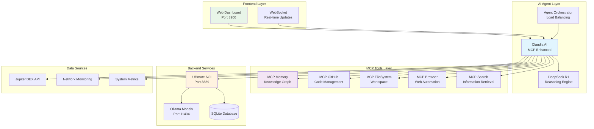

# MCPVotsAGI Architecture Diagram

## System Flow

1. **User Interaction**: Web dashboard receives user requests
2. **AI Processing**: Claudia AI processes with MCP tool integration
3. **Context Retrieval**: MCP Memory provides historical context
4. **Multi-Tool Orchestration**: Uses GitHub, FileSystem, Browser, Search as needed
5. **Analysis Generation**: DeepSeek R1 generates insights
6. **Real-time Updates**: WebSocket streams results to dashboard

## Key Features

- **Async Architecture**: All operations are non-blocking
- **Circuit Breakers**: Fault tolerance and graceful degradation
- **Load Balancing**: Intelligent task distribution
- **Real-time Monitoring**: Prometheus metrics and health checks
- **Context Awareness**: Memory-driven decision making
