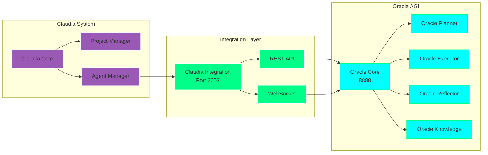

# Claudia + Oracle AGI Integration

## Overview

Claudia is fully integrated with Oracle AGI to provide advanced project management and agent orchestration capabilities. This integration enables Claudia to leverage Oracle's powerful AI agents for complex tasks.

## Architecture



## Installation

1. **Clone Claudia** (if not already installed):
```bash
cd C:\Workspace\MCPVotsAGI
git clone https://github.com/getAsterisk/claudia.git
```

2. **Start Oracle AGI Services**:
```bash
python start_production_system.py
```

3. **Start Claudia Integration**:
```bash
python oracle_claudia_integration.py
```

## Oracle Agents for Claudia

### 1. Oracle Strategic Planner
```python
{
    "id": "oracle-planner",
    "name": "Oracle Strategic Planner",
    "description": "Breaks down complex projects into actionable tasks",
    "capabilities": [
        "task_decomposition",
        "dependency_analysis",
        "timeline_estimation",
        "resource_allocation",
        "risk_assessment"
    ],
    "endpoints": {
        "plan": "POST /claudia/oracle/plan",
        "analyze": "POST /claudia/oracle/analyze"
    }
}
```

### 2. Oracle Task Executor
```python
{
    "id": "oracle-executor",
    "name": "Oracle Task Executor",
    "description": "Executes tasks and monitors progress",
    "capabilities": [
        "code_generation",
        "api_integration", 
        "automation_scripting",
        "progress_tracking",
        "error_recovery"
    ],
    "endpoints": {
        "execute": "POST /claudia/oracle/execute",
        "status": "GET /claudia/oracle/task/{task_id}/status"
    }
}
```

### 3. Oracle Performance Analyzer
```python
{
    "id": "oracle-reflector",
    "name": "Oracle Performance Analyzer",
    "description": "Analyzes performance and suggests optimizations",
    "capabilities": [
        "performance_metrics",
        "bottleneck_detection",
        "optimization_suggestions",
        "comparative_analysis",
        "learning_integration"
    ],
    "endpoints": {
        "analyze": "POST /claudia/oracle/reflect",
        "optimize": "POST /claudia/oracle/optimize"
    }
}
```

### 4. Oracle Knowledge Manager
```python
{
    "id": "oracle-knowledge",
    "name": "Oracle Knowledge Manager",
    "description": "Manages project knowledge and context",
    "capabilities": [
        "knowledge_storage",
        "context_retrieval",
        "semantic_search",
        "knowledge_synthesis",
        "documentation_generation"
    ],
    "endpoints": {
        "store": "POST /claudia/oracle/knowledge",
        "query": "GET /claudia/oracle/knowledge/search"
    }
}
```

## API Reference

### Base URL
```
http://localhost:3003
```

### Authentication
Currently uses local authentication. For production, implement API keys.

### Endpoints

#### 1. Create Project Plan
```http
POST /claudia/oracle/plan
Content-Type: application/json

{
    "project_name": "Build Trading Bot",
    "requirements": [
        "Connect to Binance API",
        "Implement DCA strategy",
        "Add stop-loss protection"
    ],
    "constraints": {
        "timeline": "2 weeks",
        "budget": "$5000",
        "technology": ["Python", "ccxt"]
    }
}

Response:
{
    "plan_id": "plan_12345",
    "tasks": [
        {
            "id": "task_1",
            "name": "Setup Binance API Connection",
            "duration": "2 days",
            "dependencies": [],
            "assigned_agent": "oracle-executor"
        }
    ],
    "timeline": {
        "start": "2025-07-03",
        "end": "2025-07-17"
    }
}
```

#### 2. Execute Task
```http
POST /claudia/oracle/execute
Content-Type: application/json

{
    "task_id": "task_1",
    "plan_id": "plan_12345",
    "context": {
        "api_key": "encrypted_key",
        "test_mode": true
    }
}

Response:
{
    "execution_id": "exec_67890",
    "status": "running",
    "progress": 0,
    "logs": []
}
```

#### 3. Get Oracle Status
```http
GET /claudia/oracle/status

Response:
{
    "status": "online",
    "agents": {
        "oracle-planner": "active",
        "oracle-executor": "active",
        "oracle-reflector": "active",
        "oracle-knowledge": "active"
    },
    "active_tasks": 3,
    "completed_today": 15
}
```

## WebSocket Integration

Connect to real-time updates:

```javascript
const ws = new WebSocket('ws://localhost:3003/claudia/ws');

ws.onmessage = (event) => {
    const data = JSON.parse(event.data);
    
    switch(data.type) {
        case 'task_progress':
            console.log(`Task ${data.task_id}: ${data.progress}%`);
            break;
            
        case 'agent_status':
            console.log(`Agent ${data.agent_id}: ${data.status}`);
            break;
            
        case 'plan_update':
            console.log(`Plan ${data.plan_id} updated`);
            break;
    }
};

// Subscribe to specific project
ws.send(JSON.stringify({
    action: 'subscribe',
    project_id: 'project_123'
}));
```

## Usage Examples

### 1. Creating a Complex Project

```python
import aiohttp
import asyncio

async def create_defi_project():
    async with aiohttp.ClientSession() as session:
        # Create project plan
        async with session.post(
            'http://localhost:3003/claudia/oracle/plan',
            json={
                'project_name': 'DeFi Yield Aggregator',
                'requirements': [
                    'Monitor yields across protocols',
                    'Auto-compound rewards',
                    'Risk assessment',
                    'Gas optimization'
                ]
            }
        ) as resp:
            plan = await resp.json()
            
        print(f"Created plan: {plan['plan_id']}")
        
        # Execute first task
        for task in plan['tasks']:
            async with session.post(
                'http://localhost:3003/claudia/oracle/execute',
                json={
                    'task_id': task['id'],
                    'plan_id': plan['plan_id']
                }
            ) as resp:
                execution = await resp.json()
                print(f"Executing: {task['name']}")

asyncio.run(create_defi_project())
```

### 2. Knowledge Query

```python
async def query_knowledge(query):
    async with aiohttp.ClientSession() as session:
        async with session.get(
            f'http://localhost:3003/claudia/oracle/knowledge/search?q={query}'
        ) as resp:
            results = await resp.json()
            return results['documents']
```

### 3. Performance Analysis

```python
async def analyze_project_performance(project_id):
    async with aiohttp.ClientSession() as session:
        async with session.post(
            'http://localhost:3003/claudia/oracle/reflect',
            json={'project_id': project_id}
        ) as resp:
            analysis = await resp.json()
            
        print(f"Performance Score: {analysis['score']}")
        print(f"Bottlenecks: {analysis['bottlenecks']}")
        print(f"Suggestions: {analysis['suggestions']}")
```

## Configuration

### oracle_claudia_integration.py

```python
# Claudia agent configurations
self.oracle_agents = {
    "oracle-planner": {
        "name": "Oracle Strategic Planner",
        "model": "claude-3-opus",
        "temperature": 0.7,
        "max_tokens": 4000
    },
    "oracle-executor": {
        "name": "Oracle Task Executor", 
        "model": "gpt-4-turbo",
        "temperature": 0.3,
        "max_tokens": 8000
    }
}
```

### Environment Variables

```bash
# Claudia Integration
CLAUDIA_PORT=3003
CLAUDIA_API_KEY=your_api_key

# Oracle AGI Connection
ORACLE_CORE_URL=http://localhost:8888
ORACLE_TIMEOUT=30

# Security
ENABLE_AUTH=true
JWT_SECRET=your_secret_key
```

## Monitoring

### Claudia Dashboard
Access Claudia's project dashboard with Oracle integration:
```
http://localhost:3003/dashboard
```

### Metrics
- Task completion rate
- Agent utilization
- Average execution time
- Error rate by agent

### Logs
```bash
# View integration logs
tail -f logs/claudia_oracle_integration.log

# View specific agent logs
tail -f logs/oracle_planner.log
tail -f logs/oracle_executor.log
```

## Best Practices

1. **Task Decomposition**: Let Oracle Planner break down complex tasks
2. **Context Preservation**: Use Oracle Knowledge to maintain project context
3. **Error Handling**: Oracle Executor has built-in retry logic
4. **Performance**: Use Oracle Reflector after each milestone

## Troubleshooting

### Common Issues

1. **Connection Refused**
   - Ensure Oracle AGI Core is running on port 8888
   - Check firewall settings

2. **Agent Timeout**
   - Increase ORACLE_TIMEOUT in environment
   - Check Oracle AGI system resources

3. **WebSocket Disconnects**
   - Implement reconnection logic
   - Check for network issues

## Future Enhancements

1. **Multi-Agent Collaboration**: Agents working together on tasks
2. **Visual Planning**: Gantt charts and dependency graphs
3. **AI Model Selection**: Dynamic model selection based on task
4. **Cost Optimization**: Track and optimize API usage

## Support

- Oracle AGI Issues: Check oracle_agi_ultimate_unified.py logs
- Claudia Issues: https://github.com/getAsterisk/claudia/issues
- Integration Issues: Check CLAUDIA_INTEGRATION.md