# MCPVotsAGI Complete System Overview with F:\ Drive Integration

## System Architecture

```mermaid
graph TB
    subgraph "F:\ Drive Storage Layer (853 GB)"
        FD[F:\MCPVotsAGI_Data]
        
        subgraph "RL Training Data (200 GB)"
            ER[Experience Replay Buffer<br/>10M+ experiences]
            TC[Training Checkpoints<br/>DQN Models]
            TB[TensorBoard Logs]
        end
        
        subgraph "Market Data (150 GB)"
            PH[Price History<br/>5 years OHLCV]
            TI[Technical Indicators]
            TD[Tick Data<br/>Real-time feeds]
            OB[Order Books]
        end
        
        subgraph "Models & Memory (200 GB)"
            DS[DeepSeek Checkpoints]
            TA[Trading Agent Models]
            KG[Knowledge Graph<br/>100M embeddings]
            RC[Reasoning Cache]
        end
        
        subgraph "Trading & Analytics (100 GB)"
            TH[Trade History]
            PM[Performance Metrics]
            BR[Backtest Results]
            RP[Reports & Analysis]
        end
        
        subgraph "Security & Backup (203 GB)"
            ST[Threat Intelligence]
            AL[Audit Logs]
            BK[System Backups]
            IP[IPFS Storage]
        end
    end
    
    subgraph "DeepSeek Integration Layer"
        DO[DeepSeek-R1 Ollama<br/>Model: Q4_K_XL]
        DM[DeepSeek MCP Server<br/>Port 3008]
        DT[DeepSeek Trading Agent<br/>Port 3009]
        
        DO --> DM
        DM --> DT
        DM --> FD
        DT --> ER
        DT --> TC
    end
    
    subgraph "MCPVotsAGI Core Services"
        EM[Ecosystem Manager]
        MM[Memory MCP<br/>Port 3002]
        SM[Solana MCP<br/>Port 3005]
        OM[OpenCTI MCP<br/>Port 3007]
        BM[Browser MCP<br/>Port 3006]
        
        EM --> MM
        EM --> SM
        EM --> OM
        EM --> BM
        
        MM --> KG
        SM --> TH
        OM --> ST
    end
    
    subgraph "Trading System"
        RL[RL Engine<br/>DQN + Attention]
        RD[Regime Detector]
        RM[Risk Manager]
        EX[Trade Executor]
        
        DT --> RL
        RL --> RD
        RD --> RM
        RM --> EX
        EX --> TH
        
        RL --> ER
        EX --> PM
    end
    
    subgraph "Data Pipeline"
        YF[Yahoo Finance]
        CC[CryptoCompare]
        JD[Jupiter DEX]
        
        YF --> PH
        CC --> PH
        JD --> TD
        
        PH --> TI
        TD --> OB
    end
    
    subgraph "User Interfaces"
        OA[Oracle AGI Dashboard<br/>Port 3011]
        PM2[Performance Monitor]
        TB2[TensorBoard<br/>Port 6006]
        
        OA --> DM
        PM2 --> PM
        TB2 --> TB
    end
    
    style FD fill:#ff9,stroke:#333,stroke-width:4px
    style DO fill:#9ff,stroke:#333,stroke-width:4px
    style DM fill:#f9f,stroke:#333,stroke-width:4px
    style RL fill:#9f9,stroke:#333,stroke-width:4px
```



## Component Details

### 1. F:\ Drive Storage Infrastructure (853 GB)

The massive F:\ drive provides persistent storage for all data-intensive operations:

#### Storage Allocation:
- **RL Training (200 GB)**
  - Experience Replay: 10M+ state-action-reward tuples
  - Model Checkpoints: Saved every 1000 episodes
  - TensorBoard Logs: Training metrics and visualizations

- **Market Data (150 GB)**
  - Historical Prices: 5 years of OHLCV data
  - Technical Indicators: RSI, MACD, Bollinger Bands
  - Real-time Tick Data: Millisecond precision
  - Order Book Snapshots: Market depth analysis

- **Models & Memory (200 GB)**
  - DeepSeek Model Cache: Reasoning results
  - Trading Agent Models: DQN neural networks
  - Knowledge Graph: 768-dimensional embeddings
  - Vector Database: Semantic search capabilities

- **Trading & Analytics (100 GB)**
  - Complete Trade History: Every execution
  - Performance Metrics: Daily/hourly aggregates
  - Backtest Results: Strategy validation
  - Generated Reports: PDF/JSON analysis

- **Security & Backup (203 GB)**
  - OpenCTI Threat Data: IOCs and patterns
  - Audit Logs: All system activities
  - Incremental Backups: Daily snapshots
  - IPFS Distributed Storage: Redundancy

### 2. DeepSeek Reasoning Engine

The local DeepSeek-R1 model provides advanced reasoning:

```python
# Model Configuration
MODEL = "hf.co/unsloth/DeepSeek-R1-0528-Qwen3-8B-GGUF:Q4_K_XL"
CONTEXT_SIZE = 8192
TEMPERATURE_SETTINGS = {
    "trading": 0.3,      # Conservative for financial decisions
    "security": 0.3,     # Precise for threat analysis
    "ecosystem": 0.5,    # Balanced for optimization
    "general": 0.7       # Creative for exploration
}
```

#### Capabilities:
- **Trading Analysis**: Market predictions and strategy generation
- **Risk Assessment**: Portfolio optimization and position sizing
- **Security Intelligence**: Threat detection and response
- **System Optimization**: Resource allocation and performance tuning

### 3. Enhanced RL Trading System

Advanced reinforcement learning with PyTorch:

#### Architecture:
- **Deep Q-Network (DQN)**
  - Input: 50-dimensional state vector
  - Hidden Layers: [512, 256, 128] with BatchNorm and Dropout
  - Attention Mechanism: 4-head self-attention
  - Dueling Architecture: Separate value and advantage streams

- **Experience Replay Buffer**
  - Capacity: 10,000,000 experiences
  - Storage: HDF5 with gzip compression
  - Sampling: Multi-chunk diversity sampling
  - Persistence: F:\ drive with metadata tracking

- **Training Process**
  ```python
  # Hyperparameters
  LEARNING_RATE = 0.0001
  GAMMA = 0.99              # Discount factor
  EPSILON_START = 1.0       # Exploration rate
  EPSILON_DECAY = 0.9995
  BATCH_SIZE = 256
  TAU = 0.001              # Soft update parameter
  ```

### 4. Market State Features

Enhanced market state with 50+ features:

- **Price Data**: Normalized prices for 4 precious metals
- **Volume Metrics**: 24h trading volumes
- **Technical Indicators**:
  - RSI (14-period)
  - MACD with signal line
  - Bollinger Bands (20-period, 2σ)
- **Market Microstructure**:
  - Order book imbalance
  - Bid-ask spreads
  - Trade flow toxicity
- **Regime Detection**: Trending/Ranging/Volatile
- **Time Features**: Cyclical encoding of hour/day
- **Portfolio State**: Current positions and PnL

### 5. Risk Management System

Multi-layered risk controls:

- **Position Limits**: Max 4 concurrent positions
- **Dynamic Stop Loss**: Tightens over time (5% → 2.5%)
- **Volatility Adjustment**: Position sizing based on market conditions
- **Drawdown Control**: Max 20% portfolio drawdown
- **Correlation Management**: Avoid over-concentration
- **Time-based Exits**: Force close after 1 week

### 6. Trading Execution

Realistic execution with costs:

```python
# Transaction Costs
COMMISSION_RATE = 0.001   # 0.1% per trade
SLIPPAGE_RATE = 0.0005   # 0.05% market impact

# Position Sizing
BASE_SIZE = 0.1          # 10% of portfolio
CONFIDENCE_SCALING = True # Scale by model confidence
RISK_ADJUSTMENT = True   # Scale by risk score
```

### 7. Performance Tracking

Comprehensive metrics stored on F:\ drive:

- **Trade Metrics**:
  - Win rate and profit factor
  - Average trade duration
  - Maximum consecutive losses
  
- **Portfolio Metrics**:
  - Sharpe ratio (annualized)
  - Maximum drawdown
  - Calmar ratio
  - Daily/Monthly returns

- **Model Metrics**:
  - Training loss convergence
  - Epsilon decay progress
  - Cache hit rates
  - Inference times

### 8. Data Pipeline

Automated market data collection:

```python
# Data Sources
SOURCES = {
    "yahoo_finance": ["GLD", "SLV", "PPLT", "PALL"],
    "cryptocompare": ["BTC", "ETH", "SOL"],
    "jupiter_dex": ["GOLD/USDC", "SILVER/USDC"]
}

# Collection Schedule
INTERVALS = {
    "tick_data": "realtime",
    "1min_candles": "every_minute",
    "hourly_indicators": "every_hour",
    "daily_summary": "end_of_day"
}
```

### 9. System Integration

All components work together seamlessly:

1. **Market Data Collection** → F:\ Drive Storage
2. **DeepSeek Analysis** → Trading Signals
3. **RL Engine Decision** → Position Management
4. **Risk Manager** → Execution Approval
5. **Trade Executor** → Portfolio Update
6. **Performance Tracker** → Learning Feedback

### 10. Operational Commands

```bash
# Setup F:\ drive storage
python configure_f_drive_storage.py

# Update ecosystem for F:\ drive
python update_ecosystem_for_f_drive.py

# Launch with DeepSeek
python launch_with_deepseek.py

# Run enhanced trading agent
python deepseek_trading_agent_enhanced.py

# Monitor performance
python performance_monitor.py

# Start data pipeline
python market_data_pipeline.py

# Check system status
python launcher.py doctor

# View logs
python launcher.py logs --tail 100
```

## Performance Expectations

With F:\ drive integration and DeepSeek reasoning:

- **Data Processing**: 100k+ ticks/second
- **Model Inference**: <100ms per decision
- **Experience Storage**: 10M+ experiences
- **Backtest Speed**: 1M+ candles/second
- **Cache Hit Rate**: >80% for repeated queries
- **System Uptime**: 99.9% with self-healing

## Resource Utilization

- **CPU**: 4-8 cores for parallel processing
- **RAM**: 16-32 GB for model inference
- **GPU**: Optional but recommended for DQN training
- **Storage**: 853 GB on F:\ drive
- **Network**: 10+ Mbps for real-time data

## Security Features

- **Encrypted Storage**: Optional AES-256 for sensitive data
- **Access Control**: Role-based permissions
- **Audit Logging**: Every action tracked
- **Threat Detection**: OpenCTI integration
- **Backup Strategy**: Daily incremental, weekly full

## Future Enhancements

1. **Multi-Agent System**: Multiple specialized trading agents
2. **Ensemble Models**: Combine multiple AI strategies
3. **Cross-Asset Arbitrage**: Exploit price discrepancies
4. **Options Trading**: Derivatives for hedging
5. **Social Sentiment**: Twitter/Reddit analysis
6. **Quantum Integration**: Quantum computing for optimization

## Conclusion

The MCPVotsAGI ecosystem with F:\ drive integration represents a state-of-the-art autonomous trading system. By combining DeepSeek's reasoning capabilities with advanced RL algorithms and massive storage capacity, the system can learn and adapt continuously while managing risk intelligently.

The 853 GB storage enables:
- Massive experience replay for better learning
- Years of historical data for backtesting
- Comprehensive model checkpointing
- Detailed performance analytics
- Robust backup and recovery

This creates a self-improving system that gets smarter with every trade, leveraging both cutting-edge AI and substantial computational resources for superior trading performance.