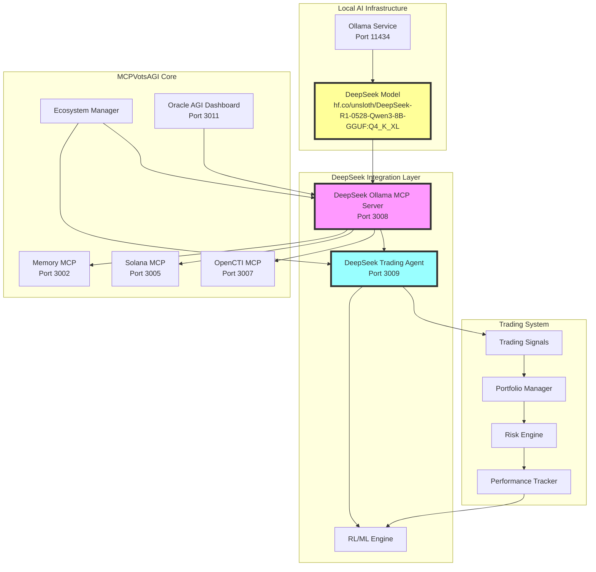

# MCPVotsAGI DeepSeek Integration Documentation

## Overview

MCPVotsAGI now integrates the powerful **DeepSeek-R1-0528-Qwen3-8B-GGUF** model as its primary reasoning engine for advanced decision making, trading strategies, and ecosystem optimization. This integration enables 24/7 autonomous trading with reinforcement learning and self-improvement capabilities.

## Architecture



## Components

### 1. DeepSeek Ollama MCP Server (`deepseek_ollama_mcp_server.py`)

The core reasoning engine that provides:

- **Advanced Reasoning**: Complex problem solving using DeepSeek-R1
- **Trading Analysis**: Market analysis and trading recommendations
- **Security Intelligence**: Threat analysis and security recommendations
- **Ecosystem Optimization**: Resource allocation and service management

**Key Features:**
- WebSocket MCP interface on port 3008
- Response caching for improved performance
- Task-specific temperature settings
- Integration with all MCPVotsAGI services

**API Methods:**
```json
{
  "method": "reasoning/execute",
  "params": {
    "task_type": "trading|security|ecosystem|general",
    "prompt": "Your query here",
    "context": {},
    "temperature": 0.7,
    "max_tokens": 2048
  }
}
```

### 2. DeepSeek Trading Agent (`deepseek_trading_agent.py`)

Autonomous 24/7 trading agent with:

- **Reinforcement Learning**: Q-Learning based strategy adaptation
- **DeepSeek Integration**: Uses reasoning engine for market analysis
- **Portfolio Management**: Automatic position sizing and risk management
- **Performance Tracking**: Comprehensive metrics and self-improvement

**Trading Configuration:**
```python
{
    "max_position_size": 0.1,      # 10% max per position
    "stop_loss": 0.05,              # 5% stop loss
    "take_profit": 0.15,            # 15% take profit
    "min_confidence": 0.7,          # 70% confidence threshold
    "max_daily_trades": 20,
    "slippage_tolerance": 0.01,     # 1% slippage
    "rebalance_threshold": 0.05     # 5% deviation triggers rebalance
}
```

### 3. Reinforcement Learning Engine

**Architecture:**
- State Size: 20 features (prices, volumes, RSI, MACD, portfolio)
- Action Space: 3 actions (buy, sell, hold)
- Q-Learning with experience replay
- Epsilon-greedy exploration strategy

**Learning Parameters:**
```python
learning_rate = 0.001
gamma = 0.95          # Discount factor
epsilon = 1.0         # Initial exploration rate
epsilon_min = 0.01
epsilon_decay = 0.995
batch_size = 32
```

## Installation

### Prerequisites

1. **Ollama**: Install from https://ollama.ai
2. **Python 3.8+**: Required for MCP servers
3. **DeepSeek Model**: Pull using Ollama

### Setup Steps

1. **Install Ollama and pull DeepSeek model:**
```bash
# Install Ollama (varies by platform)
# On Windows: Download from https://ollama.ai

# Pull the specific DeepSeek model
ollama pull hf.co/unsloth/DeepSeek-R1-0528-Qwen3-8B-GGUF:Q4_K_XL

# Verify model is available
ollama list
```

2. **Launch with DeepSeek integration:**
```bash
# Using the dedicated launcher
python launch_with_deepseek.py

# Or using the main launcher
python launcher.py quickstart --trading --security
```

3. **Configure environment (optional):**
```bash
export OLLAMA_HOST=http://localhost:11434
export DEEPSEEK_MODEL=hf.co/unsloth/DeepSeek-R1-0528-Qwen3-8B-GGUF:Q4_K_XL
export TRADING_MODE=LIVE
export MAX_POSITION_SIZE=0.1
```

## Usage Examples

### 1. Direct DeepSeek Reasoning

```python
import websockets
import json

async def query_deepseek():
    async with websockets.connect("ws://localhost:3008") as ws:
        request = {
            "jsonrpc": "2.0",
            "method": "reasoning/execute",
            "params": {
                "task_type": "general",
                "prompt": "Analyze the current gold market trends",
                "temperature": 0.7
            },
            "id": 1
        }
        
        await ws.send(json.dumps(request))
        response = await ws.recv()
        print(json.loads(response))
```

### 2. Trading Analysis

```python
async def get_trading_recommendation():
    async with websockets.connect("ws://localhost:3008") as ws:
        request = {
            "jsonrpc": "2.0",
            "method": "reasoning/trading",
            "params": {
                "prompt": "Should I buy gold at current prices?",
                "portfolio": {
                    "USD": 10000,
                    "positions": {"GOLD": {"amount": 2, "avg_price": 2000}}
                },
                "risk_profile": "moderate"
            },
            "id": 2
        }
        
        await ws.send(json.dumps(request))
        response = await ws.recv()
        data = json.loads(response)
        
        recommendation = data["result"]["trading_recommendation"]
        print(f"Action: {recommendation['action']}")
        print(f"Confidence: {recommendation['confidence']}")
        print(f"Reasoning: {recommendation['reasoning_summary']}")
```

## Performance Optimization

### 1. Model Configuration

The DeepSeek model is optimized for MCPVotsAGI with:
- **Context Size**: 8192 tokens (optimal for Q4_K_XL)
- **Temperature Settings**:
  - Trading: 0.3 (conservative)
  - Security: 0.3 (precise)
  - Ecosystem: 0.5 (balanced)
  - General: 0.7 (creative)

### 2. Caching Strategy

- Response caching with MD5 hash keys
- Automatic cache clearing at 1000 entries
- Cache hit tracking for performance monitoring

### 3. Resource Management

- Automatic Ollama service management
- Health monitoring every 5 minutes
- Graceful degradation if model unavailable

## Trading Strategy

### Market Analysis Pipeline

1. **Data Collection**: Real-time price, volume, indicators
2. **DeepSeek Analysis**: Market sentiment and predictions
3. **RL Decision**: Action selection based on Q-values
4. **Risk Assessment**: Position sizing and stop-loss
5. **Execution**: Trade placement with slippage control
6. **Learning**: Experience replay and model updates

### Performance Metrics

The system tracks:
- Total trades and win rate
- Sharpe ratio and max drawdown
- Average trade duration
- Portfolio value over time
- Model confidence evolution

## Troubleshooting

### Common Issues

1. **"DeepSeek model not found"**
   ```bash
   # Pull the specific model
   ollama pull hf.co/unsloth/DeepSeek-R1-0528-Qwen3-8B-GGUF:Q4_K_XL
   ```

2. **"Ollama not running"**
   ```bash
   # Start Ollama service
   ollama serve
   
   # Or use the launcher
   python launch_with_deepseek.py
   ```

3. **"Connection refused on port 3008"**
   ```bash
   # Check if DeepSeek MCP is running
   python launcher.py status
   
   # Restart specific service
   python launcher.py restart deepseek_mcp
   ```

### Performance Tuning

1. **Reduce context size for faster responses:**
   ```python
   MODEL_CONTEXT_SIZE = 4096  # Reduce from 8192
   ```

2. **Adjust trading parameters:**
   ```python
   TRADING_TEMPERATURE = 0.2  # More conservative
   MAX_POSITION_SIZE = 0.05   # Smaller positions
   ```

3. **Enable GPU acceleration (if available):**
   ```bash
   # Check GPU support
   ollama list --verbose
   
   # Configure GPU layers
   export OLLAMA_NUM_GPU=999  # Use all available
   ```

## Security Considerations

1. **API Keys**: Store securely in environment variables
2. **Trading Limits**: Implement position and loss limits
3. **Network Security**: Use localhost only for Ollama
4. **Audit Logging**: All trades are logged with reasoning

## Future Enhancements

1. **Multi-Model Ensemble**: Combine multiple AI models
2. **Advanced RL**: Implement PPO or A3C algorithms
3. **Social Sentiment**: Integrate news and social data
4. **Cross-Asset Arbitrage**: Expand beyond precious metals
5. **Distributed Training**: Multi-agent learning system

## Conclusion

The DeepSeek integration transforms MCPVotsAGI into an advanced autonomous trading and reasoning system. With continuous learning and 24/7 operation, the system adapts to market conditions while managing risk intelligently.

For support or contributions, please refer to the main MCPVotsAGI documentation.