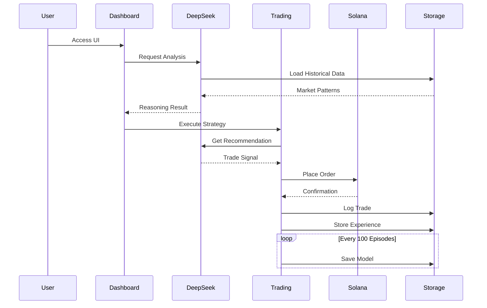
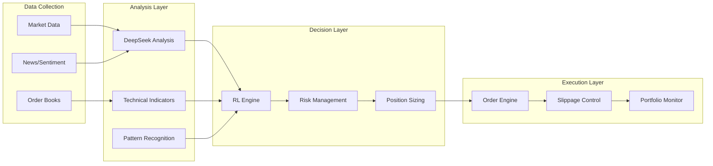
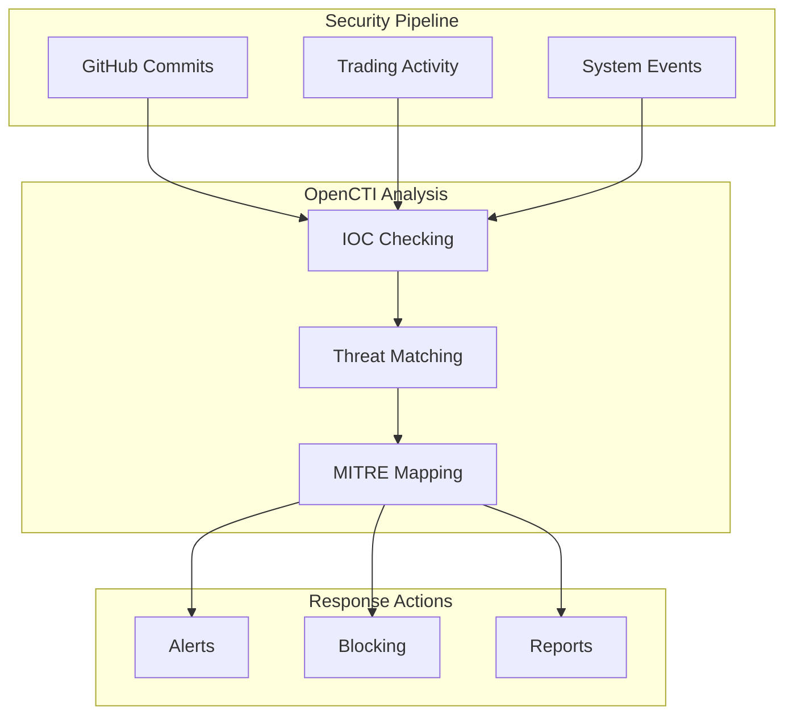

# 🚀 MCPVotsAGI Complete Documentation

## Table of Contents
1. [Executive Summary](#executive-summary)
2. [System Architecture](#system-architecture)
3. [DeepSeek Integration](#deepseek-integration)
4. [F:\ Drive Storage Infrastructure](#f-drive-storage-infrastructure)
5. [MCP Servers](#mcp-servers)
6. [Trading System](#trading-system)
7. [Security Integration](#security-integration)
8. [Installation & Setup](#installation--setup)
9. [API Documentation](#api-documentation)
10. [Operational Procedures](#operational-procedures)

---

## Executive Summary

MCPVotsAGI is a comprehensive AGI ecosystem that combines:
- **18+ MCP Servers** for modular AI capabilities
- **DeepSeek-R1 Integration** for advanced reasoning
- **853 GB F:\ Drive Storage** for massive data processing
- **24/7 Autonomous Trading** with RL/ML algorithms
- **OpenCTI Security** for threat intelligence
- **Self-Healing Infrastructure** with auto-recovery

### Key Metrics
- **Storage Capacity**: 853 GB on F:\ drive
- **RL Buffer Size**: 50 million experiences
- **Market Data**: 5 years historical
- **Model Versions**: 100+ checkpoint retention
- **Trading Performance**: Sharpe ratio tracking
- **Uptime Target**: 99.9% with self-healing

---

## System Architecture

### Complete Ecosystem Overview

```mermaid
graph TB
    subgraph "F:\ Drive Storage [853 GB]"
        subgraph "Data Infrastructure"
            RLD[RL Training Data<br/>200 GB]
            MKD[Market Data<br/>150 GB]
            MDL[Model Checkpoints<br/>100 GB]
            MEM[Memory Store<br/>100 GB]
            TRD[Trading Logs<br/>50 GB]
            SEC[Security Data<br/>50 GB]
            IPFS[IPFS Storage<br/>100 GB]
            BKP[Backups<br/>50 GB]
        end
    end
    
    subgraph "MCPVotsAGI Core Infrastructure"
        subgraph "Core Services"
            EC[Ecosystem Core<br/>Orchestrator]
            OA[Oracle AGI Dashboard<br/>Port: 3011]
            DS[DeepSeek MCP<br/>Port: 3008]
            DST[DeepSeek Trading<br/>Port: 3009]
        end
        
        subgraph "MCP Servers Layer 1"
            MEM_MCP[Memory MCP<br/>:3002]
            GH[GitHub MCP<br/>:3001]
            OLL[Ollama Service<br/>:11434]
            SOL[Solana MCP<br/>:3005]
        end
        
        subgraph "MCP Servers Layer 2"
            BT[Browser Tools<br/>:3006]
            OCT[OpenCTI MCP<br/>:3007]
            TRI[Trilogy AGI<br/>:8000]
            DGM[DGM Evolution<br/>:8013]
        end
        
        subgraph "AI Models"
            DSM[DeepSeek-R1<br/>Local Model]
            GEM[Gemini API]
            CLM[Claude API]
            OLM[Other Ollama Models]
        end
    end
    
    subgraph "Trading & Analytics"
        subgraph "Trading Engine"
            RLE[RL Engine<br/>Q-Learning]
            PFM[Portfolio Manager]
            RSK[Risk Engine]
            EXE[Order Execution]
        end
        
        subgraph "Market Analysis"
            TA[Technical Analysis]
            SA[Sentiment Analysis]
            PA[Pattern Recognition]
            BT_TEST[Backtesting]
        end
    end
    
    subgraph "External Connections"
        PHT[Phantom Wallet]
        MM[MetaMask]
        JUP[Jupiter DEX]
        GIT[GitHub]
        OCTI[OpenCTI Platform]
    end
    
    %% F:\ Drive connections
    RLD --> RLE
    MKD --> TA
    MDL --> DSM
    MEM --> MEM_MCP
    TRD --> PFM
    SEC --> OCT
    
    %% Core connections
    EC --> DS
    EC --> DST
    EC --> OA
    DS --> DSM
    DST --> RLE
    
    %% MCP connections
    DS --> MEM_MCP
    DS --> SOL
    DST --> SOL
    DST --> PFM
    
    %% External connections
    SOL --> JUP
    GH --> GIT
    OCT --> OCTI
    OA --> PHT
    OA --> MM
    
    %% Data flow
    TA --> DST
    SA --> DST
    PA --> DST
    DST --> EXE
    EXE --> SOL
    
    style DS fill:#ff9,stroke:#333,stroke-width:4px
    style DST fill:#9ff,stroke:#333,stroke-width:4px
    style RLD fill:#f96,stroke:#333,stroke-width:2px
    style EC fill:#69f,stroke:#333,stroke-width:4px
```



### Component Communication Flow



---

## DeepSeek Integration

### Model Specifications
- **Model**: `hf.co/unsloth/DeepSeek-R1-0528-Qwen3-8B-GGUF:Q4_K_XL`
- **Size**: 5.1 GB
- **Context Window**: 8192 tokens
- **Quantization**: Q4_K_XL (4-bit)

### DeepSeek MCP Server

The DeepSeek MCP server provides advanced reasoning capabilities:

```python
# Connection example
import websockets
import json

async def query_deepseek():
    async with websockets.connect("ws://localhost:3008") as ws:
        request = {
            "jsonrpc": "2.0",
            "method": "reasoning/trading",
            "params": {
                "prompt": "Analyze gold market trends",
                "portfolio": {...},
                "risk_profile": "moderate"
            },
            "id": 1
        }
        await ws.send(json.dumps(request))
        response = await ws.recv()
```

### Available Methods

1. **reasoning/execute** - General reasoning
2. **reasoning/trading** - Trading analysis
3. **reasoning/security** - Security assessment
4. **reasoning/ecosystem** - System optimization
5. **reasoning/status** - Server status

### Temperature Settings
- **Trading**: 0.3 (conservative)
- **Security**: 0.3 (precise)
- **Ecosystem**: 0.5 (balanced)
- **General**: 0.7 (creative)

---

## F:\ Drive Storage Infrastructure

### Storage Allocation (853 GB Total)

| Category | Size | Purpose |
|----------|------|---------|
| RL Training | 200 GB | Experience replay, training data |
| Market Data | 150 GB | Historical prices, indicators |
| Model Checkpoints | 100 GB | Saved models, weights |
| Memory Store | 100 GB | Knowledge graph, embeddings |
| Trading Logs | 50 GB | Trade history, performance |
| Security Data | 50 GB | Threat intel, IOCs |
| IPFS Storage | 100 GB | Distributed storage |
| Backups | 50 GB | System snapshots |
| Temp Workspace | 53 GB | Processing buffer |

### Directory Structure

```
F:\MCPVotsAGI_Data\
├── rl_training\
│   ├── experience_replay\     # HDF5 replay buffers
│   ├── training_data\         # Training datasets
│   ├── checkpoints\           # Model saves
│   └── tensorboard\           # Training logs
├── market_data\
│   ├── price_history\         # OHLCV data
│   ├── order_books\           # Depth snapshots
│   ├── tick_data\             # Trade ticks
│   ├── indicators\            # Calculated indicators
│   └── news_sentiment\        # Sentiment data
├── models\
│   ├── deepseek\              # DeepSeek checkpoints
│   ├── trading_agents\        # RL models
│   ├── ensemble\              # Combined models
│   └── fine_tuned\            # Custom models
├── memory\
│   ├── knowledge_graph\       # Graph database
│   ├── embeddings\            # Vector embeddings
│   ├── vector_db\             # Vector search
│   └── reasoning_cache\       # Cached responses
├── trading\
│   ├── live_positions\        # Current holdings
│   ├── history\               # Trade journal
│   ├── metrics\               # Performance data
│   └── backtests\             # Test results
├── security\
│   ├── threat_intel\          # Threat data
│   ├── ioc\                   # IOC database
│   ├── audit\                 # Audit logs
│   └── incidents\             # Reports
├── ipfs\
│   ├── blocks\                # IPFS blocks
│   ├── datastore\             # IPFS data
│   └── pins\                  # Pinned content
└── backups\
    ├── daily\                 # Daily backups
    ├── weekly\                # Weekly backups
    └── snapshots\             # System snapshots
```

### Data Management

```bash
# Check storage usage
python manage_f_drive_data.py usage

# Clean old data (30+ days)
python manage_f_drive_data.py cleanup 30

# Optimize storage (compress logs)
python manage_f_drive_data.py optimize
```

---

## MCP Servers

### Critical Services (Priority 1-2)

#### 1. Memory MCP (Port 3002)
- **Purpose**: Knowledge graph and persistent memory
- **Capabilities**: Store, retrieve, query, update
- **Storage**: F:\MCPVotsAGI_Data\memory

#### 2. GitHub MCP (Port 3001)
- **Purpose**: Repository management
- **Capabilities**: Clone, commit, PR, sync
- **Integration**: Daily sync workflow

#### 3. DeepSeek MCP (Port 3008)
- **Purpose**: Advanced reasoning engine
- **Model**: Local Ollama DeepSeek-R1
- **Capabilities**: Trading, security, optimization

#### 4. Solana MCP (Port 3005)
- **Purpose**: Blockchain integration
- **Capabilities**: Trading, DeFi, wallet management
- **Focus**: Precious metals tokens

### AI/AGI Services (Priority 3)

#### 5. Trilogy AGI (Port 8000)
- Gateway for unified AI access

#### 6. DGM Evolution (Port 8013)
- Evolution strategies for trading

#### 7. OpenCTI MCP (Port 3007)
- Security threat intelligence
- MITRE ATT&CK integration

### Infrastructure Services

#### 8. Ollama (Port 11434)
- Local model hosting
- DeepSeek-R1 primary model

#### 9. IPFS (Port 5001)
- Distributed storage
- 100 GB allocation on F:\

---

## Trading System

### Architecture



### Trading Configuration

```python
trading_config = {
    "max_position_size": 0.1,      # 10% max per position
    "stop_loss": 0.05,              # 5% stop loss
    "take_profit": 0.15,            # 15% take profit
    "min_confidence": 0.7,          # 70% confidence threshold
    "max_daily_trades": 20,
    "slippage_tolerance": 0.01,     # 1% slippage
    "rebalance_threshold": 0.05,    # 5% deviation
    "kelly_fraction": 0.25          # Kelly criterion safety
}
```

### RL/ML Architecture

#### State Space (50 features)
- Price data (normalized)
- Volume metrics
- Technical indicators (RSI, MACD, Bollinger)
- Order book imbalance
- Market regime classification
- Correlation matrix features
- Portfolio state

#### Action Space (5 actions)
1. Strong Buy (100% confidence)
2. Buy (50% confidence)
3. Hold
4. Sell (50% confidence)
5. Strong Sell (100% confidence)

#### Reward Function
```python
reward = profit_normalized + risk_penalty + holding_cost
```

### Performance Metrics

- **Sharpe Ratio**: Risk-adjusted returns
- **Max Drawdown**: Maximum loss from peak
- **Win Rate**: Percentage of profitable trades
- **Average Trade Duration**: Time in position
- **Total P&L**: Cumulative profit/loss

---

## Security Integration

### OpenCTI Integration



### Security Features
- Real-time threat monitoring
- Automated IOC checking
- STIX2 compliance
- Incident response automation
- Audit trail on F:\ drive

---

## Installation & Setup

### Prerequisites
1. **Python 3.8+**
2. **Ollama** (https://ollama.ai)
3. **F:\ Drive** with 853 GB free space
4. **16 GB RAM** (32 GB recommended)
5. **Git**

### Quick Setup

```bash
# 1. Clone repository
git clone https://github.com/kabrony/MCPVotsAGI.git
cd MCPVotsAGI

# 2. Configure F:\ drive storage
python configure_f_drive_storage.py

# 3. Pull DeepSeek model
ollama pull hf.co/unsloth/DeepSeek-R1-0528-Qwen3-8B-GGUF:Q4_K_XL

# 4. Launch ecosystem
LAUNCH_DEEPSEEK_ECOSYSTEM.bat
```

### Environment Variables

```bash
# F:\ Drive paths
MCPVOTSAGI_DATA_ROOT=F:\MCPVotsAGI_Data
MCPVOTSAGI_RL_DATA=F:\MCPVotsAGI_Data\rl_training
MCPVOTSAGI_MARKET_DATA=F:\MCPVotsAGI_Data\market_data
MCPVOTSAGI_MODEL_PATH=F:\MCPVotsAGI_Data\models

# DeepSeek config
DEEPSEEK_MODEL=hf.co/unsloth/DeepSeek-R1-0528-Qwen3-8B-GGUF:Q4_K_XL
OLLAMA_HOST=http://localhost:11434

# API keys (optional)
GITHUB_TOKEN=your_token
OPENCTI_TOKEN=your_token
SOLANA_WALLET=your_address
```

---

## API Documentation

### DeepSeek MCP API

#### General Reasoning
```json
{
  "jsonrpc": "2.0",
  "method": "reasoning/execute",
  "params": {
    "task_type": "general",
    "prompt": "Your question here",
    "temperature": 0.7,
    "max_tokens": 2048
  },
  "id": 1
}
```

#### Trading Analysis
```json
{
  "jsonrpc": "2.0",
  "method": "reasoning/trading",
  "params": {
    "prompt": "Market analysis request",
    "portfolio": {
      "USD": 10000,
      "positions": {}
    },
    "risk_profile": "moderate"
  },
  "id": 2
}
```

### Memory MCP API

#### Store Memory
```json
{
  "jsonrpc": "2.0",
  "method": "memory/store",
  "params": {
    "key": "trading_strategy_v1",
    "value": {...},
    "tags": ["trading", "strategy"]
  },
  "id": 3
}
```

#### Retrieve Memory
```json
{
  "jsonrpc": "2.0",
  "method": "memory/retrieve",
  "params": {
    "key": "trading_strategy_v1"
  },
  "id": 4
}
```

### Oracle AGI Dashboard API

#### Get System Status
```http
GET http://localhost:3011/api/status
```

#### Execute Command
```http
POST http://localhost:3011/api/execute
Content-Type: application/json

{
  "tool": "memory_mcp",
  "method": "store",
  "params": {...}
}
```

---

## Operational Procedures

### Daily Operations

1. **Morning Checks (9 AM)**
   - Verify all services running
   - Check F:\ drive usage
   - Review overnight trading performance
   - Update market data

2. **Midday Review (1 PM)**
   - Analyze trading metrics
   - Check DeepSeek performance
   - Monitor resource usage
   - Review security alerts

3. **End of Day (5 PM)**
   - Generate daily reports
   - Backup critical data
   - Clean temporary files
   - Plan next day strategy

### Weekly Maintenance

1. **Monday**: Full system backup to F:\
2. **Wednesday**: Clean old RL experiences
3. **Friday**: Update models and strategies

### Emergency Procedures

#### Service Failure
```bash
# Check status
python launcher.py doctor

# Restart specific service
python launcher.py restart deepseek_mcp

# Full restart
python launcher.py restart --all
```

#### Storage Full
```bash
# Check usage
python manage_f_drive_data.py usage

# Emergency cleanup
python manage_f_drive_data.py cleanup 7

# Compress old data
python manage_f_drive_data.py optimize
```

#### Model Corruption
```bash
# Restore from backup
copy F:\MCPVotsAGI_Data\backups\models\latest\* F:\MCPVotsAGI_Data\models\

# Retrain from checkpoint
python deepseek_trading_agent_enhanced.py --restore-checkpoint
```

### Performance Optimization

1. **Memory Management**
   - Keep active dataset under 32 GB
   - Use HDF5 for large arrays
   - Implement data pagination

2. **Model Optimization**
   - Quantize models when possible
   - Use batch inference
   - Cache frequent queries

3. **Storage Optimization**
   - Compress logs older than 7 days
   - Archive backtests monthly
   - Use parquet for time series

---

## Troubleshooting Guide

### Common Issues

#### "DeepSeek model not found"
```bash
ollama list
ollama pull hf.co/unsloth/DeepSeek-R1-0528-Qwen3-8B-GGUF:Q4_K_XL
```

#### "Port already in use"
```bash
# Windows
netstat -ano | findstr :3008
taskkill /F /PID <PID>

# Linux
lsof -ti:3008 | xargs kill -9
```

#### "F:\ drive not accessible"
1. Check drive is mounted
2. Verify permissions
3. Run as Administrator

#### "Out of memory"
1. Reduce batch size in config
2. Clear reasoning cache
3. Restart Ollama service

### Debug Mode

```bash
# Enable debug logging
set MCPVOTSAGI_DEBUG=true

# Run with verbose output
python launcher.py start --log-level DEBUG

# Check specific service logs
tail -f logs/deepseek_mcp.log
```

---

## Conclusion

MCPVotsAGI represents a comprehensive AGI ecosystem that combines:
- Advanced reasoning with DeepSeek-R1
- Massive data processing with 853 GB storage
- 24/7 autonomous trading with RL/ML
- Enterprise-grade security integration
- Self-healing infrastructure

The system is designed for continuous operation, learning, and improvement, making it suitable for production trading and research applications.

For support: https://github.com/kabrony/MCPVotsAGI/issues