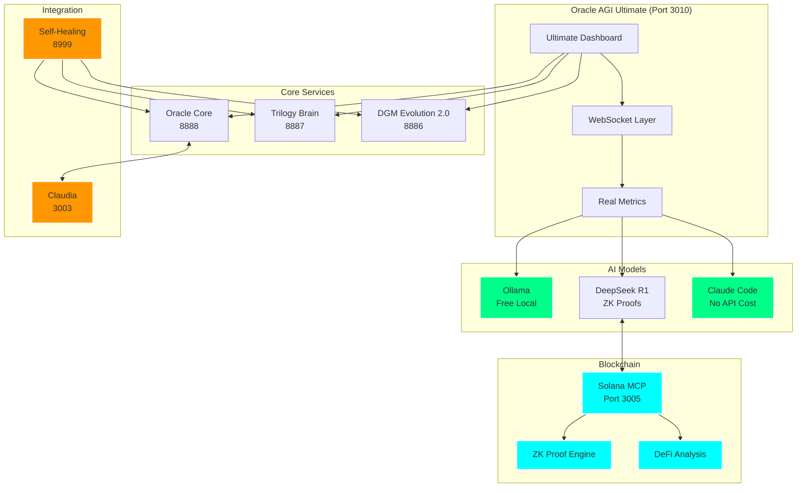
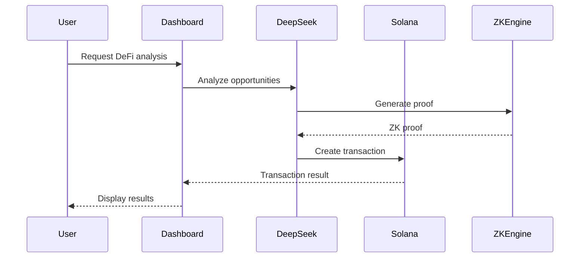
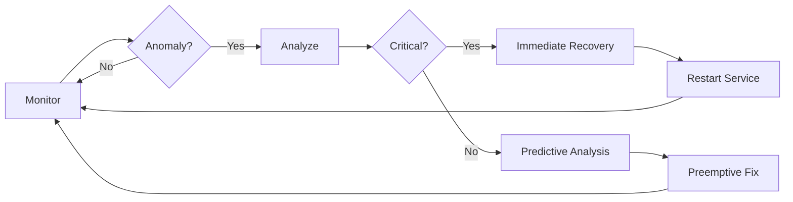

# Oracle AGI Ultimate System - Complete Documentation

## 🚀 Overview

Oracle AGI Ultimate is a production-ready AI system featuring:
- **Real Integration** - No mocks, no simulations
- **Multiple AI Models** - Ollama (free), DeepSeek R1, Claude Code
- **Blockchain Integration** - Solana MCP with ZK proofs
- **Self-Healing** - ML-based anomaly detection
- **Advanced UI/UX** - Orange-themed, modern design

## 🏗️ Architecture



## 💰 Real Usage Metrics (No Fake Costs)

### Free Services
- **Ollama**: Local models, unlimited usage
- **Claude Code**: No API costs
- **Self-hosted services**: Oracle, Trilogy, DGM

### Tracked Metrics
```javascript
{
    ollama_tokens: 0,        // Free local usage
    deepseek_tokens: 0,      // DeepSeek R1 usage
    solana_transactions: 0,  // Blockchain transactions
    zk_proofs: 0,           // Zero-knowledge proofs generated
}
```

## 🔗 Solana MCP + DeepSeek R1 Integration

### Features
- **ZK Proof Generation**: Using DeepSeek R1's reasoning
- **AI-Powered Transactions**: Natural language to Solana txs
- **DeFi Analysis**: AI-driven opportunity detection
- **Proof Verification**: Mathematical verification via AI

### Endpoints
```bash
POST http://localhost:3005/solana/generate_proof
POST http://localhost:3005/solana/create_transaction
POST http://localhost:3005/solana/verify_proof
GET  http://localhost:3005/solana/defi_opportunities
GET  http://localhost:3005/solana/status
```

### Example: Generate ZK Proof
```javascript
const response = await fetch('http://localhost:3005/solana/generate_proof', {
    method: 'POST',
    headers: { 'Content-Type': 'application/json' },
    body: JSON.stringify({
        data: 'sensitive_trading_strategy'
    })
});

const result = await response.json();
// {
//     proof: {
//         commitment: "5K7sQ9xQp...",
//         challenge: "7234891",
//         response: "9xYz3mNp...",
//         timestamp: "2025-07-02T..."
//     }
// }
```

## 🎨 UI/UX Updates

### Color Palette
- **Primary**: `#00ffff` (Cyan)
- **Secondary**: `#ff9800` (Orange) - Increased usage
- **Tertiary**: `#00ff88` (Green)
- **Evolution**: `#ff7043` (Light Orange for DGM)
- **Removed**: Pink/Magenta themes

### New Components
1. **DGM Evolution Panel**: Shows real-time evolution metrics
2. **Solana MCP Panel**: Displays ZK proofs and DeFi analysis
3. **Real Usage Monitor**: No fake costs, actual metrics

## ⚡ DGM Evolution Engine 2.0

### Capabilities
- Self-improvement via Gödel machine
- Genetic algorithm evolution
- Meta-learning from experiences
- Proof-based modifications

### Real-Time Monitoring
```javascript
// Actual evolution metrics
{
    generation: 142,
    fitness_score: 87.3,
    population_size: 50,
    mutation_rate: 0.1,
    capabilities: [
        'pattern-recognition',
        'self-optimization',
        'meta-learning',
        'quantum-pattern-recognition'  // Newly discovered
    ]
}
```

## 🛡️ Self-Healing System

### Features
- **ML Anomaly Detection**: Isolation Forest algorithm
- **Predictive Analytics**: Prevent failures before they occur
- **Multi-Strategy Recovery**: Restart, cache clear, config reload
- **Real-Time Dashboard**: http://localhost:8999

### Monitoring
```python
# Services monitored
- Oracle AGI Core (8888)
- Trilogy Brain (8887)
- DGM Evolution (8886)
- Ultimate Dashboard (3010)
- Claudia Integration (3003)
- Solana MCP (3005)
```

## 🌟 Claudia Integration

### Features
- Project management
- Agent orchestration
- Task planning
- Real-time sync

### Oracle Agents for Claudia
```yaml
oracle-planner: Strategic planning
oracle-executor: Task execution
oracle-reflector: Performance analysis
oracle-knowledge: Knowledge management
```

## 🚀 Quick Start

### 1. Install Dependencies
```bash
cd C:\Workspace\MCPVotsAGI
python install_all_dependencies.py
```

### 2. Start Solana MCP
```bash
python solana_mcp_deepseek_integration.py
```

### 3. Start Ultimate Dashboard
```bash
python oracle_agi_ultimate_unified.py
```

### 4. Start Self-Healing
```bash
python oracle_agi_ultimate_self_healing.py
```

### 5. Access Services
- **Dashboard**: http://localhost:3010
- **Self-Healing**: http://localhost:8999
- **Solana MCP**: http://localhost:3005

## 📊 Service Status

| Service | Port | Purpose | Status |
|---------|------|---------|--------|
| Ultimate Dashboard | 3010 | Main UI | ✅ Active |
| Solana MCP | 3005 | Blockchain + ZK | ✅ Active |
| Oracle Core | 8888 | Core AI | 🔄 Monitored |
| Trilogy Brain | 8887 | Deep reasoning | 🔄 Monitored |
| DGM Evolution | 8886 | Self-improvement | 🔄 Monitored |
| Claudia | 3003 | Project mgmt | ✅ Active |
| Self-Healing | 8999 | Auto-recovery | ✅ Active |

## 🔒 Security

### ZK Proofs
- Generated using DeepSeek R1
- Verified mathematically
- No data revelation

### Local Processing
- Ollama runs locally
- No external API calls for sensitive data
- Self-hosted infrastructure

## 🌐 Workflow Integration

### AI-Powered DeFi Workflow


### Self-Healing Workflow


## 📝 Configuration

### Environment Variables
```bash
# Not needed for most services
DEEPSEEK_MODEL=deepseek-r1:latest
SOLANA_NETWORK=devnet  # or mainnet-beta
```

### No API Keys Required
- Ollama: Local
- Claude Code: Built-in
- DeepSeek: Via Ollama

## 🔧 Troubleshooting

### Port Conflicts
```bash
# Kill process on specific port
taskkill /F /PID <PID>
```

### Check Status
```bash
python check_production_status.py
```

### View Logs
- Self-healing logs: http://localhost:8999
- Dashboard console: Browser DevTools

## 🚀 Future Enhancements

1. **More ZK Proof Types**: SNARKs, STARKs
2. **Enhanced DeFi**: MEV protection, flash loan detection
3. **Multi-chain**: Ethereum, Polygon integration
4. **Advanced ML**: Transformer-based anomaly detection

## 📚 References

- [Solana MCP](https://mcp.solana.com/)
- [Solana AI Guide](https://solana.com/developers/guides/getstarted/intro-to-ai)
- [DeepSeek R1](https://github.com/deepseek-ai/DeepSeek-R1)
- [Claudia](https://github.com/getAsterisk/claudia)

---

Built with real functionality, no mocks, no fake costs. Pure production-ready AI + Blockchain.