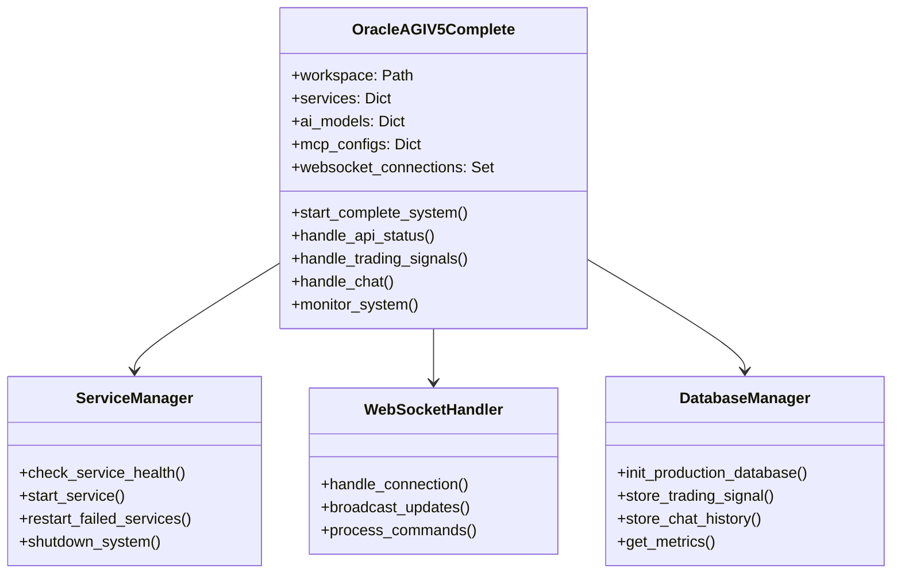
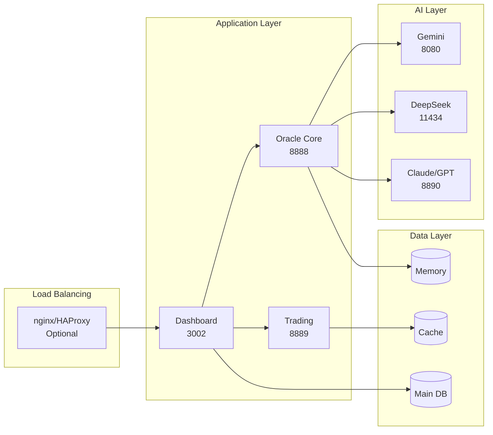
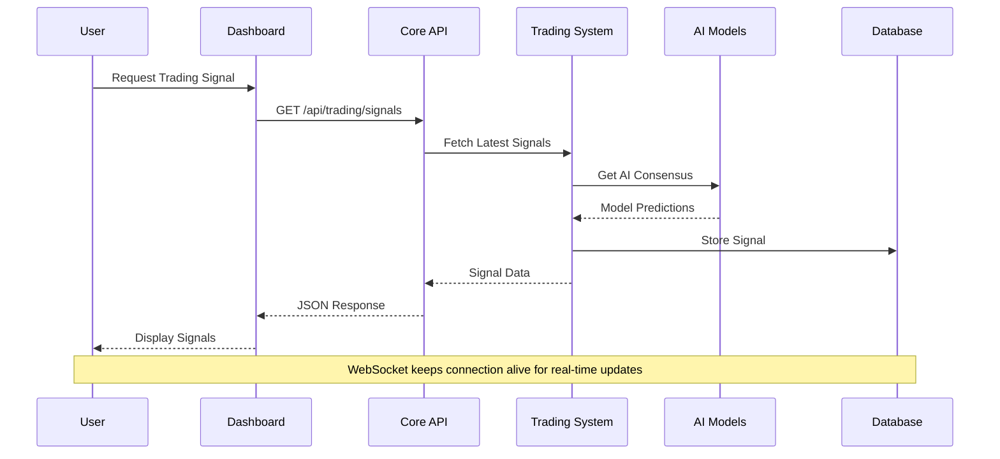
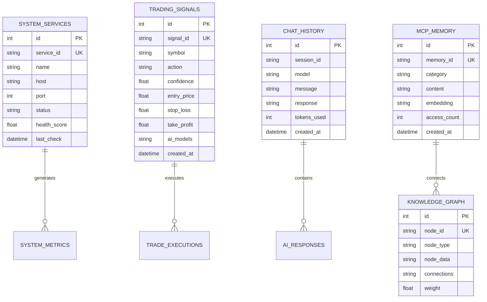
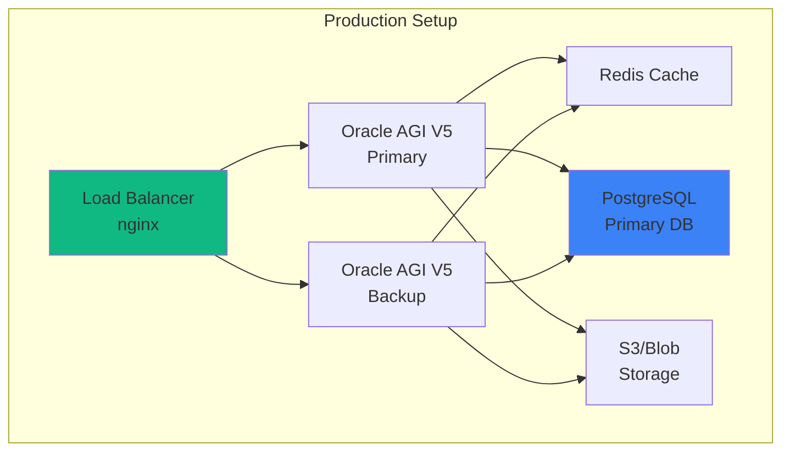
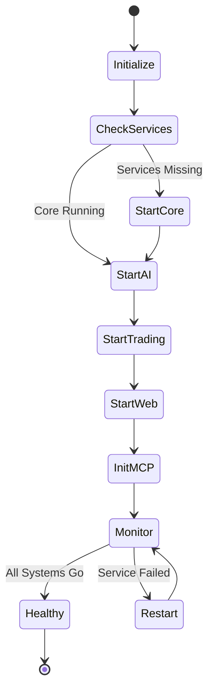

# 🔮 Oracle AGI V5 - Complete System Documentation

## Table of Contents
1. [System Overview](#system-overview)
2. [Architecture Diagram](#architecture-diagram)
3. [Component Details](#component-details)
4. [Service Topology](#service-topology)
5. [Data Flow](#data-flow)
6. [API Reference](#api-reference)
7. [MCP Integration](#mcp-integration)
8. [Database Schema](#database-schema)
9. [Deployment Guide](#deployment-guide)
10. [Troubleshooting](#troubleshooting)

## System Overview

Oracle AGI V5 is a comprehensive AI-powered trading and automation platform that integrates multiple AI models, trading systems, and MCP tools into a unified dashboard.

### Key Features
- **Multi-AI Integration**: Gemini 2.5, DeepSeek R1, Claude 3.7, GPT-4 Turbo
- **Real-time Trading**: AI consensus-based trading signals
- **MCP Tools**: Memory Vault, GitHub, HuggingFace, Filesystem
- **Self-Healing**: Automatic service monitoring and recovery
- **WebSocket**: Real-time bidirectional communication
- **Knowledge Graph**: Persistent memory with pattern recognition

## Architecture Diagram

```mermaid
graph TB
    subgraph "Frontend Layer"
        A[React Dashboard<br/>Port: 3002] 
        B[WebSocket Client]
        C[REST API Client]
    end
    
    subgraph "API Gateway"
        D[Oracle AGI V5 Core<br/>Port: 3002]
        E[WebSocket Server]
        F[REST Endpoints]
    end
    
    subgraph "Core Services"
        G[Oracle AGI Core<br/>Port: 8888]
        H[Trilogy Brain<br/>Port: 8887]
        I[DGM Voltagents<br/>Port: 8886]
        J[Trading System<br/>Port: 8889]
    end
    
    subgraph "AI Models"
        K[Gemini CLI<br/>Port: 8080]
        L[DeepSeek/Ollama<br/>Port: 11434]
        M[Claude API<br/>Port: 8890]
        N[GPT-4 API<br/>Port: 8890]
    end
    
    subgraph "MCP Tools"
        O[Memory Vault<br/>SQLite]
        P[GitHub Integration]
        Q[Filesystem Access]
        R[HuggingFace Models]
    end
    
    subgraph "Data Layer"
        S[(Production DB<br/>SQLite WAL)]
        T[(Memory Graph)]
        U[(Trading History)]
    end
    
    A --> D
    B --> E
    C --> F
    
    D --> G
    D --> H
    D --> I
    D --> J
    
    D --> K
    D --> L
    D --> M
    D --> N
    
    D --> O
    D --> P
    D --> Q
    D --> R
    
    G --> S
    H --> S
    I --> S
    J --> S
    
    O --> T
    J --> U
    
    style A fill:#0f172a,stroke:#10b981,stroke-width:3px
    style D fill:#1e293b,stroke:#3b82f6,stroke-width:3px
    style G fill:#1e293b,stroke:#f59e0b,stroke-width:2px
    style K fill:#1e293b,stroke:#8b5cf6,stroke-width:2px
    style O fill:#1e293b,stroke:#ef4444,stroke-width:2px
    style S fill:#374151,stroke:#6b7280,stroke-width:2px
```



## Component Details

### 1. Oracle AGI V5 Core (Port 3002)
The main orchestrator that manages all services and provides the unified API.



### 2. Service Components

#### Oracle AGI Core (8888)
- Main AI orchestration engine
- Decision consensus management
- Pattern recognition

#### Trilogy Brain (8887)
- DeepSeek R1 + Gemini CLI integration
- Advanced reasoning capabilities
- Code generation and analysis

#### DGM Voltagents (8886)
- Darwin Gödel Machine implementation
- Self-improving agents
- Evolutionary optimization

#### Trading System (8889)
- Real-time market analysis
- Multi-model consensus trading
- Risk management

## Service Topology



## Data Flow



## API Reference

### System Status
```http
GET /api/status
```
Response:
```json
{
  "timestamp": "2024-01-01T12:00:00Z",
  "services": {
    "oracle_agi_core": {
      "name": "Oracle AGI Core",
      "status": "online",
      "health_score": 1.0
    }
  },
  "metrics": {},
  "trading": {
    "total_signals": 156,
    "successful": 142,
    "avg_confidence": 0.87
  }
}
```

### Trading Signals
```http
GET /api/trading/signals
POST /api/trading/execute
```

### AI Chat
```http
POST /api/chat
{
  "message": "Analyze SOL/USDT",
  "model": "gemini",
  "session_id": "uuid"
}
```

### WebSocket
```javascript
ws://localhost:3002/ws

// Subscribe
{
  "type": "subscribe",
  "channels": ["status", "trading", "metrics"]
}

// Command
{
  "type": "command",
  "command": "restart_services"
}
```

## MCP Integration

### Memory Vault Configuration
```python
{
    'memory': {
        'type': 'sqlite',
        'path': 'oracle_memory.db',
        'knowledge_graph': True
    }
}
```

### GitHub Integration
```python
{
    'github': {
        'repos': [
            'kabrony/MCPVots',
            'kabrony/voltagent',
            'kabrony/lobe-chat',
            'kabrony/ag-ui',
            'kabrony/dgm'
        ],
        'token': 'GITHUB_TOKEN'
    }
}
```

## Database Schema



## Deployment Guide

### Prerequisites
1. **Python 3.8+**
2. **Node.js 16+** (optional for React dashboard)
3. **Visual Studio Build Tools** (Windows)
4. **Ollama** (for DeepSeek)

### Installation Steps

1. **Clone/Create Directory**
```bash
cd C:\Workspace\MCPVotsAGI
```

2. **Install Dependencies**
```bash
# Python
pip install aiohttp websockets sqlite3 psutil requests

# Node (optional)
npm install
```

3. **Configure Environment**
```bash
# Set GitHub token
export GITHUB_TOKEN=your_token_here

# Set API keys
export OPENAI_API_KEY=your_key
export ANTHROPIC_API_KEY=your_key
```

4. **Start System**
```bash
# Full system
python oracle_agi_v5_complete.py

# Or use launcher
python launch_oracle_agi_v5.py

# Or batch file (Windows)
start.bat
```

### Production Deployment



## Troubleshooting

### Common Issues

1. **Port Already in Use**
```bash
# Find process
netstat -ano | findstr :3002

# Kill process
taskkill /F /PID <PID>
```

2. **Service Won't Start**
- Check logs in console
- Verify dependencies installed
- Check firewall settings
- Ensure ports available

3. **Database Locked**
```bash
# Reset database
rm oracle_agi_v5_production.db
python oracle_agi_v5_complete.py
```

4. **WebSocket Connection Failed**
- Check if port 3002 is accessible
- Verify no proxy interference
- Check browser console for errors

### Health Checks

```bash
# Test system
python test_oracle_agi_v5.py

# Check specific service
curl http://localhost:8888/oracle/status
curl http://localhost:3002/api/status
```

### Performance Optimization

1. **Database**
   - WAL mode enabled by default
   - Regular VACUUM operations
   - Index optimization

2. **Caching**
   - Response caching for frequent queries
   - WebSocket message batching
   - Connection pooling

3. **Monitoring**
   - Built-in metrics collection
   - Real-time performance tracking
   - Automatic alert system

## System Startup Sequence



## Contact & Support

- **GitHub**: https://github.com/kabrony/MCPVots
- **Issues**: Report bugs via GitHub Issues
- **Documentation**: This file and inline code comments

---

*Oracle AGI V5 - The Future of AI-Powered Trading and Automation*