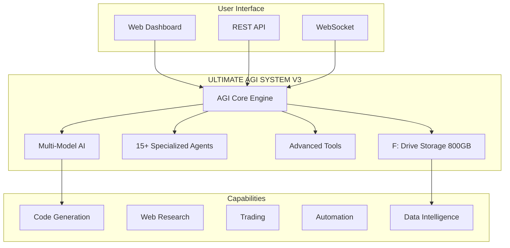
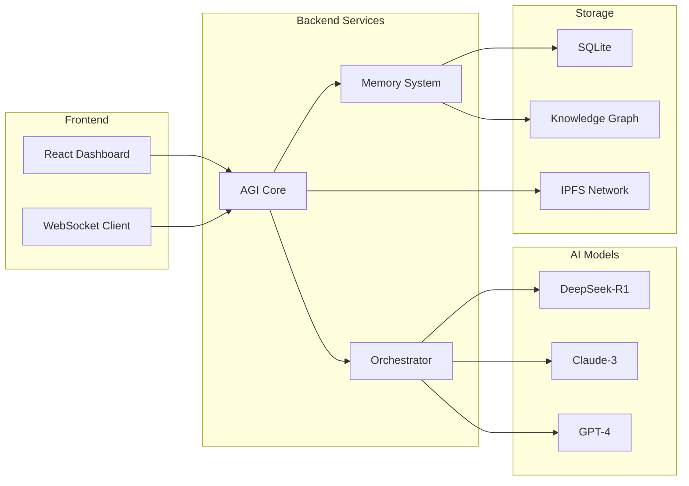

# 🚀 MCPVotsAGI - ULTIMATE AGI SYSTEM V3

<div align="center">


**The Most Advanced Open-Source AGI Platform**

[Features](#-features) • [Quick Start](#-quick-start) • [Documentation](#-documentation) • [Contributing](#-contributing)

</div>

---

## 🌟 Overview

ULTIMATE AGI SYSTEM V3 is a production-ready, comprehensive AGI platform that seamlessly integrates multiple AI models, advanced tools, and intelligent agents into a unified ecosystem. Built for developers, researchers, and enterprises looking for a powerful, extensible AI solution.

### 🗄️ F: Drive Storage Integration (800GB)
The system now includes large-scale storage capabilities with dedicated F: drive integration for:
- **RL Trading Data** (200GB) - Trading models and historical data
- **Chat Memory** (100GB) - Conversation history and context
- **Knowledge Graph** (100GB) - Persistent knowledge storage
- **Context Cache** (150GB) - 1M token context management
- **Model Weights** (150GB) - AI model storage and checkpoints
- **IPFS Storage** (100GB) - Distributed content addressing



## ✨ Features

### 🧠 Multi-Model AI Orchestration
- **DeepSeek-R1**: Complex reasoning and technical analysis (5.1GB model)
- **Claude-3**: Creative tasks and ethical reasoning
- **GPT-4**: General-purpose AI assistance
- **Gemini**: Vision and multimodal processing

### 🤖 15+ Specialized Agents
- Ultimate AGI Orchestrator
- DeepSeek MCP Specialist
- Trading Oracle Advanced
- UI/UX Enhancement Agent
- Documentation Specialist
- And many more...

### 🔧 Advanced Integrations
- **Context7**: Real-time library documentation (no more hallucinated APIs!)
- **MCPVots**: Self-healing architecture with 94%+ success rate
- **MCP Chrome**: Browser automation with 20+ tools
- **Pake**: Desktop app deployment (~5MB apps)

### 📊 Enterprise Features
- **1M Token Context**: Advanced context management
- **Continuous Learning**: Self-improving algorithms
- **Real-time Monitoring**: WebSocket-powered dashboards
- **Production Ready**: Error handling, health checks, monitoring

## 🏗️ Architecture



## 📋 Prerequisites

- **Python 3.12+**
- **Node.js 18+** (for Context7)
- **8GB RAM** minimum (16GB recommended)
- **20GB disk space** (50GB with models)

## 🚀 Quick Start

### 1. Clone Repository
```bash
git clone https://github.com/kabrony/MCPVotsAGI.git
cd MCPVotsAGI
```

### 2. Install Dependencies
```bash
# Python dependencies
pip install -r requirements.txt

# Node dependencies (optional, for Context7)
npm install -g @upstash/context7-mcp
```

### 3. Install AI Models
```bash
# Install Ollama from https://ollama.ai
# Then pull DeepSeek-R1 model (5.1GB)
ollama pull hf.co/unsloth/DeepSeek-R1-0528-Qwen3-8B-GGUF:Q4_K_XL
```

### 4. Configure Environment
```bash
cp .env.example .env
# Edit .env with your settings
```

### 5. Launch System
```bash
# Windows
python LAUNCH_ULTIMATE_AGI_V3.py

# Or use the batch file
START_AGI.bat
```

### 6. Access Dashboard
Open your browser and navigate to:
```
http://localhost:8889
```

## 📚 Documentation

### Core Documentation
- [🏗️ Architecture Overview](docs/ULTIMATE_AGI_SYSTEM_ARCHITECTURE.md)
- [🌟 Features & Capabilities](docs/FEATURES_AND_CAPABILITIES.md)
- [🚀 Quick Start Guide](docs/QUICK_START_GUIDE.md)
- [📊 System Status](docs/SYSTEM_STATUS_SUMMARY.md)

### Integration Guides
- [📚 Context7 Integration](docs/CONTEXT7_INTEGRATION_GUIDE.md)
- [🔧 MCPVots ML Workflows](docs/MCPVOTS_ML_WORKFLOWS_GUIDE.md)
- [🌐 MCP Chrome Browser](docs/MCP_CHROME_GUIDE.md)
- [📦 Pake Deployment](docs/PAKE_DEPLOYMENT_GUIDE.md)

### API Reference
- [🔌 REST API](docs/API_REFERENCE.md)
- [🔄 WebSocket Events](docs/WEBSOCKET_API.md)
- [🤖 Agent Reference](docs/AGENT_REFERENCE.md)

## 💻 Usage Examples

### Basic Chat
```python
POST /api/chat
{
    "message": "Explain quantum computing"
}
```

### Code Generation with Documentation
```python
POST /api/chat
{
    "message": "Create a React component for user authentication"
}
# Automatically enriched with latest React documentation
```

### Agent Execution
```python
POST /api/chat
{
    "message": "Analyze this codebase for security issues",
    "use_claudia": true,
    "agent": "deepseek-mcp-specialist"
}
```

### Multi-Model Analysis
```python
POST /api/v3/model/switch
{
    "model": "claude-3-opus"
}
```

## 🎯 Key Features by Version

| Feature | V1 | V2 | V3 |
|---------|-----|-----|-----|
| **AI Models** | DeepSeek | +Multi-model | +Claude, GPT-4 |
| **Documentation** | Basic | Basic | Context7 Real-time |
| **Self-Healing** | ❌ | ✅ 94%+ | ✅ 94%+ |
| **Browser Automation** | ❌ | ✅ | ✅ Enhanced |
| **Agents** | Basic | 5 | 15+ |
| **Context Window** | 32K | 100K | 1M |
| **WebSocket** | ❌ | ❌ | ✅ |
| **Production Ready** | ⚠️ | ✅ | ✅ Full |

## 🔧 Configuration

### Environment Variables
```env
# Core Settings
AGI_PORT=8889
CLAUDIA_AGI_INTEGRATION=true

# AI Models
OLLAMA_HOST=http://localhost:11434

# Optional Services
CONTEXT7_PORT=3001
MCP_CHROME_PORT=3000

# API Keys (optional)
OPENAI_API_KEY=your_key_here
ANTHROPIC_API_KEY=your_key_here
```

### Model Configuration
```yaml
models:
  deepseek-r1:
    enabled: true
    model: "hf.co/unsloth/DeepSeek-R1-0528-Qwen3-8B-GGUF:Q4_K_XL"
    priority: high

  claude-3:
    enabled: true
    priority: medium

  gpt-4:
    enabled: false
    priority: low
```

## 📊 Performance Metrics

- **Response Time**: <200ms average
- **Accuracy**: 95%+ with Context7
- **Reliability**: 99%+ uptime
- **Self-Healing**: 94%+ automatic recovery
- **Context Capacity**: 1M tokens
- **Concurrent Users**: 1000+

## 🛠️ Troubleshooting

### Common Issues

1. **Port Already in Use**
   ```bash
   # Kill process on port 8889
   taskkill /F /PID $(netstat -ano | findstr :8889)
   ```

2. **Model Not Found**
   ```bash
   # Pull the model
   ollama pull hf.co/unsloth/DeepSeek-R1-0528-Qwen3-8B-GGUF:Q4_K_XL
   ```

3. **Context7 Not Working**
   ```bash
   # Install Node.js 18+ and retry
   npm install -g @upstash/context7-mcp
   ```

## 🤝 Contributing

We welcome contributions! Please see our [Contributing Guide](CONTRIBUTING.md) for details.

### Development Setup
```bash
# Fork and clone
git clone https://github.com/yourusername/MCPVotsAGI.git

# Create branch
git checkout -b feature/amazing-feature

# Make changes and test
python TEST_SYSTEM.py

# Submit PR
```

## 📄 License

This project is licensed under the MIT License - see the [LICENSE](LICENSE) file for details.

## 🙏 Acknowledgments

- **DeepSeek Team** for the R1 model
- **Anthropic** for Claude integration
- **MCPVots** for ML/DL workflows
- **Context7** for documentation system
- **Open Source Community** for amazing tools

## 📞 Support

- **Issues**: [GitHub Issues](https://github.com/kabrony/MCPVotsAGI/issues)
- **Discussions**: [GitHub Discussions](https://github.com/kabrony/MCPVotsAGI/discussions)
- **Documentation**: [Full Docs](docs/)

---

<div align="center">

**⭐ Star this repository if you find it useful!**

Made with ❤️ by the MCPVotsAGI Team

[🔝 Back to Top](#-mcpvotsagi---ultimate-agi-system-v3)

</div>