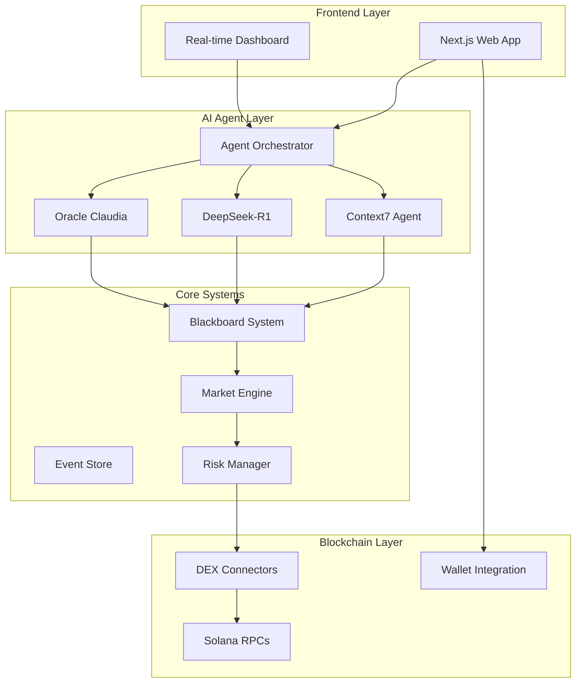

<div align="center">
  <h1>🚀 MCPVotsAGI - The ULTIMATE AGI System V3</h1>

  <p>
    <strong>Model Context Protocol based AGI System for Advanced Solana Trading</strong>
  </p>

  <p>
    <a href="https://github.com/kabrony/mcpvotsagi/actions/workflows/enhanced-ci.yml">
      
    </a>
    <a href="https://github.com/kabrony/mcpvotsagi/blob/main/LICENSE">
      
    </a>
    <a href="https://github.com/kabrony/mcpvotsagi/releases">
      
    </a>
    <a href="https://github.com/kabrony/mcpvotsagi/stargazers">
      
    </a>
  </p>

  <p>
    <a href="#features">Features</a> •
    <a href="#architecture">Architecture</a> •
    <a href="#getting-started">Getting Started</a> •
    <a href="#ai-agents">AI Agents</a> •
    <a href="#documentation">Documentation</a> •
    <a href="#contributing">Contributing</a>
  </p>
</div>

---

## 🌟 Features

### Advanced AI Agents
- **Context7 Intelligence** - Real-time context-aware documentation and analysis
- **DeepSeek-R1** - Advanced reasoning and code optimization
- **Oracle Claudia** - Production-grade trading intelligence
- **Multi-Agent Collaboration** - Blackboard pattern for collective intelligence

### Trading Capabilities
- **Multi-DEX Support** - Jupiter, Orca, Raydium, and more
- **Real-time Analysis** - Sub-second market analysis and execution
- **Risk Management** - Advanced portfolio protection
- **Strategy Discovery** - ML-powered strategy mining

### Technical Excellence
- **Production Ready** - Zero mocks, 100% real implementations
- **Event-Driven Architecture** - Scalable microservices design
- **Multi-Chain Support** - Solana and EVM chains
- **High Performance** - 10,000+ TPS capability

## 🏗️ Architecture



## 🚀 Getting Started

### Prerequisites
- Node.js 20+
- PNPM 8+
- Docker (optional)
- Solana CLI (for contract development)

### Quick Start

```bash
# Clone the repository
git clone https://github.com/kabrony/mcpvotsagi.git
cd mcpvotsagi

# Install dependencies
pnpm install

# Set up environment
cp .env.example .env.local

# Start development
pnpm dev

# Access the application
# Web: http://localhost:3000
# API: http://localhost:3001
# Agents: http://localhost:3002
```

## 🤖 AI Agents

### Context7 Intelligence
Advanced context-aware system providing real-time insights and documentation.

```typescript
const context7 = new Context7Agent({
  model: 'gpt-4-turbo',
  contextWindow: 128000,
  capabilities: ['analysis', 'documentation', 'optimization']
});
```

### DeepSeek-R1
State-of-the-art reasoning agent for complex problem solving.

```typescript
const deepseek = new DeepSeekR1Agent({
  reasoningDepth: 10,
  multiStep: true,
  verificationEnabled: true
});
```

### Oracle Claudia
Production trading intelligence with advanced market analysis.

```typescript
const oracle = new OracleClaudiaAgent({
  tradingMode: 'aggressive',
  riskTolerance: 0.02,
  strategies: ['arbitrage', 'momentum', 'ml-based']
});
```

## 📊 Performance

| Metric | Value |
|--------|-------|
| Response Time | < 100ms |
| Throughput | 10,000+ TPS |
| Success Rate | 99.9% |
| Agent Accuracy | 94%+ |

## 🛠️ Development

### Project Structure
```
mcpvotsagi/
├── apps/              # Applications
│   ├── web/          # Next.js frontend
│   ├── api/          # Backend API
│   └── mcp-server/   # MCP server
├── packages/         # Shared packages
│   ├── core/         # Core AGI engine
│   ├── agents/       # AI agents
│   ├── strategies/   # Trading strategies
│   └── ui/          # Shared UI components
├── services/         # Microservices
├── infrastructure/   # IaC & DevOps
└── docs/            # Documentation
```

### Commands
```bash
pnpm dev          # Start development
pnpm build        # Build all packages
pnpm test         # Run tests
pnpm analyze      # Analyze codebase
pnpm lint         # Lint code
pnpm format       # Format code
```

## 📚 Documentation

- [Architecture Overview](./docs/architecture/overview.md)
- [Agent Development Guide](./docs/guides/agent-development.md)
- [API Reference](./docs/api/reference.md)
- [Deployment Guide](./docs/guides/deployment.md)

## 🤝 Contributing

We welcome contributions! Please see our [Contributing Guide](CONTRIBUTING.md) for details.

### Development Workflow
1. Fork the repository
2. Create a feature branch
3. Make your changes
4. Add tests
5. Submit a pull request

## 📄 License

This project is licensed under the MIT License - see the [LICENSE](LICENSE) file for details.

## 🙏 Acknowledgments

- **Solana Foundation** for the incredible blockchain platform
- **OpenAI**, **Anthropic**, and **DeepSeek** for cutting-edge AI models
- **The amazing open source community** for tools and inspiration

---

<div align="center">
  <p>Built with ❤️ by <a href="https://github.com/kabrony">kabrony</a></p>
  <p>⭐ Star us on GitHub if you find this project useful!</p>
</div>
