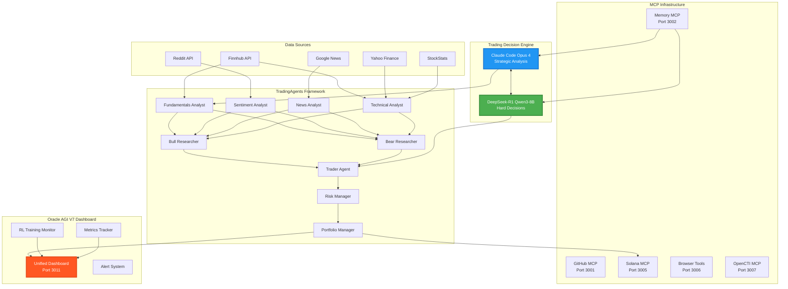
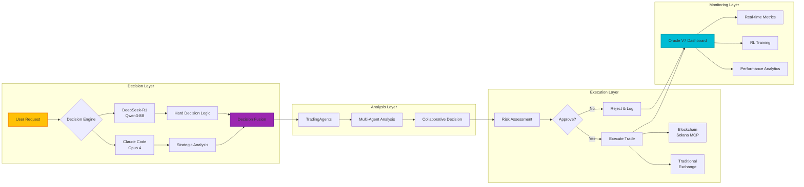
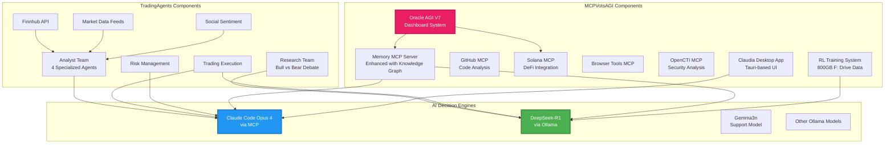

# MCPVotsAGI + TradingAgents Integration
## Unified AI Trading System with Claude Code (Opus 4) & DeepSeek-R1

### 🚀 Overview

This repository combines the power of MCPVotsAGI's Model Context Protocol (MCP) infrastructure with TradingAgents' multi-agent financial trading framework, enhanced by Claude Code (Opus 4) and DeepSeek-R1 for making the hardest trading decisions.



### 🏗️ System Architecture



### 📊 Component Integration Map



### 🔧 Installation & Setup

#### Prerequisites
- Python 3.13+
- Node.js 18+ (for Claudia and some MCP servers)
- Git
- Ollama (with DeepSeek-R1 model installed)
- API Keys: OpenAI, Finnhub, GitHub, Gemini

#### Step 1: Clone and Setup Base
```bash
# Clone MCPVotsAGI (already done)
cd /mnt/c/Workspace/MCPVotsAGI

# Install Python dependencies
pip install -r requirements.txt

# Install TradingAgents dependencies
cd TradingAgents
pip install -r requirements.txt
cd ..
```

#### Step 2: Configure Environment Variables
```bash
# Create .env file
cat > .env << EOF
# API Keys
OPENAI_API_KEY=your_openai_key
FINNHUB_API_KEY=your_finnhub_key
GITHUB_TOKEN=your_github_token
GEMINI_API_KEY=your_gemini_key

# Ollama Configuration
OLLAMA_HOST=http://localhost:11434
DEEPSEEK_MODEL=hf.co/unsloth/DeepSeek-R1-0528-Qwen3-8B-GGUF:Q4_K_XL

# MCP Configuration
MCP_MEMORY_PORT=3002
MCP_GITHUB_PORT=3001
MCP_SOLANA_PORT=3005
ORACLE_AGI_PORT=3011

# RL Data Path
RL_DATA_PATH=F:/MCPVotsAGI/rl_data
EOF
```

#### Step 3: Start MCP Servers
```bash
# Start all MCP servers
python start_all_mcp_servers.py start

# Or start production system
python start_production_system.py
```

#### Step 4: Launch Oracle AGI V7 Dashboard
```bash
# Start the unified dashboard
python oracle_v7_simple.py

# Or use the full version
python oracle_agi_v7_ultimate.py
```

### 🤖 Using the Integrated System

#### Basic Trading Decision
```python
from tradingagents_deepseek_integration import TradingDecisionEngine

# Initialize the decision engine
engine = TradingDecisionEngine(
    use_claude=True,      # Use Claude Code Opus 4
    use_deepseek=True,    # Use DeepSeek-R1 for hard decisions
    ollama_model="hf.co/unsloth/DeepSeek-R1-0528-Qwen3-8B-GGUF:Q4_K_XL"
)

# Make a trading decision
decision = engine.analyze_and_decide(
    ticker="NVDA",
    date="2025-01-03",
    risk_tolerance="moderate"
)

print(decision)
```

#### CLI Usage
```bash
# Use the enhanced CLI with AI integration
python -m cli.main --ai-mode deepseek --decision-engine claude
```

### 📈 Key Features

1. **Multi-AI Decision Making**
   - Claude Code (Opus 4) for strategic analysis
   - DeepSeek-R1 for complex reasoning and hard decisions
   - Consensus mechanism between AI models

2. **Comprehensive Analysis**
   - Fundamental analysis with financial metrics
   - Technical analysis with indicators
   - Sentiment analysis from social media
   - News impact assessment

3. **Risk Management**
   - Multi-level risk assessment
   - Portfolio optimization
   - Real-time monitoring via Oracle V7

4. **Blockchain Integration**
   - Solana MCP for DeFi trading
   - Zero-knowledge proof capabilities
   - Smart contract execution

5. **Reinforcement Learning**
   - 800GB of training data on F: drive
   - Continuous learning from trading outcomes
   - Performance optimization

### 🔄 Daily Update Workflow

```yaml
# .github/workflows/daily-sync.yml
name: Daily TradingAgents Sync

on:
  schedule:
    - cron: '0 0 * * *'  # Daily at midnight
  workflow_dispatch:

jobs:
  sync:
    runs-on: ubuntu-latest
    steps:
      - uses: actions/checkout@v3
      
      - name: Sync from kabrony/TradingAgents
        run: |
          git remote add upstream https://github.com/kabrony/TradingAgents.git
          git fetch upstream
          git merge upstream/main --no-edit
          
      - name: Update Integration
        run: |
          python scripts/update_integration.py
          
      - name: Run Tests
        run: |
          python -m pytest tests/
          
      - name: Deploy to Codespaces
        if: success()
        run: |
          # Deploy to private Codespace
          gh codespace create --repo ${{ github.repository }}
```

### 🧪 Testing the Integration

```bash
# Run integration tests
python -m pytest tests/test_integration.py -v

# Test DeepSeek-R1 connection
python tests/test_deepseek_ollama.py

# Test Claude MCP integration
python tests/test_claude_mcp.py

# Full system test
python tests/test_full_system.py
```

### 📁 Project Structure

```
MCPVotsAGI/
├── TradingAgents/              # Cloned TradingAgents framework
├── oracle_agi_v7_ultimate.py   # Main Oracle AGI system
├── tradingagents_deepseek_integration.py  # DeepSeek integration
├── start_all_mcp_servers.py    # MCP server manager
├── claudia/                    # Claude Desktop App
│   ├── cc_agents/             # Agent configurations
│   └── src/                   # Tauri app source
├── servers/                    # MCP server implementations
├── rl_data/ -> F:/            # Symlink to RL training data
└── docs/                      # Documentation
```

### 🔐 Security Considerations

1. **API Key Management**
   - Store all keys in `.env` file
   - Never commit `.env` to git
   - Use environment variables in production

2. **MCP Security**
   - Each MCP server runs in isolation
   - Authentication required for sensitive operations
   - OpenCTI integration for threat analysis

3. **Trading Safety**
   - Risk limits enforced at multiple levels
   - Approval required for large trades
   - Audit trail for all decisions

### 🚀 Performance Optimization

1. **Parallel Processing**
   - Multi-agent analysis runs concurrently
   - AI models process in parallel when possible
   - Async architecture throughout

2. **Caching Strategy**
   - Market data cached with TTL
   - AI responses cached for identical queries
   - RL model checkpoints for fast loading

3. **Resource Management**
   - Automatic scaling based on load
   - Memory limits per service
   - CPU throttling for non-critical services

### 📊 Monitoring & Metrics

Access the Oracle V7 Dashboard at `http://localhost:3011` to monitor:
- Real-time trading decisions
- AI model performance metrics
- System resource usage
- RL training progress
- Portfolio performance

### 🤝 Contributing

1. Fork the repository
2. Create your feature branch (`git checkout -b feature/AmazingFeature`)
3. Commit your changes (`git commit -m 'Add some AmazingFeature'`)
4. Push to the branch (`git push origin feature/AmazingFeature`)
5. Open a Pull Request

### 📝 License

This project combines multiple open-source components. See individual LICENSE files in respective directories.

### 🙏 Acknowledgments

- TradingAgents team for the multi-agent framework
- Anthropic for Claude Code
- DeepSeek team for the R1 model
- Ollama for local model hosting
- The open-source community

---

**Note**: This system is for research and educational purposes. Always perform due diligence before making real trading decisions.