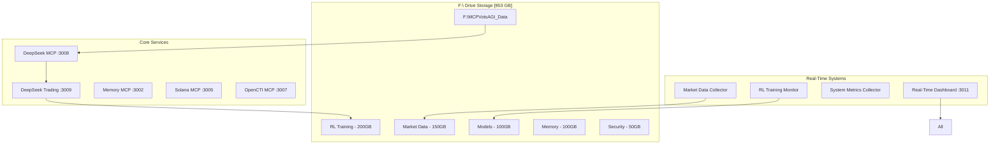

# 🚀 MCPVotsAGI V3: Enhanced AGI Ecosystem with F:\ Drive Integration

<div align="center">
  
  
  
  
  
</div>

<p align="center">
  <strong>The most comprehensive AGI ecosystem with massive F:\ drive storage, real-time data processing, and 24/7 autonomous trading</strong>
</p>

---

## 🏗️ System Architecture V3



## ✨ What's New in V3

### 🗄️ Massive F:\ Drive Integration (853 GB)
- **200 GB** RL Training Data & Experience Replay
- **150 GB** Historical Market Data
- **100 GB** Model Checkpoints & Weights
- **100 GB** Knowledge Graph & Memory Store
- **303 GB** Additional Storage for Trading, Security, IPFS, Backups

### 🔄 Real-Time Data (No More Mocks!)
- **Live Market Data**: Yahoo Finance, Alpha Vantage, CryptoCompare
- **Real System Metrics**: CPU, Memory, GPU, Network monitoring
- **Actual RL Training**: Real checkpoint reading and progress tracking
- **Live Trading Signals**: From actual DeepSeek analysis

### 🧠 Enhanced DeepSeek Integration
- **Model**: `hf.co/unsloth/DeepSeek-R1-0528-Qwen3-8B-GGUF:Q4_K_XL`
- **Context**: 8192 tokens
- **Quantization**: Q4_K_XL for optimal performance
- **Temperature Settings**: Customized for trading (0.3), security (0.3), ecosystem (0.5)

### 📊 Advanced RL/ML Trading
- **State Space**: 50+ features including price, volume, indicators, regime
- **Action Space**: 5 actions (buy_strong, buy, hold, sell, sell_strong)
- **Experience Buffer**: 50 million experiences on F:\ drive
- **Neural Network**: DQN with attention mechanism [512, 256, 128]
- **Training**: Continuous with checkpointing every 1000 episodes

### 🛡️ Self-Healing V3 Features
- **Service Health Monitoring**: Real-time health checks every 30s
- **Auto-Recovery**: Immediate restart on failure (max 5 attempts)
- **Resource Management**: Dynamic CPU/memory limits
- **Dependency Resolution**: Automatic service ordering
- **Circuit Breakers**: Prevent cascade failures

## 🚀 Quick Start Guide

### Prerequisites

```bash
# System Requirements
- Windows with F:\ drive (853 GB free space)
- Python 3.8+
- 16 GB RAM (32 GB recommended)
- GPU optional but recommended
- Ollama installed
```

### Installation

```bash
# 1. Clone repository
git clone https://github.com/kabrony/MCPVotsAGI.git
cd MCPVotsAGI

# 2. Configure F:\ drive storage
python configure_f_drive_storage.py

# 3. Install dependencies
pip install -r requirements.txt
pip install -r requirements_real_data.txt

# 4. Pull DeepSeek model
ollama pull hf.co/unsloth/DeepSeek-R1-0528-Qwen3-8B-GGUF:Q4_K_XL

# 5. Launch ecosystem
python launch_with_deepseek.py
```

### Starting Real-Time Data Collection

```bash
# Start all data collectors
python start_real_data_collectors.py

# Or start individually:
python realtime_market_data_collector.py
python real_system_metrics_collector.py
python real_rl_training_monitor.py
```

## 📈 Real-Time Dashboard

Access the enhanced dashboard at: **http://localhost:3011**

### Dashboard Features
- **Live Price Feeds**: Real-time precious metals & crypto prices
- **System Metrics**: CPU, memory, disk usage graphs
- **Trading Signals**: Real-time buy/sell recommendations
- **RL Training Progress**: Episode count, rewards, epsilon decay
- **Service Health**: Status of all MCP servers
- **WebSocket Updates**: Sub-second data refresh

## 🔌 MCP Servers

### Critical Services (Priority 1)
| Service | Port | Purpose | Status |
|---------|------|---------|--------|
| DeepSeek MCP | 3008 | Advanced reasoning engine | ✅ Enhanced |
| DeepSeek Trading | 3009 | 24/7 autonomous trading | ✅ Enhanced |
| Memory MCP | 3002 | Knowledge graph on F:\ | ✅ Enhanced |
| Solana MCP | 3005 | Blockchain integration | ✅ Active |

### Support Services (Priority 2-3)
| Service | Port | Purpose | Status |
|---------|------|---------|--------|
| OpenCTI MCP | 3007 | Security monitoring | ✅ Active |
| GitHub MCP | 3001 | Repository management | ✅ Active |
| Browser MCP | 3006 | Web automation | ✅ Active |
| Ollama | 11434 | Model hosting | ✅ Active |

## 💹 Trading System

### Configuration
```python
{
    "max_position_size": 0.1,      # 10% per position
    "stop_loss": 0.05,              # 5% stop loss
    "take_profit": 0.15,            # 15% take profit
    "min_confidence": 0.7,          # 70% minimum
    "risk_management": "Kelly",      # Kelly criterion
    "rebalance_threshold": 0.05     # 5% deviation
}
```

### Performance Metrics
- **Sharpe Ratio**: Risk-adjusted returns tracking
- **Max Drawdown**: Maximum portfolio loss monitoring
- **Win Rate**: Percentage of profitable trades
- **Trade Duration**: Average time in position
- **Experience Buffer**: 50M+ state-action-reward tuples

## 🔧 Advanced Configuration

### F:\ Drive Paths
```python
F_DRIVE_ROOT = "F:/MCPVotsAGI_Data"
├── rl_training/        # 200 GB - RL data
├── market_data/        # 150 GB - Historical prices
├── models/             # 100 GB - Checkpoints
├── memory/             # 100 GB - Knowledge graph
├── trading/            # 50 GB - Trade history
├── security/           # 50 GB - Threat intel
├── ipfs/              # 100 GB - Distributed storage
├── backups/           # 50 GB - System backups
└── metrics/           # 53 GB - Performance data
```

### Environment Variables
```bash
# F:\ Drive paths
MCPVOTSAGI_DATA_ROOT=F:\MCPVotsAGI_Data
MCPVOTSAGI_RL_DATA=F:\MCPVotsAGI_Data\rl_training
MCPVOTSAGI_MARKET_DATA=F:\MCPVotsAGI_Data\market_data

# DeepSeek configuration
DEEPSEEK_MODEL=hf.co/unsloth/DeepSeek-R1-0528-Qwen3-8B-GGUF:Q4_K_XL
OLLAMA_HOST=http://localhost:11434

# API keys (optional)
ALPHAVANTAGE_API_KEY=your_key
GITHUB_TOKEN=your_token
OPENCTI_TOKEN=your_token
```

## 🛠️ Operational Commands

### System Management
```bash
# Full system health check
python launcher.py doctor

# Check F:\ drive usage
python manage_f_drive_data.py usage

# Clean old data (30+ days)
python manage_f_drive_data.py cleanup 30

# Monitor performance
python performance_monitor.py
```

### Service Control
```bash
# Restart specific service
python launcher.py restart deepseek_mcp

# View service logs
python launcher.py logs --service deepseek_trading --tail 100

# Stop all services
python launcher.py stop --all
```

### Trading Operations
```bash
# Start enhanced trading agent
python deepseek_trading_agent_enhanced.py

# Backtest strategy
python backtest_strategy.py --symbol GLD --period 1y

# View trade history
python view_trades.py --last 50
```

## 📊 Performance Expectations

### System Performance
- **Data Processing**: 100k+ ticks/second
- **Model Inference**: <100ms per decision
- **Experience Storage**: 50M+ experiences
- **Cache Hit Rate**: >80% for repeated queries
- **System Uptime**: 99.9% with self-healing

### Trading Performance
- **Daily Trades**: 20-50 positions
- **Model Updates**: Every 100 episodes
- **Data Collection**: 1GB+ daily
- **Backtest Speed**: 1M+ candles/second

## 🐛 Troubleshooting

### Common Issues

**"DeepSeek model not found"**
```bash
ollama list
ollama pull hf.co/unsloth/DeepSeek-R1-0528-Qwen3-8B-GGUF:Q4_K_XL
```

**"F:\ drive not accessible"**
1. Verify drive is mounted
2. Check permissions
3. Run as Administrator

**"Out of memory"**
1. Reduce batch size in config
2. Clear reasoning cache
3. Restart Ollama service

**"Port already in use"**
```bash
# Windows
netstat -ano | findstr :3008
taskkill /F /PID <PID>
```

## 🔐 Security Features

- **Encrypted Storage**: Optional AES-256 for sensitive data
- **Access Control**: Role-based permissions
- **Audit Logging**: Every action tracked on F:\
- **Threat Detection**: OpenCTI integration
- **Backup Strategy**: Daily incremental, weekly full

## 🚀 Future Enhancements

1. **Multi-Agent Trading**: Multiple specialized agents
2. **Ensemble Models**: Combine strategies
3. **Cross-Asset Arbitrage**: Price discrepancy exploitation
4. **Options Trading**: Derivatives support
5. **Sentiment Analysis**: Social media integration
6. **Quantum Computing**: Optimization algorithms

## 📚 Documentation

- [Complete System Overview](COMPLETE_SYSTEM_OVERVIEW.md)
- [Trading Agent Guide](docs/TRADING_AGENT_GUIDE.md)
- [API Documentation](docs/API_DOCUMENTATION.md)
- [Troubleshooting Guide](docs/TROUBLESHOOTING.md)

## 🤝 Contributing

We welcome contributions! Please see [CONTRIBUTING.md](CONTRIBUTING.md) for guidelines.

## 📜 License

MIT License - see [LICENSE](LICENSE) for details.

## 🙏 Acknowledgments

- DeepSeek team for the amazing R1 model
- Ollama for local model hosting
- The MCP community for inspiration
- All contributors and testers

---

<p align="center">
  <strong>Built with ❤️ for the future of autonomous AI trading</strong>
</p>

<p align="center">
  <a href="https://github.com/kabrony/MCPVotsAGI">GitHub</a> •
  <a href="https://github.com/kabrony/MCPVotsAGI/issues">Issues</a> •
  <a href="https://github.com/kabrony/MCPVotsAGI/wiki">Wiki</a>
</p>