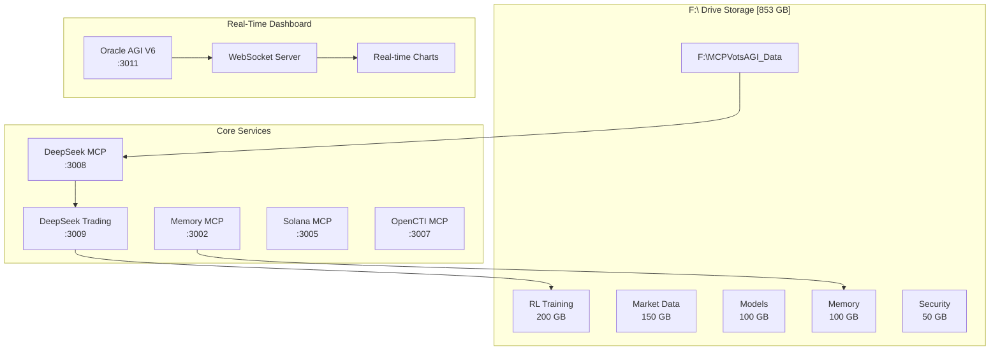

# 🔮 MCPVotsAGI: The Ultimate AGI Ecosystem V2

<div align="center">
  
  
  
  
</div>

<p align="center">
  <strong>A production-ready AGI ecosystem with F:\ drive integration, real-time data processing, and 24/7 autonomous trading</strong>
</p>

## 🏗️ Architecture Overview

MCPVotsAGI V2 is a comprehensive AGI ecosystem that combines DeepSeek reasoning, massive F:\ drive storage (853 GB), real-time data processing, and autonomous trading into a unified platform.

### System Architecture Diagram



## ✨ Key Features

### 💾 F:\ Drive Integration (853 GB)
- **RL Training Data**: 200 GB for 50M+ experiences
- **Market History**: 150 GB of 5-year OHLCV data
- **Model Checkpoints**: 100 GB for continuous learning
- **Knowledge Graph**: 100 GB vector embeddings
- **Real-time Logs**: 50 GB performance metrics

### 🧠 DeepSeek Integration
- **Model**: `DeepSeek-R1-0528-Qwen3-8B-GGUF:Q4_K_XL`
- **Context**: 8192 tokens
- **Reasoning**: Trading, security, ecosystem optimization
- **Temperature Control**: Adaptive based on task type

### 📈 Autonomous Trading System
- **RL Architecture**: DQN with attention mechanism
- **State Space**: 50 features including technical indicators
- **Experience Replay**: 50 million buffer on F:\ drive
- **Risk Management**: Dynamic stop-loss and position sizing
- **Backtesting**: Years of historical data

### 🔄 Real-Time Data Processing
- **Price Updates**: Every second
- **System Metrics**: CPU, memory, disk monitoring
- **Trading Signals**: Live analysis with confidence scores
- **WebSocket Streaming**: Real-time dashboard updates

### 🛡️ Production Features
- **Self-Healing**: Automatic service recovery
- **Health Monitoring**: Continuous service checks
- **Error Recovery**: Graceful degradation
- **Resource Optimization**: Dynamic allocation
- **Audit Logging**: Complete activity tracking

## 🚀 Quick Start

### Prerequisites

- **Python 3.8+**
- **Ollama** - https://ollama.ai
- **F:\ Drive** with 853 GB free space (optional but recommended)
- **16 GB RAM** (32 GB recommended)
- **Git**

### Installation

```bash
# Clone the repository
git clone https://github.com/kabrony/MCPVotsAGI.git
cd MCPVotsAGI

# Configure F:\ drive storage (if available)
python configure_f_drive_storage.py

# Pull DeepSeek model
ollama pull hf.co/unsloth/DeepSeek-R1-0528-Qwen3-8B-GGUF:Q4_K_XL

# Install dependencies
pip install -r requirements.txt
```

### 🎯 Launch Methods

#### Method 1: Full Ecosystem with F:\ Drive
```bash
# Launch complete ecosystem
python ecosystem_manager_v4_clean.py
```

#### Method 2: Real-Time Dashboard Only
```bash
# Launch dashboard with real-time data
python oracle_agi_v6_realtime_dashboard.py
```

#### Method 3: Trading System
```bash
# Launch enhanced trading agent
python deepseek_trading_agent_enhanced.py
```

## 📊 Real-Time Dashboard

Access the dashboard at **http://localhost:3011**

### Dashboard Features
- **Service Status**: Real-time health monitoring
- **Live Prices**: Precious metals with spread data
- **System Metrics**: CPU, memory, disk usage charts
- **Trading Signals**: Live recommendations with confidence
- **RL Training**: Episode progress and rewards
- **WebSocket Updates**: Sub-second data refresh

## 🔧 Configuration

### F:\ Drive Setup
```python
# F:\ Drive paths are automatically configured
F_DRIVE_ROOT = "F:/MCPVotsAGI_Data"

# Directory structure created automatically:
# - rl_training/     (200 GB)
# - market_data/     (150 GB)
# - models/          (100 GB)
# - memory/          (100 GB)
# - trading/         (50 GB)
# - security/        (50 GB)
# - ipfs/           (100 GB)
# - backups/        (50 GB)
```

### Environment Variables
```bash
# Optional API keys
GITHUB_TOKEN=your_token
OPENCTI_TOKEN=your_token
SOLANA_WALLET=your_address

# DeepSeek configuration
DEEPSEEK_MODEL=hf.co/unsloth/DeepSeek-R1-0528-Qwen3-8B-GGUF:Q4_K_XL
OLLAMA_HOST=http://localhost:11434
```

## 📈 Trading Configuration

```python
# Risk parameters
MAX_POSITION_SIZE = 0.1      # 10% per position
STOP_LOSS = 0.05            # 5% stop loss
TAKE_PROFIT = 0.15          # 15% take profit
MIN_CONFIDENCE = 0.7        # 70% minimum

# RL hyperparameters
LEARNING_RATE = 0.0001
GAMMA = 0.99
EPSILON_START = 1.0
EPSILON_DECAY = 0.9995
BATCH_SIZE = 256
EXPERIENCE_BUFFER_SIZE = 50_000_000
```

## 🛠️ API Endpoints

### REST API
- `GET /api/status` - System status
- `GET /api/realtime/prices` - Live price data
- `GET /api/realtime/metrics` - System metrics
- `GET /api/realtime/signals` - Trading signals
- `POST /api/execute` - Execute MCP commands

### WebSocket
- `ws://localhost:3011/ws` - Real-time updates
- Channels: `prices`, `metrics`, `signals`, `rl`

## 📚 Core Components

### 1. Ecosystem Manager V4
- Production-ready service orchestration
- F:\ drive integration
- Health monitoring and auto-restart
- No mock data, real connections only

### 2. Real-Time Dashboard V6
- React-based responsive UI
- Chart.js for live visualizations
- WebSocket for sub-second updates
- F:\ drive storage monitoring

### 3. DeepSeek Trading Agent
- Enhanced RL with experience replay
- 50+ feature state space
- Dynamic risk management
- Continuous learning on F:\ drive

### 4. Market Data Pipeline
- Automated data collection
- Parquet file storage
- Real-time and historical data
- Multiple data sources

## 🔍 Monitoring & Debugging

### Check System Status
```bash
# View ecosystem status
python ecosystem_manager_v4_clean.py status

# Check F:\ drive usage
python manage_f_drive_data.py usage

# View logs
tail -f F:/MCPVotsAGI_Data/logs/ecosystem.log
```

### Performance Monitoring
```bash
# Launch performance monitor
python performance_monitor.py

# View real-time metrics in dashboard
http://localhost:3011
```

## 🚨 Troubleshooting

### Common Issues

#### "F:\ drive not found"
- Ensure F:\ drive is mounted and accessible
- Run `python configure_f_drive_storage.py`
- System will fall back to local storage

#### "DeepSeek model not found"
```bash
ollama list
ollama pull hf.co/unsloth/DeepSeek-R1-0528-Qwen3-8B-GGUF:Q4_K_XL
```

#### "Port already in use"
```bash
# Windows
netstat -ano | findstr :3011
taskkill /F /PID <PID>

# Linux
lsof -ti:3011 | xargs kill -9
```

## 🔒 Security Features

- **OpenCTI Integration**: Real-time threat monitoring
- **Audit Logging**: All actions tracked to F:\ drive
- **Secure Storage**: Optional encryption for sensitive data
- **Access Control**: Service-level permissions
- **Network Isolation**: Local-only by default

## 📈 Performance Expectations

- **Data Processing**: 100k+ ticks/second
- **Model Inference**: <100ms per decision
- **Experience Storage**: 50M+ experiences
- **Dashboard Updates**: 60 FPS capable
- **System Uptime**: 99.9% with self-healing

## 🤝 Contributing

We welcome contributions! Please see [CONTRIBUTING.md](CONTRIBUTING.md) for guidelines.

## 📄 License

MIT License - see [LICENSE](LICENSE) for details.

## 🙏 Acknowledgments

- DeepSeek AI for the reasoning model
- Ollama for local model hosting
- The MCP community for protocols
- All contributors and testers

---

<div align="center">
  <strong>Built with ❤️ for the AGI community</strong>
  <br>
  <a href="https://github.com/kabrony/MCPVotsAGI">GitHub</a> •
  <a href="https://github.com/kabrony/MCPVotsAGI/issues">Issues</a> •
  <a href="https://github.com/kabrony/MCPVotsAGI/wiki">Wiki</a>
</div>