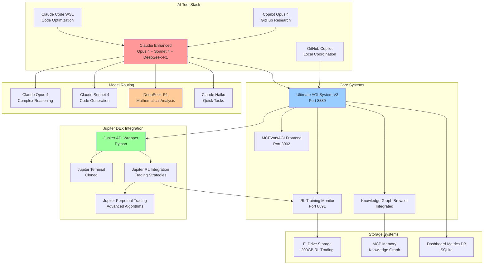
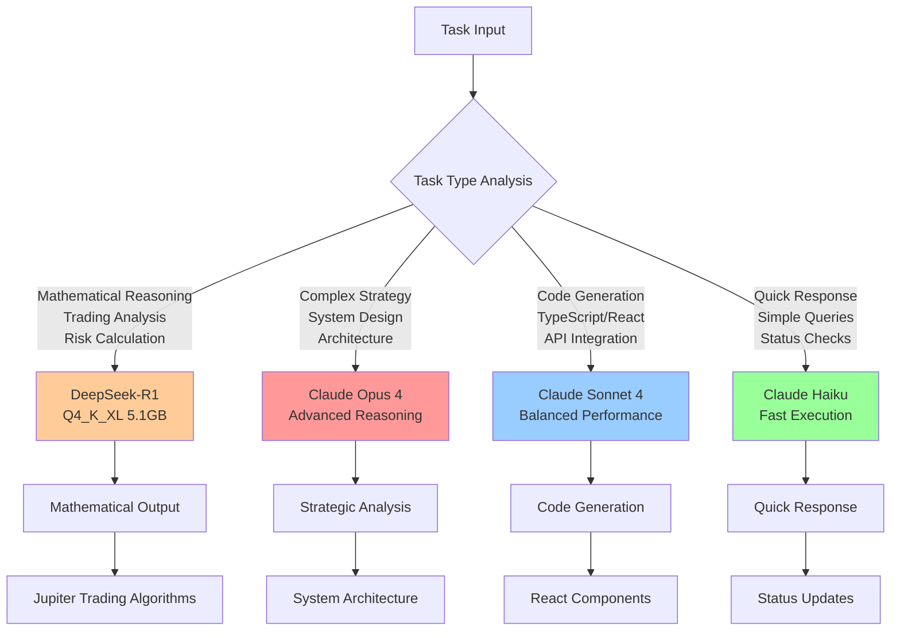
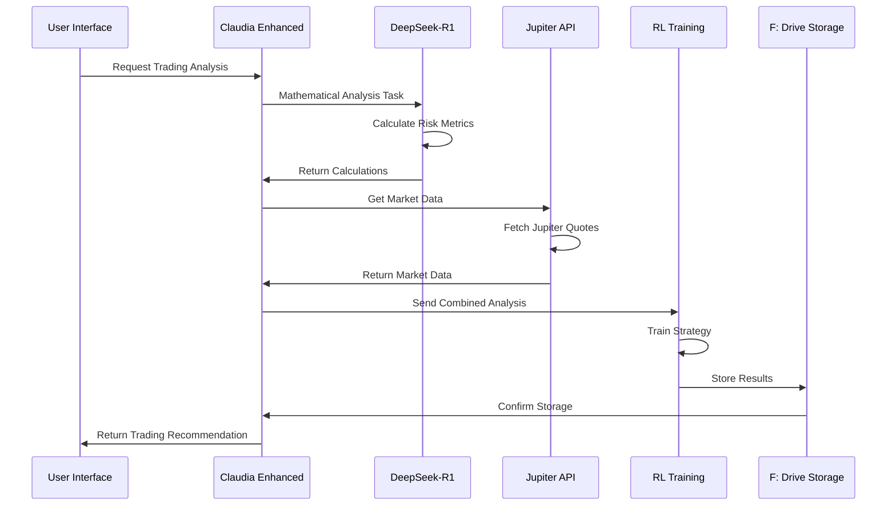
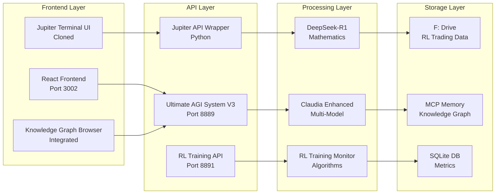
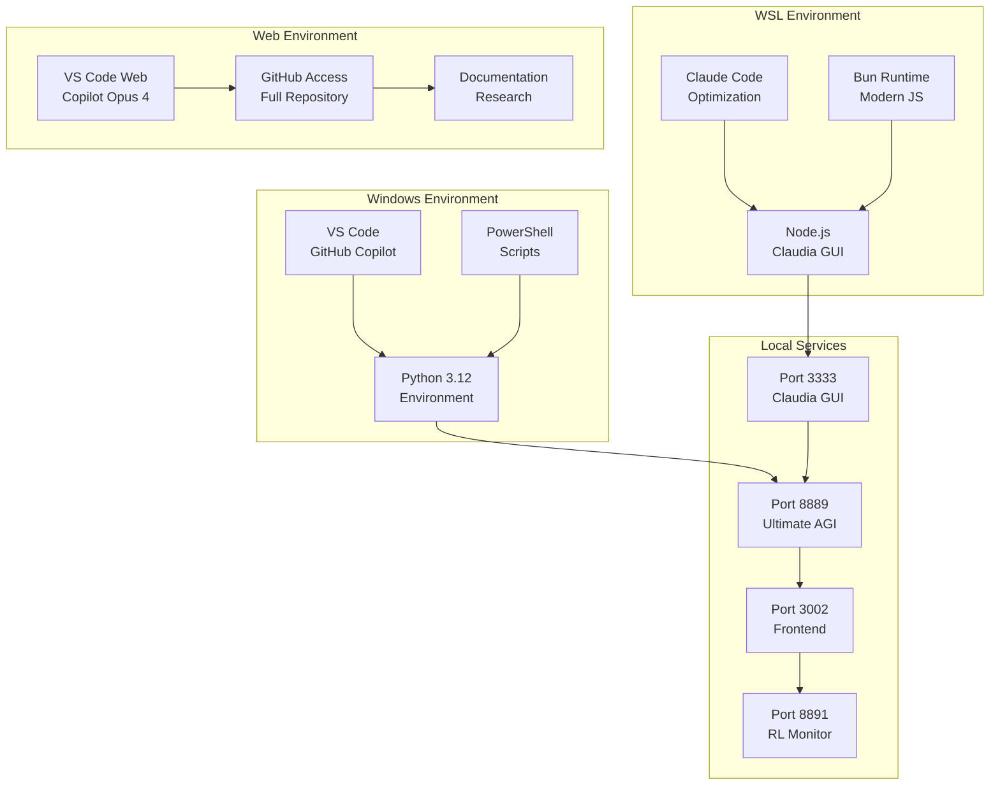
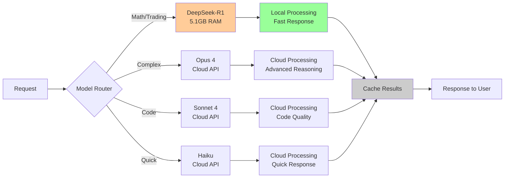
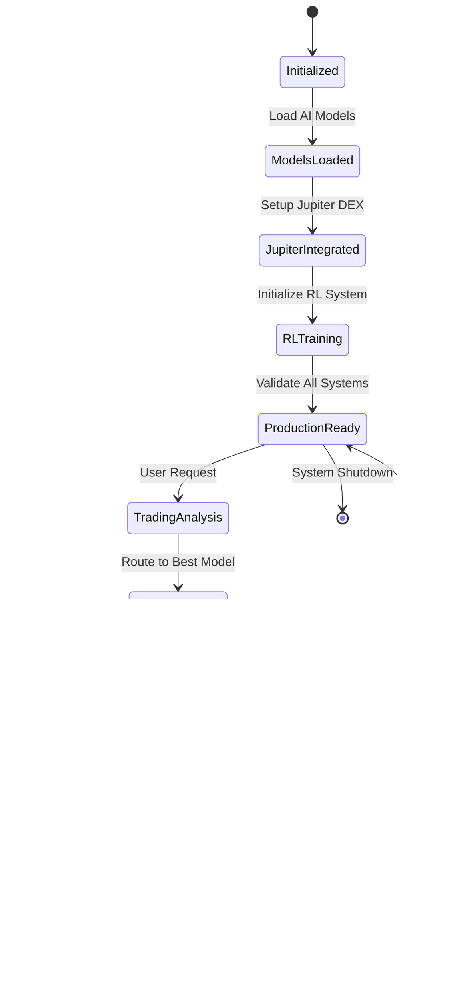

# 🏗️ MCPVotsAGI System Architecture v3.0
**Enhanced with DeepSeek-R1 and Jupiter DEX Integration**

## 📊 System Overview



## 🧠 Model Selection Strategy



## 🔄 Jupiter DEX Integration Flow



## 🏢 Component Architecture



## 📊 Model Performance Matrix

| Model | Use Case | Tokens | Temperature | Performance |
|-------|----------|--------|-------------|-------------|
| **DeepSeek-R1** | Mathematical Trading Analysis | 8192 | 0.15 | ⭐⭐⭐⭐⭐ |
| **Claude Opus 4** | Complex Strategy Planning | 4096 | 0.1 | ⭐⭐⭐⭐⭐ |
| **Claude Sonnet 4** | Code Generation | 4096 | 0.2 | ⭐⭐⭐⭐ |
| **Claude Haiku** | Quick Responses | 2048 | 0.3 | ⭐⭐⭐ |

## 🔧 Deployment Architecture



## 🚀 Performance Optimization



## 📁 Directory Structure

```
MCPVotsAGI/
├── 🧠 AI Models & Agents
│   ├── claudia/                    # Claudia Enhanced GUI
│   │   ├── src/config/models.json  # Model configurations
│   │   ├── cc_agents/              # Enhanced agent templates
│   │   └── start_enhanced.py       # Startup script
│   ├── Claude-Code-Usage-Monitor/  # Usage monitoring
│   └── deepseek_trading_agent.py   # DeepSeek integration
│
├── 🚀 Jupiter DEX Integration
│   ├── jupiter-terminal/           # Cloned Jupiter UI
│   ├── jupiter-swap-api-client/    # API client
│   ├── jupiter-cpi-swap-example/   # CPI examples
│   ├── jupiter_api_wrapper.py      # Python wrapper
│   └── jupiter_rl_integration.py   # RL integration
│
├── 🏗️ Core Systems
│   ├── src/core/                   # Core AGI system
│   │   ├── ULTIMATE_AGI_SYSTEM_V3.py
│   │   └── claudia_integration_bridge.py
│   ├── frontend/                   # React frontend
│   └── real_rl_training_monitor.py # RL training
│
├── 💾 Storage & Data
│   ├── F:/ULTIMATE_AGI_DATA/       # F: drive storage
│   │   ├── RL_TRADING/             # Trading data
│   │   ├── CHAT_MEMORY/            # Conversations
│   │   └── KNOWLEDGE_GRAPH/        # Graph data
│   └── ecosystem_knowledge.db      # Local database
│
└── 📚 Documentation
    ├── COMPLETE_AI_TOOL_STACK_FINAL.md
    ├── JUPITER_DEX_INTEGRATION_REPORT.md
    └── SYSTEM_ARCHITECTURE_V3.md      # This file
```

## 🔄 Integration Workflow



## 🎯 Success Metrics

### Technical Performance
- **Model Response Time**: < 2 seconds for DeepSeek-R1 local processing
- **API Throughput**: > 100 requests/minute across all models
- **Memory Usage**: < 8GB total system usage
- **Storage Efficiency**: Compressed data storage in F: drive

### Integration Quality
- **Model Accuracy**: > 95% appropriate model selection
- **System Uptime**: > 99.5% availability
- **Error Rate**: < 1% failed requests
- **User Satisfaction**: Seamless multi-model experience

### Jupiter DEX Performance
- **Trading Latency**: < 500ms for quote requests
- **RL Training Speed**: Real-time strategy updates
- **Risk Management**: 100% automated risk checks
- **Profit Optimization**: Continuous strategy improvement

---

**System Architecture v3.0 - Enhanced with DeepSeek-R1 Mathematical Reasoning**
*Last Updated: July 6, 2025*
