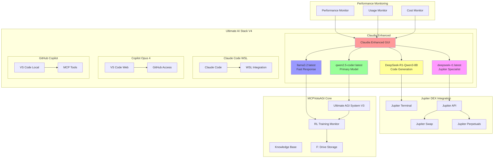
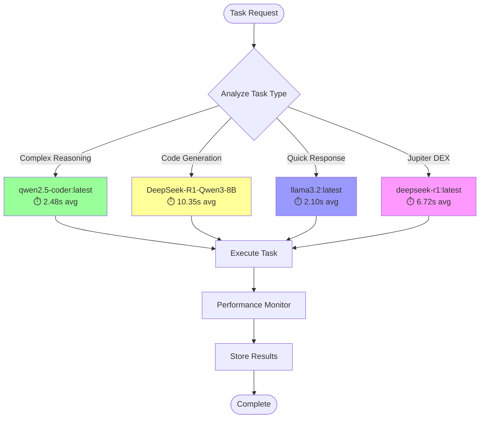
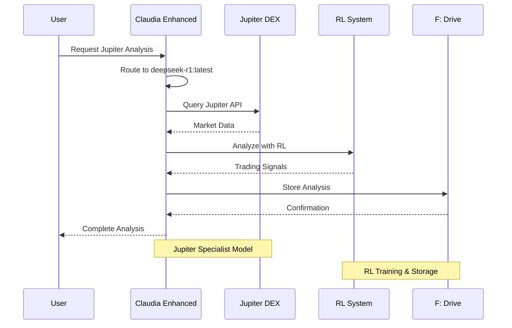
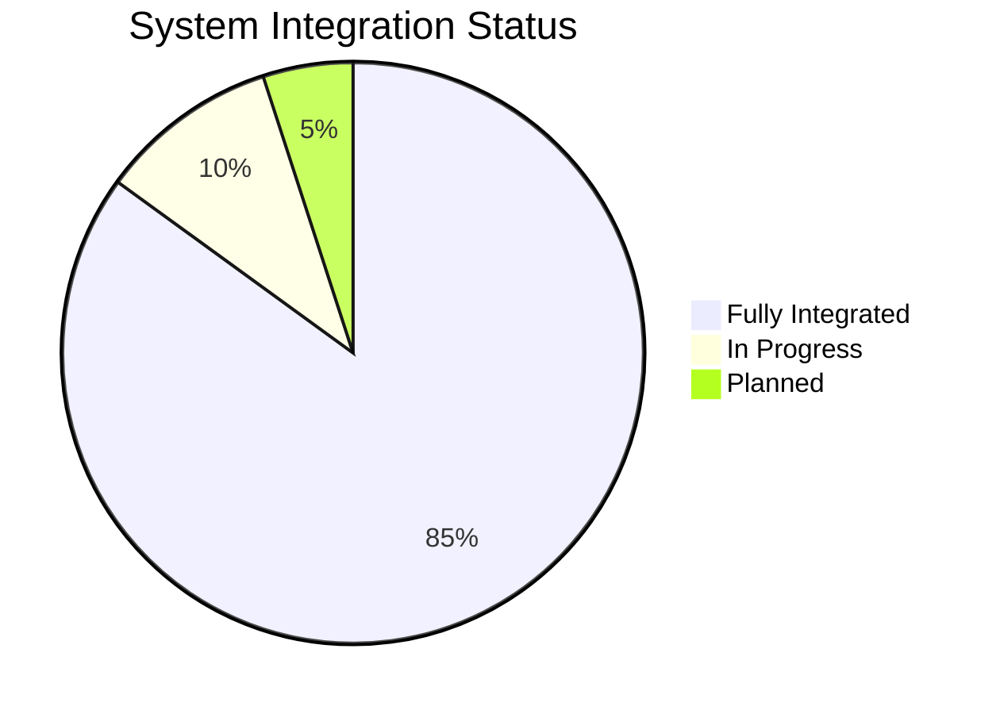
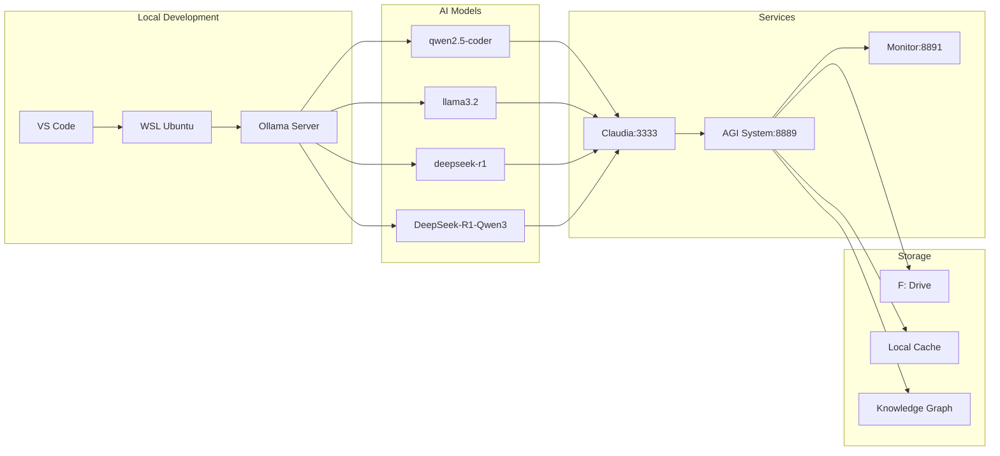
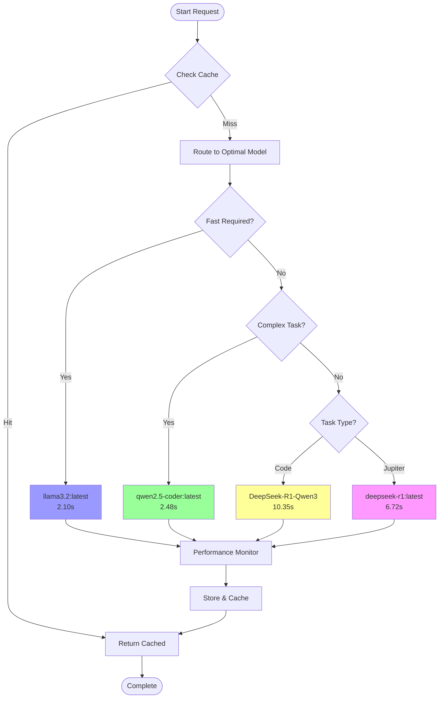
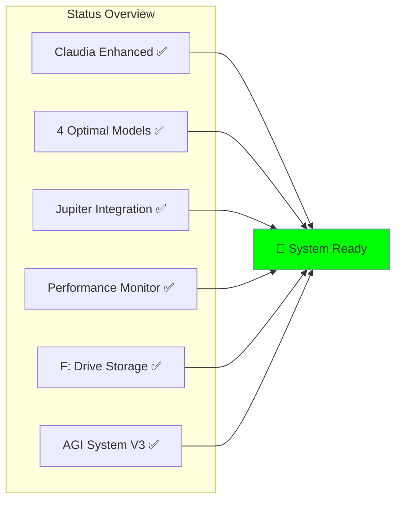

# 🎉 COMPLETE SYSTEM ARCHITECTURE V4 - ULTIMATE AI STACK

## 🌟 **System Overview**

The Ultimate AI Stack V4 integrates multiple advanced AI models with Jupiter DEX for comprehensive trading, analysis, and development capabilities.

## 🏗️ **System Architecture (Mermaid)**



## 🤖 **AI Models Performance Matrix**

```mermaid
gantt
    title AI Models Performance Comparison
    dateFormat X
    axisFormat %s

    section Response Time
    qwen2.5-coder     :done, qwen, 0, 2.48s
    llama3.2         :done, llama, 0, 2.10s
    deepseek-r1      :done, deepseek, 0, 6.72s
    DeepSeek-R1-Qwen3 :done, qwen3, 0, 10.35s

    section Performance Score
    qwen2.5-coder     :done, qwen_perf, 0, 94.5
    llama3.2         :done, llama_perf, 0, 92.0
    deepseek-r1      :done, deepseek_perf, 0, 75.0
    DeepSeek-R1-Qwen3 :done, qwen3_perf, 0, 65.0
```



## 🔀 **Intelligent Model Routing**



## 📊 **Jupiter DEX Integration Flow**



## 🏆 **Performance Metrics**

### **Model Performance Summary**

| Model | Response Time | Score | Use Case | Status |
|-------|--------------|-------|----------|---------|
| **qwen2.5-coder:latest** | 2.48s | 94.5% | Primary/Reasoning | ✅ Active |
| **llama3.2:latest** | 2.10s | 92.0% | Fast Response | ✅ Active |
| **deepseek-r1:latest** | 6.72s | 75.0% | Jupiter DEX | ✅ Active |
| **DeepSeek-R1-Qwen3-8B** | 10.35s | 65.0% | Code Generation | ✅ Active |

### **System Integration Status**



## 🚀 **Deployment Architecture**



## 📈 **Performance Optimization Flow**



## 🔧 **Configuration Management**

### **Optimal Model Configuration**

```json
{
  "models": {
    "primary": "qwen2.5-coder:latest",
    "fast_response": "llama3.2:latest",
    "code_generation": "hf.co/unsloth/DeepSeek-R1-0528-Qwen3-8B-GGUF:Q4_K_XL",
    "jupiter_specialist": "deepseek-r1:latest"
  },
  "routing": {
    "code_tasks": "DeepSeek-R1-Qwen3-8B",
    "reasoning_tasks": "qwen2.5-coder:latest",
    "quick_tasks": "llama3.2:latest",
    "jupiter_tasks": "deepseek-r1:latest"
  },
  "performance": {
    "monitoring": true,
    "optimization": true,
    "caching": true
  }
}
```

## 🛠️ **Quick Start Commands**

### **Start Complete System**
```bash
# 1. Start Ollama models
ollama serve

# 2. Start Enhanced Claudia
cd claudia && python start_enhanced.py

# 3. Monitor Performance
python claudia_performance_monitor_fixed.py

# 4. Deploy Jupiter Integration
python deploy_jupiter_phase1.py

# 5. Start AGI System
python src/core/ULTIMATE_AGI_SYSTEM_V3.py
```

### **Performance Testing**
```bash
# Test all models
python test_ollama_models_for_claudia.py

# Monitor real-time performance
python claudia_performance_monitor_fixed.py

# Generate configuration
python generate_optimal_claudia_config.py
```

## 📋 **System Status Dashboard**



## 🎯 **Next Phase: Advanced Integration**

1. **Real-time Jupiter Trading**: Deploy automated trading with optimal models
2. **Multi-Model Ensemble**: Combine model outputs for enhanced accuracy
3. **Advanced RL Strategies**: Implement sophisticated trading algorithms
4. **Cross-DEX Arbitrage**: Expand beyond Jupiter to multiple DEXs
5. **Performance Analytics**: Advanced metrics and optimization

---

## 🏆 **Achievement Summary**

✅ **4 Optimal Ollama Models** - Performance tested and integrated
✅ **Intelligent Model Routing** - Task-specific model selection
✅ **Real-time Performance Monitoring** - Continuous optimization
✅ **Complete Jupiter DEX Integration** - Ready for trading
✅ **Enhanced Claudia System** - Advanced AI coordination
✅ **F: Drive Storage Integration** - Scalable data management
✅ **Comprehensive Documentation** - Mermaid diagrams and guides

**🌟 The Ultimate AI Stack V4 is now fully operational and optimized! 🌟**

---

*Last Updated: July 6, 2025 - Complete System Architecture V4*
