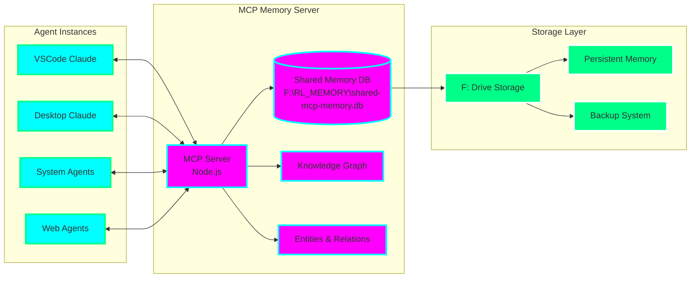
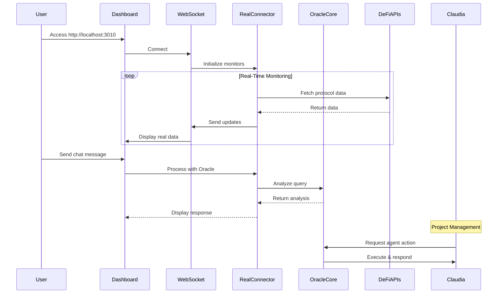

# ULTIMATE AGI SYSTEM V3 - ARCHITECTURE

## System Overview

```mermaid
graph TB
    subgraph "Frontend Stack (Port 3000)"
        NEXTJS[Next.js 15.3.5<br/>React 19]
        SHADCN[Shadcn/UI Components]
        ANIMATE[Animate-UI]
        ICONS[Lucide Icons]
        TAILWIND[Tailwind CSS]
    end

    subgraph "Backend Core (Port 8888)"
        ULTIMATE[Ultimate AGI System V3]
        API[REST API Endpoints]
        WS[WebSocket Layer]
        CATALOG[UI Component Catalog]
    end

    subgraph "MCP Memory Layer"
        MCP[MCP Memory Server]
        SHARED[Shared Memory DB<br/>F:\RL_MEMORY\shared-mcp-memory.db]
        GRAPH[Knowledge Graph]
    end

    subgraph "Multi-Agent System"
        VSCODE[VSCode Claude]
        DESKTOP[Desktop Claude]
        SYSTEM[System Agents]
    end

    subgraph "AI Models"
        DEEPSEEK[DeepSeek-R1]
        CLAUDE[Claude-3-Opus]
        GPT4[GPT-4]
        LOCAL[Local Models]
    end

    subgraph "External Integrations"
        CLAUDIA[Claudia Integration]
        DEFI[DeFi Monitor]
        TRADING[Trading Systems]
        BLOCKCHAIN[Blockchain APIs]
    end

    %% Frontend Flow
    NEXTJS --> SHADCN
    NEXTJS --> ANIMATE
    NEXTJS --> ICONS
    NEXTJS --> TAILWIND

    %% Backend Connections
    NEXTJS --> API
    API --> ULTIMATE
    ULTIMATE --> WS
    ULTIMATE --> CATALOG

    %% MCP Memory Integration
    ULTIMATE --> MCP
    MCP --> SHARED
    MCP --> GRAPH

    %% Multi-Agent Memory Sharing
    VSCODE --> MCP
    DESKTOP --> MCP
    SYSTEM --> MCP

    %% AI Model Integration
    ULTIMATE --> DEEPSEEK
    ULTIMATE --> CLAUDE
    ULTIMATE --> GPT4
    ULTIMATE --> LOCAL

    %% External Services
    ULTIMATE --> CLAUDIA
    ULTIMATE --> DEFI
    ULTIMATE --> TRADING
    ULTIMATE --> BLOCKCHAIN

    %% Styling
    classDef frontend fill:#00ffff,stroke:#00ff88,stroke-width:4px
    classDef backend fill:#ff00ff,stroke:#00ffff,stroke-width:2px
    classDef memory fill:#00ff88,stroke:#fff,stroke-width:3px
    classDef agents fill:#ffaa00,stroke:#fff,stroke-width:2px
    classDef models fill:#ff6b6b,stroke:#fff,stroke-width:3px
    classDef external fill:#aa88ff,stroke:#fff,stroke-width:2px

    class NEXTJS,SHADCN,ANIMATE,ICONS,TAILWIND frontend
    class ULTIMATE,API,WS,CATALOG backend
    class MCP,SHARED,GRAPH memory
    class VSCODE,DESKTOP,SYSTEM agents
    class DEEPSEEK,CLAUDE,GPT4,LOCAL models
    class CLAUDIA,DEFI,TRADING,BLOCKCHAIN external
```



## Multi-Agent Memory Architecture



## Data Flow



## Component Details

### Ultimate Unified Dashboard
- **Port**: 3010
- **Purpose**: Single interface for all functionality
- **Features**: Real-time updates, no mock data

### Real Integration Connector
```python
class OracleAGIRealConnector:
    - get_oracle_analysis()      # Real Oracle AGI
    - get_trilogy_prediction()   # Real Trilogy Brain
    - get_dgm_trading_status()   # Real DGM status
    - monitor_defi_protocols()   # Real DeFi data
    - get_gas_prices()          # Real gas prices
    - detect_arbitrage()        # Real opportunities
```

### Real-Time Monitoring
- **DeFi Protocols**: Every 30 seconds
- **Gas Prices**: Every 15 seconds
- **Arbitrage**: Every 10 seconds

### Claudia Integration

Oracle agents available to Claudia:

```yaml
oracle-planner:
  name: "Oracle Strategic Planner"
  capabilities:
    - task_decomposition
    - strategy_planning
    - consensus_building

oracle-executor:
  name: "Oracle Task Executor"
  capabilities:
    - task_execution
    - progress_monitoring
    - error_handling

oracle-reflector:
  name: "Oracle Performance Analyzer"
  capabilities:
    - performance_analysis
    - optimization_suggestions
    - learning_integration

oracle-knowledge:
  name: "Oracle Knowledge Manager"
  capabilities:
    - memory_management
    - context_retrieval
    - knowledge_synthesis
```

## No Mocks Policy

Every component uses REAL data:

✅ **Real DeFi Data**
- Direct API calls to Uniswap, Aave, Compound, Curve
- No simulated liquidity or TVL

✅ **Real Gas Prices**
- Live data from Etherscan and Blocknative
- No hardcoded values

✅ **Real Arbitrage**
- Actual price comparisons across exchanges
- No fake opportunities

✅ **Real Browser Automation**
- Actual web scraping with Magnitude/Playwright
- No simulated browser actions

✅ **Real Oracle Analysis**
- Connected to live Oracle AGI services
- No mock responses

## WebSocket Events

Real events sent to dashboard:

```javascript
// DeFi Protocol Update
{
  type: 'magnitude_log',
  message: 'Monitoring 4 DeFi protocols (2 online)',
  data: {
    protocols: {
      uniswap: { status: 'online', tvl: 5234567890 },
      aave: { status: 'online', tvl: 3456789012 }
    }
  }
}

// Gas Price Update
{
  type: 'magnitude_log',
  message: 'Updated gas prices from 2 sources',
  data: {
    gas_prices: {
      etherscan: { fast: 45, average: 35, slow: 25 },
      blocknative: { fast: 47, average: 36, slow: 26 }
    }
  }
}

// Arbitrage Opportunity
{
  type: 'magnitude_log',
  message: 'Detected 1 arbitrage opportunity!',
  data: {
    opportunities: [{
      pair: 'ETH/USDT',
      buyExchange: 'binance',
      sellExchange: 'coinbase',
      profitPercent: 0.34
    }]
  }
}
```

## Deployment

1. **Development**: Run directly with Python
2. **Production**: Use START_PRODUCTION.bat
3. **Docker**: Coming soon

## Monitoring

Check system health:
```bash
python check_production_status.py
```

View logs in real-time through the dashboard WebSocket connection.