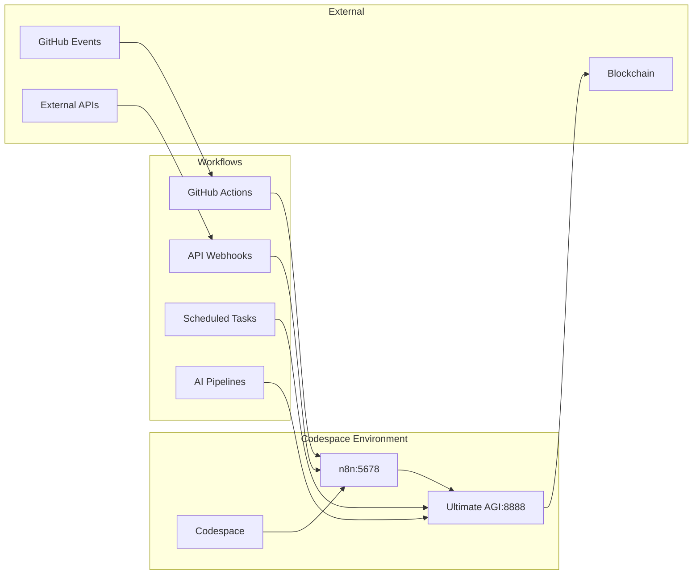

# 🚀 GitHub Codespaces Integration for MCPVotsAGI

## 🌟 Overview

GitHub Codespaces provides **cloud-powered development environments** that give MCPVotsAGI the computational resources needed for AI/AGI development without local hardware constraints.

```mermaid
graph TB
    subgraph "Local Development"
        L1[VS Code Local]
        L2[Local Repository]
        L3[Limited Resources]
    end
    
    subgraph "GitHub Codespaces"
        C1[Cloud VS Code]
        C2[Powerful VMs]
        C3[Pre-configured Environment]
        C4[All Dependencies]
    end
    
    subgraph "MCPVotsAGI Benefits"
        B1[Run DeepSeek-R1]
        B2[800GB RL Processing]
        B3[Multi-Agent Swarms]
        B4[IPFS Network]
        B5[n8n Workflows]
    end
    
    L1 --> C1
    L2 --> C2
    C3 --> B1
    C3 --> B2
    C3 --> B3
    C4 --> B4
    C4 --> B5
    
    style C1 fill:#0099ff,stroke:#000,stroke-width:2px
    style C2 fill:#00ff41,stroke:#000,stroke-width:2px
```



## 🎯 Why Codespaces for MCPVotsAGI?

### 1. **Resource-Intensive Operations**
- Run DeepSeek-R1 (5.1GB model) without local GPU
- Process 800GB RL data efficiently
- Run multiple AI agents simultaneously
- Handle blockchain operations

### 2. **Complex Environment Setup**
- Pre-configured with all dependencies
- Ollama, IPFS, n8n ready to go
- All MCP servers pre-installed
- No local setup headaches

### 3. **Team Collaboration**
- Share exact development environment
- Onboard new developers instantly
- Consistent setup across team
- Live collaboration features

## 🚀 Quick Start

### 1. From GitHub Repository
```bash
# Navigate to: https://github.com/kabrony/MCPVotsAGI
# Click "Code" → "Codespaces" → "Create codespace on main"
```

### 2. From VS Code
```bash
# Install GitHub Codespaces extension
# Ctrl+Shift+P → "Codespaces: Create New Codespace"
# Select MCPVotsAGI repository
```

### 3. From CLI
```bash
gh codespace create -r kabrony/MCPVotsAGI
gh codespace code  # Opens in VS Code
```

## 📋 Pre-configured Environment

Our `.devcontainer/devcontainer.json` provides:

### **Included Features**
- Python 3.11 environment
- Node.js LTS
- Docker-in-Docker support
- GitHub CLI
- Ollama integration
- Poetry package manager

### **Pre-installed Extensions**
- Python development tools
- Jupyter notebooks
- GitHub Copilot
- Docker support
- Tauri development
- And more!

### **Auto-forwarded Ports**
| Port | Service |
|------|---------|
| 8888 | Ultimate AGI Dashboard |
| 11434 | Ollama API |
| 3000-3006 | MCP Servers |
| 3333 | Ultimate AGI MCP |
| 5001/8080 | IPFS |
| 5678 | n8n Workflows |

## 🔧 Codespaces Workflow

### 1. **Initial Setup**
When you create a Codespace, it automatically:
1. Clones your repository
2. Installs all Python dependencies
3. Sets up MCP servers
4. Configures databases
5. Prepares Ollama
6. Starts background services

### 2. **Daily Development**
```bash
# Codespace starts with services ready
# Just run:
python START_ULTIMATE_AGI_WITH_CLAUDIA.py

# Access dashboard at forwarded URL
# https://<codespace-name>-8888.preview.app.github.dev
```

### 3. **Resource Scaling**
Choose machine type based on needs:
- **2-core**: Basic development
- **4-core**: Running AGI + agents
- **8-core**: Full system + training
- **16-core**: Maximum performance

## 🔗 Integration with n8n Workflows



## 📊 Working with Large Data

### F: Drive Alternative
Since F: drive isn't available in Codespaces:

```yaml
# .devcontainer/devcontainer.json
"mounts": [
  "source=mcpvotsagi-rl-data,target=/workspace/rl_data,type=volume"
]
```

### Data Sync Options
1. **GitHub LFS** for model files
2. **Azure Storage** mount
3. **S3 bucket** integration
4. **IPFS** for distributed storage

## 🛠️ Advanced Features

### 1. **Prebuilds**
```yaml
# .github/codespaces/prebuild.yml
name: Codespace Prebuild
on:
  push:
    branches: [main]
  schedule:
    - cron: '0 0 * * *'  # Daily
```

### 2. **Secrets Management**
```bash
# Add secrets via GitHub UI or CLI
gh secret set OPENAI_API_KEY
gh secret set ANTHROPIC_API_KEY
gh secret set FINNHUB_API_KEY
```

### 3. **GPU Support** (Beta)
```json
{
  "hostRequirements": {
    "gpu": "optional"
  }
}
```

## 🔄 Syncing with Local

### 1. **Push/Pull Changes**
```bash
# In Codespace
git add .
git commit -m "feat: Updates from Codespace"
git push

# Locally
git pull
```

### 2. **Settings Sync**
VS Code automatically syncs:
- Extensions
- Settings
- Keybindings
- Snippets

### 3. **Live Share**
```bash
# Start Live Share session
# Others can join your Codespace
# Real-time collaboration
```

## 📱 Access from Anywhere

### Browser
- Full VS Code in browser
- Access from any device
- No installation needed

### iPad/Tablet
- Use github.dev
- Or VS Code for Web
- Touch-optimized

### VS Code Desktop
- Native performance
- Full extension support
- Seamless integration

## 🚨 Tips & Tricks

### 1. **Performance Optimization**
```bash
# Use prebuild for faster starts
# Cache dependencies in volumes
# Use appropriate machine size
```

### 2. **Cost Management**
```bash
# Stop Codespace when not in use
gh codespace stop

# Delete unused Codespaces
gh codespace delete
```

### 3. **Debugging**
```bash
# View logs
gh codespace logs

# SSH into Codespace
gh codespace ssh
```

## 🎯 MCPVotsAGI Specific Workflows

### 1. **AGI Development**
```bash
# Start Codespace
# Services auto-start
# Run Ultimate AGI
python START_ULTIMATE_AGI_WITH_CLAUDIA.py
```

### 2. **Model Training**
```bash
# Use 16-core machine
# Mount training data
# Run distributed training
```

### 3. **Multi-Agent Testing**
```bash
# Spawn multiple agents
# Use port forwarding
# Monitor in dashboard
```

## 🔐 Security Considerations

### 1. **Secrets**
- Never commit API keys
- Use GitHub Secrets
- Environment-specific configs

### 2. **Network**
- Codespaces are private
- Port forwarding is authenticated
- Use HTTPS for public URLs

### 3. **Data**
- Encrypt sensitive data
- Use volumes for persistence
- Regular backups

## 📈 Monitoring & Logs

### View All Logs
```bash
# Ollama logs
tail -f logs/ollama.log

# MCP server logs
tail -f logs/mcp_*.log

# n8n workflow logs
tail -f logs/n8n.log

# Ultimate AGI logs
tail -f logs/ultimate_agi.log
```

## 🎉 Getting Started

1. **Fork/Clone MCPVotsAGI**
2. **Create Codespace**
3. **Wait for setup** (5-10 minutes first time)
4. **Start developing!**

```bash
# Everything is ready!
python START_ULTIMATE_AGI_WITH_CLAUDIA.py
# Access at: https://<your-codespace>-8888.preview.app.github.dev
```

---

**With GitHub Codespaces, MCPVotsAGI gets unlimited cloud power for AGI development!** 🚀