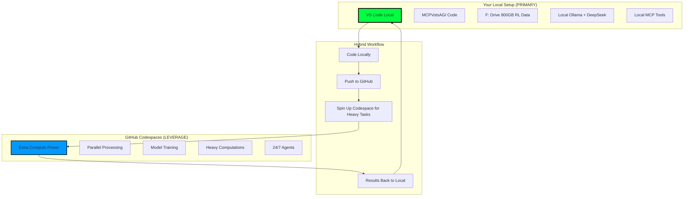
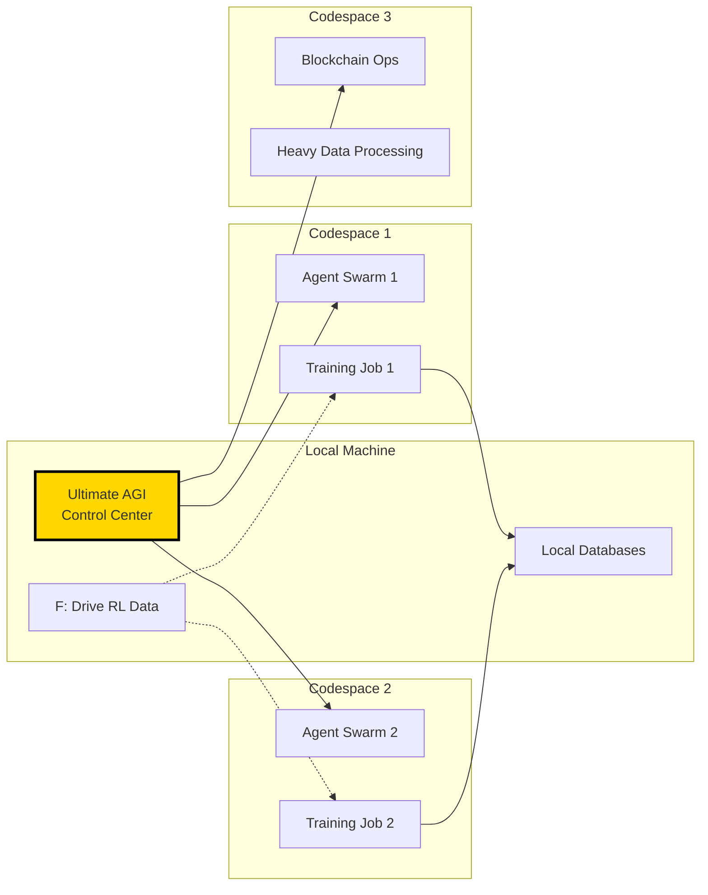
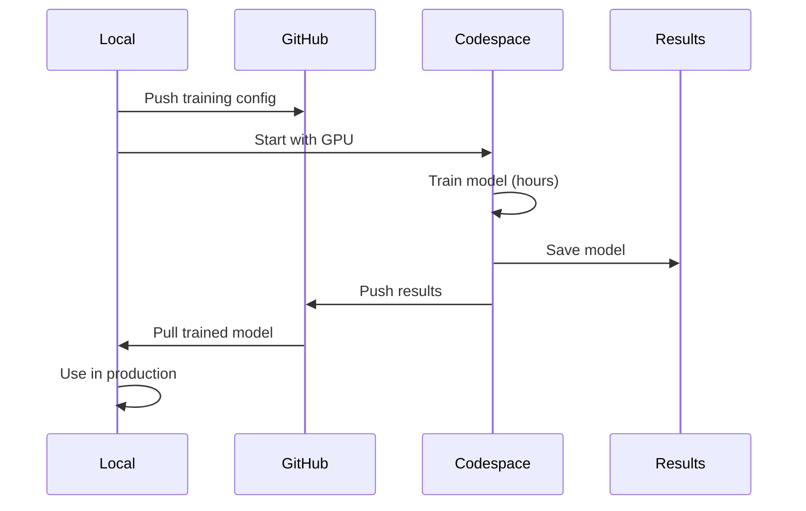

# 🚀 Leveraging GitHub Codespaces with Local MCPVotsAGI

## 🎯 Strategy: Local First, Cloud Power When Needed

We use Codespaces as **additional compute resources** while keeping your local development as the primary environment. Think of it as having a powerful cloud assistant that helps with heavy tasks.



## 🔧 Setup for Hybrid Development

### 1. Keep Your Local Environment Primary
```bash
# Your local setup remains unchanged
C:\Workspace\MCPVotsAGI  # Your code
F:\MCPVotsAGI_Data      # Your 800GB RL data
http://localhost:8888    # Your dashboard
```

### 2. Use Codespaces for Specific Tasks

#### A. Heavy Model Training
```python
# train_in_codespace.py
"""
Push training job to Codespace while you continue working locally
"""
import subprocess

def train_in_cloud(model_config):
    # Push latest code
    subprocess.run(["git", "push"])
    
    # Start Codespace and run training
    subprocess.run([
        "gh", "codespace", "create", 
        "--machine", "largeMachine",  # 16-core
        "--idle-timeout", "4h"
    ])
    
    # SSH and start training
    subprocess.run([
        "gh", "codespace", "ssh", "--", 
        "python", "src/training/train_model.py"
    ])
```

#### B. Parallel Agent Processing
```python
# Run multiple agents in Codespace while local runs main system
def spawn_cloud_agents():
    # Your local AGI coordinates
    # Codespace runs worker agents
    pass
```

## 📊 Hybrid Architecture



## 🛠️ Practical Workflows

### 1. Development Stays Local
```bash
# Normal development
cd C:\Workspace\MCPVotsAGI
code .  # Your local VS Code
python START_ULTIMATE_AGI_WITH_CLAUDIA.py
```

### 2. Heavy Tasks to Cloud
```bash
# When you need extra power
gh codespace create --machine largeMachine

# Run specific heavy task
gh codespace ssh -- "cd /workspace/MCPVotsAGI && python scripts/heavy_training.py"

# Get results
gh codespace cp remote:/workspace/results.pkl local:./results/
```

### 3. 24/7 Agents in Cloud
```yaml
# .github/workflows/cloud_agents.yml
name: Run Persistent Agents
on:
  schedule:
    - cron: '0 */6 * * *'  # Every 6 hours
    
jobs:
  agents:
    runs-on: ubuntu-latest
    steps:
      - uses: actions/checkout@v3
      - name: Run Cloud Agents
        run: |
          python scripts/cloud_agents.py --duration 6h
```

## 🔗 Connecting Local + Cloud

### 1. Shared State via GitHub
```python
# Local pushes state
git add memory/state.json
git commit -m "state: Update memory"
git push

# Codespace pulls and continues
git pull
state = load_state()
continue_processing(state)
```

### 2. Real-time via WebSockets
```python
# Local AGI acts as coordinator
class HybridCoordinator:
    def __init__(self):
        self.local_endpoint = "ws://localhost:8888"
        self.cloud_endpoints = [
            "wss://kabrony-mcpvotsagi-xyz.github.dev:8888"
        ]
    
    async def coordinate(self):
        # Local makes decisions
        # Cloud executes heavy tasks
        pass
```

### 3. Database Sync
```bash
# Periodic sync of results
# Cloud writes to cloud DB
# Script syncs to local F: drive
python scripts/sync_cloud_results.py
```

## 🚀 Specific Use Cases

### 1. Model Training Pipeline


### 2. Multi-Agent Simulations
```python
# Run 100 agents in cloud while local coordinates
def distribute_agents():
    # Local: 1 coordinator + 10 agents
    local_agents = spawn_local_agents(10)
    
    # Cloud: 90 worker agents across 3 Codespaces
    for i in range(3):
        spawn_cloud_agents(30, machine_type="8-core")
```

### 3. Data Processing Pipeline
```python
# Process 800GB in chunks using cloud
def process_rl_data():
    chunks = split_data("F:/MCPVotsAGI_Data", chunk_size="10GB")
    
    # Process in parallel using Codespaces
    for i, chunk in enumerate(chunks):
        subprocess.run([
            "gh", "codespace", "create",
            "--machine", "4-core",
            "-c", f"python process_chunk.py --chunk {i}"
        ])
```

## 📋 Configuration

### Modified `.devcontainer/devcontainer.json`
```json
{
  "name": "MCPVotsAGI Cloud Compute",
  "features": {
    "ghcr.io/devcontainers/features/nvidia-cuda:1": {
      "installCudnn": true
    }
  },
  "hostRequirements": {
    "gpu": "optional"  // For ML tasks
  },
  "postCreateCommand": "pip install -r requirements_cloud.txt"
}
```

### Local `.env`
```env
# Local config
LOCAL_MODE=true
F_DRIVE_PATH=F:/MCPVotsAGI_Data
LOCAL_DASHBOARD=http://localhost:8888

# Cloud endpoints
CODESPACE_ENDPOINTS=["endpoint1", "endpoint2"]
SYNC_INTERVAL=3600  # Sync every hour
```

## 🎯 Best Practices

### 1. Task Distribution
- **Local**: Coordination, UI, decision making
- **Cloud**: Training, heavy processing, parallel agents

### 2. Data Management
- Keep source data local (F: drive)
- Process in cloud, results back to local
- Use git LFS for model files

### 3. Cost Optimization
```bash
# Auto-stop after task completes
gh codespace create --idle-timeout 30m

# Use appropriate machine size
# 2-core for light tasks
# 16-core only when needed

# Delete after use
gh codespace delete --all
```

## 🔄 Example: Training Workflow

```bash
# 1. Local: Prepare training
cd C:\Workspace\MCPVotsAGI
python scripts/prepare_training.py

# 2. Push to GitHub
git add training_config/
git commit -m "config: New training run"
git push

# 3. Start Codespace for training
gh codespace create --machine gpuMachine

# 4. Run training in cloud
gh codespace ssh -- "python train_heavy_model.py"

# 5. Monitor from local
python scripts/monitor_cloud_training.py

# 6. Get results
gh codespace cp remote:/workspace/models/ local:./trained_models/

# 7. Continue locally
python START_ULTIMATE_AGI_WITH_CLAUDIA.py --model trained_models/new_model.pth
```

## 📊 Monitoring Hybrid System

```python
# Local monitoring dashboard shows:
- Local AGI status
- Connected Codespaces
- Running cloud tasks
- Resource usage
- Task queue
```

## 🎉 Benefits of This Approach

1. **Keep Control**: Your local machine runs the show
2. **Unlimited Scale**: Spin up Codespaces when needed
3. **Cost Effective**: Only pay for what you use
4. **No Migration**: Your existing setup stays intact
5. **Best of Both**: Local control + cloud power

---

**Your local MCPVotsAGI remains the brain, Codespaces become the muscle!** 💪🚀