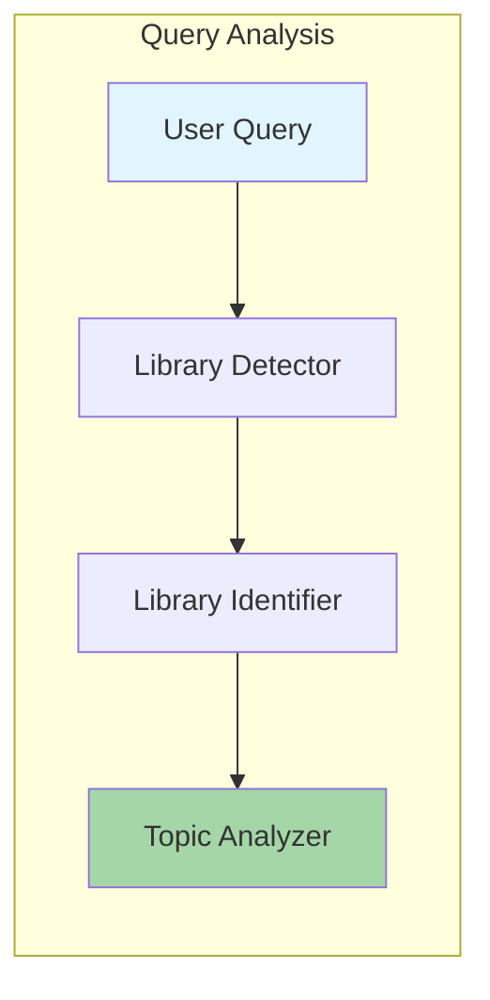
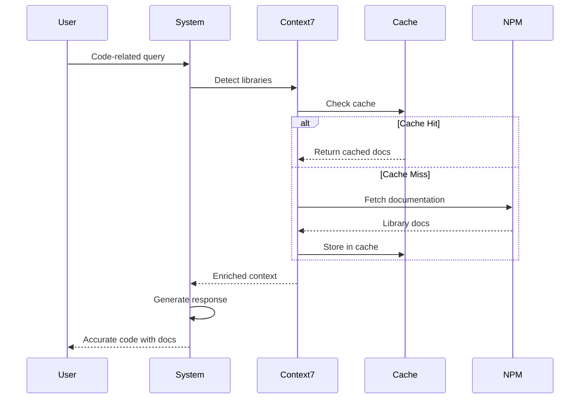
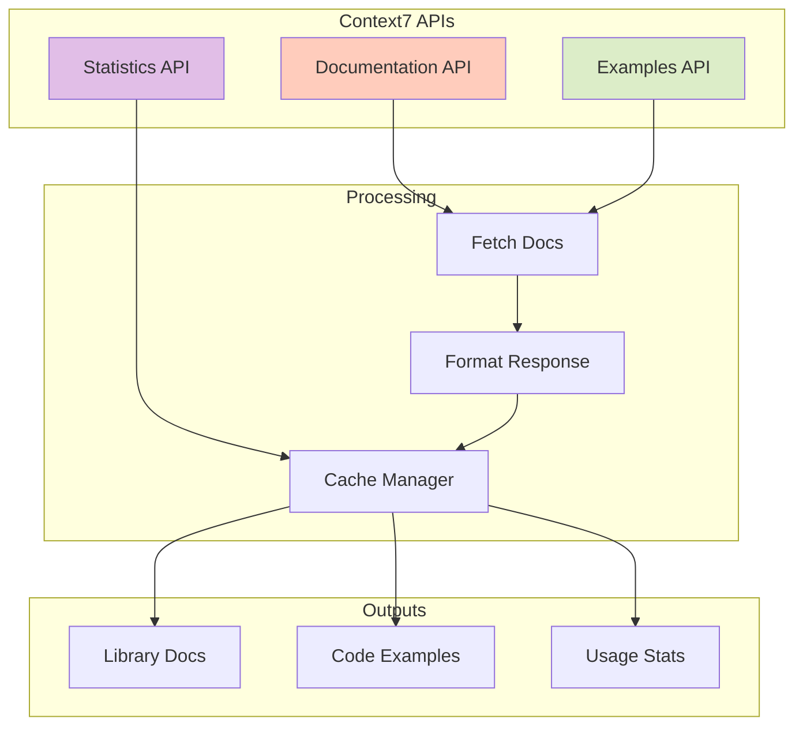
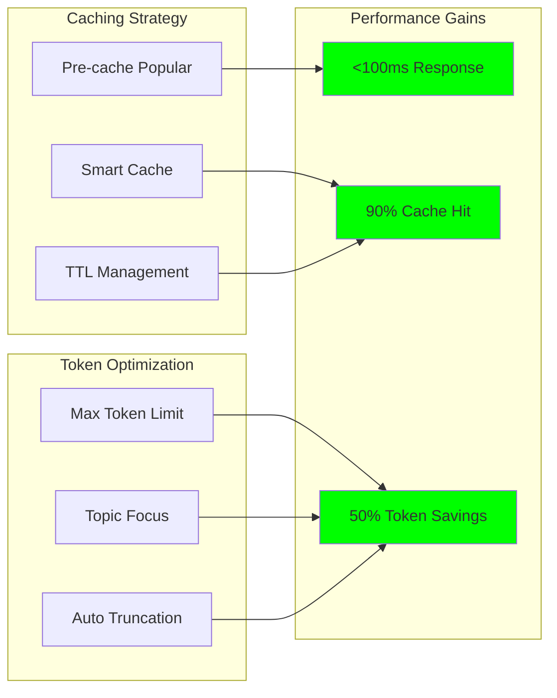
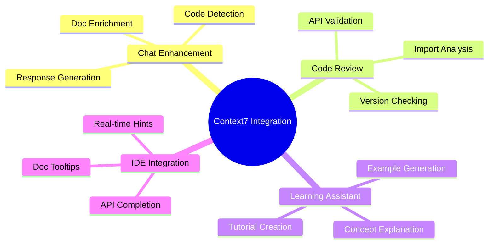

# 📚 Context7 Integration Guide for MCPVotsAGI

## Overview

Context7 is a revolutionary MCP server that provides real-time, accurate documentation for programming libraries directly into our AGI system. This solves the critical problem of AI models generating outdated or incorrect API calls.

## 🌟 Key Benefits

1. **No More Hallucinated APIs**: Always uses current, verified documentation
2. **Version-Specific Docs**: Get documentation for specific library versions
3. **Automatic Detection**: Detects library references in user queries
4. **Token Efficient**: Topic-focused retrieval reduces token usage
5. **Performance**: Pre-cached popular libraries for instant access

## 🚀 Quick Start

### 1. Start the V3 System

```bash
python START_V3_CONTEXT7.py
```

### 2. Try These Examples

```python
# React Hooks
"How do I use useState and useEffect in React?"
# → Gets latest React hooks documentation

# FastAPI
"Create a FastAPI endpoint with Pydantic validation"
# → Uses current FastAPI and Pydantic APIs

# LangChain
"Build a conversational AI with LangChain memory"
# → Provides verified LangChain patterns

# Next.js 14
"Create a Next.js 14 app with the new app router"
# → Version-specific Next.js documentation
```

## 📖 How It Works

### 1. Query Analysis
When a user asks a coding question, Context7:
- Detects library mentions (imports, function names, etc.)
- Identifies the specific libraries needed
- Determines relevant topics within those libraries



### 2. Documentation Retrieval


### 3. Enhanced Code Generation
The AI model receives:
- Original user query
- Current library documentation
- Verified code examples
- Version information

Result: Accurate, working code with current APIs!

## 🔧 Configuration

### Environment Variables

```bash
# Context7 server port (default: 3001)
CONTEXT7_PORT=3001

# Maximum tokens for documentation (default: 10000)
CONTEXT7_MAX_TOKENS=10000

# Cache TTL in seconds (default: 3600)
CONTEXT7_CACHE_TTL=3600
```

### Supported Libraries

Context7 supports 1000+ libraries including:

**Frontend**
- React, Next.js, Vue, Angular, Svelte
- Tailwind CSS, Material-UI, Chakra UI

**Backend**
- Express, FastAPI, Django, Flask
- Node.js, Deno, Bun

**AI/ML**
- LangChain, OpenAI, Anthropic
- TensorFlow, PyTorch, Scikit-learn
- Transformers, Hugging Face

**Databases**
- PostgreSQL, MongoDB, Redis
- Prisma, SQLAlchemy, Mongoose

**And many more!**

## 🛠️ Advanced Usage

### API Flow Architecture



### 1. Direct Documentation API

```python
# Get documentation for a specific library
POST /api/documentation
{
  "library": "react",
  "topic": "hooks",
  "maxTokens": 5000
}
```

### 2. Code Examples API

```python
# Get code examples
POST /api/examples
{
  "library": "fastapi",
  "topic": "authentication"
}
```

### 3. Library Usage Statistics

```python
# See which libraries are most requested
GET /api/library-stats
```

## 🧪 Testing Context7

### 1. Test Library Detection

```python
from core.CONTEXT7_INTEGRATION import Context7Integration

context7 = Context7Integration()
libraries = context7.detect_libraries("Create a React component with hooks")
print(libraries)  # {'react'}
```

### 2. Test Documentation Enrichment

```python
enriched = await context7.enrich_context(
    "How do I use LangChain with OpenAI?",
    max_tokens=5000
)
print(enriched['libraries_detected'])  # ['langchain', 'openai']
```

### 3. Test Code Generation

```python
assistant = Context7CodeAssistant(context7)
result = await assistant.generate_code_with_docs(
    "Create a Next.js API route"
)
```

## 📊 Performance Optimization



### 1. Pre-caching
Popular libraries are pre-cached on startup:
- React, Next.js, FastAPI, LangChain, OpenAI

### 2. Smart Caching
- Documentation cached for 1 hour by default
- Cache key includes library + max tokens
- Automatic cache invalidation

### 3. Token Management
- Configure max tokens per request
- Topic-focused retrieval for efficiency
- Automatic truncation for large docs

## 🔍 Troubleshooting

### Context7 Server Not Starting

```bash
# Check if Node.js is installed
node --version  # Should be v18+

# Install Context7 manually
npm install -g @upstash/context7-mcp

# Check if port 3001 is available
netstat -an | grep 3001
```

### No Documentation Retrieved

1. Check library name spelling
2. Verify library is in Context7 database
3. Check network connectivity
4. Review server logs

### Performance Issues

1. Reduce `maxTokens` for faster responses
2. Enable caching if disabled
3. Use topic-specific queries
4. Check server resources

## 🎯 Best Practices

### 1. Query Formulation
```python
# Good: Specific library and task
"Create a FastAPI endpoint with JWT authentication"

# Better: Include version if needed
"Create a Next.js 14 server component with data fetching"

# Best: Clear context and requirements
"Using React 18, create a form component with useState for validation"
```

### 2. Token Optimization
- Use topic parameter for focused docs
- Set appropriate maxTokens (5000 for examples, 10000 for full docs)
- Cache frequently used libraries

### 3. Error Handling
```python
try:
    enriched = await context7.enrich_context(query)
    if enriched.get('enriched'):
        # Use enriched context
    else:
        # Fall back to standard processing
except Exception as e:
    logger.error(f"Context7 error: {e}")
    # Continue without enrichment
```

## 🚀 Integration Examples



### 1. Chat Enhancement

```python
async def enhanced_chat_handler(message):
    # Detect if coding request
    if is_coding_request(message):
        # Enrich with Context7
        enriched = await context7.enrich_context(message)
        
        # Generate response with docs
        response = await generate_with_docs(message, enriched)
    else:
        response = await standard_handler(message)
    
    return response
```

### 2. Code Review

```python
async def review_code_with_docs(code, language):
    # Detect libraries used
    libraries = detect_imports(code)
    
    # Get latest docs for each
    for lib in libraries:
        docs = await context7.get_library_docs(lib)
        # Check if APIs are current
```

### 3. Learning Assistant

```python
async def explain_library_concept(library, concept):
    # Get focused documentation
    docs = await context7.get_library_docs(
        library=library,
        topic=concept,
        maxTokens=3000
    )
    
    # Generate explanation with examples
    explanation = await generate_explanation(docs)
    return explanation
```

## 📈 Metrics and Monitoring

The V3 system tracks:
- Libraries requested
- Cache hit rates  
- Documentation tokens used
- Response times
- Error rates

Access metrics at: `http://localhost:8888/api/library-stats`

## 🔮 Future Enhancements

1. **Custom Library Support**: Add your own libraries to Context7
2. **Offline Mode**: Local documentation cache
3. **IDE Integration**: VSCode/JetBrains plugins
4. **Multi-language**: Documentation in multiple languages
5. **Video Tutorials**: Link to relevant video content

## 📚 Additional Resources

- [Context7 GitHub](https://github.com/kabrony/context7)
- [MCP Protocol Spec](https://modelcontextprotocol.io)
- [Supported Libraries List](https://context7.ai/libraries)

---

With Context7 integration, MCPVotsAGI V3 provides the most accurate, up-to-date code generation available in any AGI system. No more guessing about APIs - always current, always correct! 🚀