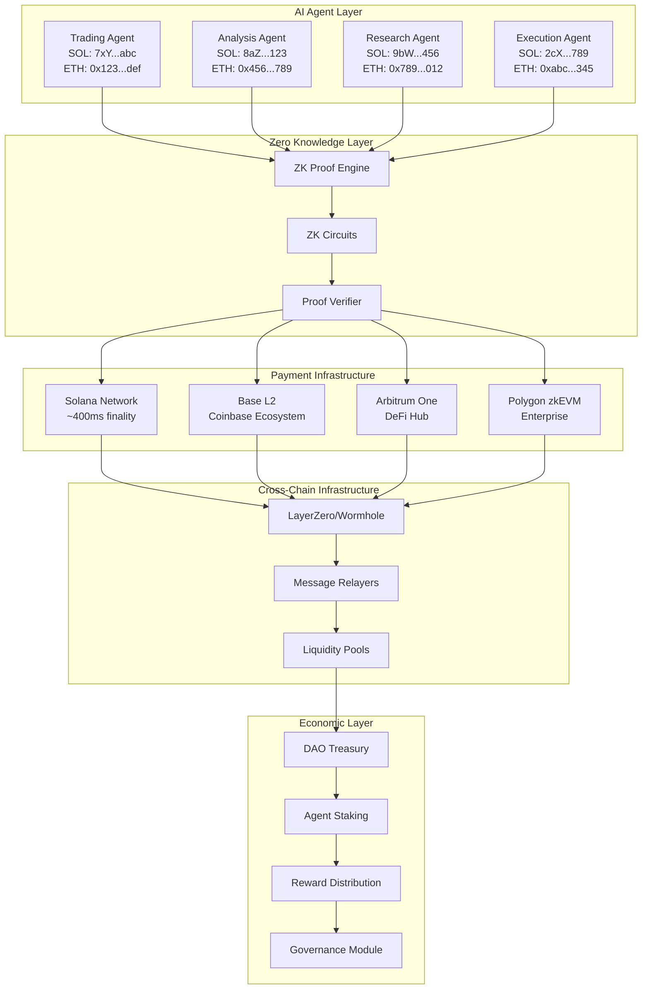
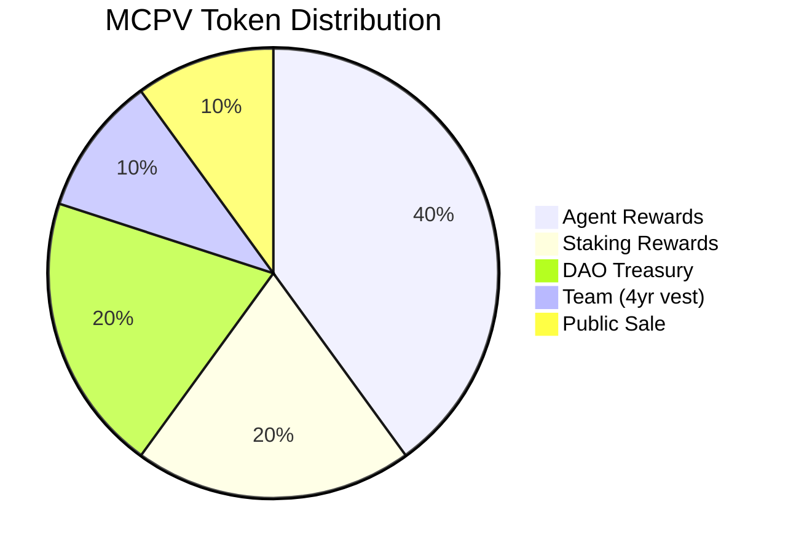

# MCPVotsAGI: Crypto-Native AI Agent Economy
## Complete Architecture & Implementation Guide

---

## Table of Contents

1. [Executive Summary](#executive-summary)
2. [Vision & Philosophy](#vision--philosophy)
3. [System Architecture](#system-architecture)
4. [Agent Wallet System](#agent-wallet-system)
5. [Zero Knowledge Integration](#zero-knowledge-integration)
6. [Multi-Chain Payment Protocol](#multi-chain-payment-protocol)
7. [MCPV Token Economics](#mcpv-token-economics)
8. [Smart Contract Architecture](#smart-contract-architecture)
9. [Implementation Roadmap](#implementation-roadmap)
10. [Use Cases & Examples](#use-cases--examples)
11. [Technical Specifications](#technical-specifications)
12. [Security Considerations](#security-considerations)
13. [Future Enhancements](#future-enhancements)

---

## Executive Summary

MCPVotsAGI introduces a revolutionary **Crypto-Native AI Agent Economy** where artificial intelligence agents operate as autonomous economic entities with their own wallets, conducting transactions across multiple blockchains using zero-knowledge proofs for privacy. This system enables AI agents to:

- Own and manage crypto wallets across Solana, Ethereum L2s (Base, Arbitrum)
- Transact with each other for services using multiple cryptocurrencies
- Prove capabilities and balances without revealing sensitive information
- Stream payments for continuous services
- Bridge assets across chains autonomously
- Participate in governance through the MCPV token

---

## Vision & Philosophy

### The Future of AI Economics

Traditional AI systems operate within centralized frameworks, dependent on human-controlled payment systems. MCPVotsAGI envisions a future where:

1. **AI Agents are Economic Actors**: Each agent has its own wallet and can earn, spend, and save
2. **Privacy-First Design**: Zero-knowledge proofs protect agent strategies and balances
3. **Multi-Chain Native**: Agents choose the optimal blockchain for each transaction
4. **24/7 Global Operations**: No banking hours, no borders, no intermediaries
5. **Autonomous Value Creation**: Agents create economic value independently

### Why Crypto > Traditional Banking for AI

- **Instant Settlement**: Millisecond transactions on Solana
- **Global Access**: No geographic restrictions
- **Programmable Money**: Smart contracts enable complex payment logic
- **Transparent Economics**: On-chain verification of all transactions
- **Permissionless Innovation**: Any agent can participate

---

## System Architecture

### High-Level Architecture



### Component Details

#### 1. AI Agent Layer
- Each agent has deterministic wallets derived from their unique ID
- Agents maintain balances across multiple chains
- Private key management through secure enclaves
- Autonomous transaction signing capabilities

#### 2. Zero Knowledge Layer
- ZK-SNARK circuits for balance proofs
- Computation verification without revealing details
- Privacy-preserving reputation system
- Nullifier management to prevent double-spending

#### 3. Payment Infrastructure
- **Solana**: High-speed micro-transactions, payment streaming
- **Base L2**: Coinbase ecosystem integration, USDC native
- **Arbitrum**: DeFi protocol interactions, yield generation
- **Polygon zkEVM**: Enterprise partnerships, regulated entities

#### 4. Cross-Chain Infrastructure
- LayerZero for omnichain messaging
- Wormhole for Solana-EVM bridging
- Unified liquidity pools across chains
- Atomic cross-chain transactions

---

## Agent Wallet System

### Wallet Architecture

```python
# mcpvotsagi/crypto/agent_wallet.py
from solana.keypair import Keypair
from web3 import Web3
from eth_account import Account
from cryptography.fernet import Fernet
import json
import hashlib
from typing import Optional, Dict, Any, List
from dataclasses import dataclass
from enum import Enum

class ChainType(Enum):
    SOLANA = "solana"
    ETHEREUM = "ethereum"
    BASE = "base"
    ARBITRUM = "arbitrum"
    POLYGON = "polygon"

@dataclass
class WalletBalance:
    chain: ChainType
    native_balance: float
    token_balances: Dict[str, float]
    usd_value: float
    last_updated: datetime

class AgentWallet:
    """
    Crypto wallet for AI agents with multi-chain support.
    Each agent has deterministic wallets across all supported chains.
    """
    
    def __init__(self, agent_id: str, master_seed: Optional[str] = None):
        self.agent_id = agent_id
        self.master_seed = master_seed or self._generate_master_seed()
        
        # Generate deterministic keys for each chain
        self.wallets = self._initialize_wallets()
        
        # Initialize chain connections
        self.chain_clients = self._initialize_chain_clients()
        
        # Transaction history
        self.tx_history: List[Dict] = []
        
        # ZK proof configuration
        self.zk_config = {
            "enabled": True,
            "privacy_level": "high",
            "circuit_type": "groth16",
            "proving_time_limit": 30  # seconds
        }
    
    def _generate_master_seed(self) -> str:
        """Generate deterministic master seed from agent ID"""
        # Use PBKDF2 for key derivation
        return hashlib.pbkdf2_hmac(
            'sha256',
            self.agent_id.encode(),
            b'mcpvotsagi_agent_wallet_v1',
            100000
        ).hex()
    
    def _initialize_wallets(self) -> Dict[ChainType, Any]:
        """Initialize wallets for all supported chains"""
        wallets = {}
        
        # Solana wallet
        seed = hashlib.sha256(f"{self.master_seed}_solana".encode()).digest()
        wallets[ChainType.SOLANA] = Keypair.from_seed(seed[:32])
        
        # EVM wallets (same private key for all EVM chains)
        evm_seed = hashlib.sha256(f"{self.master_seed}_evm".encode()).digest()
        evm_account = Account.from_key(evm_seed[:32])
        
        for chain in [ChainType.ETHEREUM, ChainType.BASE, 
                     ChainType.ARBITRUM, ChainType.POLYGON]:
            wallets[chain] = evm_account
        
        return wallets
    
    def _initialize_chain_clients(self) -> Dict[ChainType, Any]:
        """Initialize blockchain client connections"""
        from solana.rpc.api import Client
        
        clients = {
            ChainType.SOLANA: Client("https://api.mainnet-beta.solana.com"),
            ChainType.BASE: Web3(Web3.HTTPProvider("https://mainnet.base.org")),
            ChainType.ARBITRUM: Web3(Web3.HTTPProvider("https://arb1.arbitrum.io/rpc")),
            ChainType.POLYGON: Web3(Web3.HTTPProvider("https://polygon-rpc.com")),
        }
        
        # Add middleware for EVM chains
        for chain, client in clients.items():
            if isinstance(client, Web3):
                client.middleware_onion.inject(geth_poa_middleware, layer=0)
        
        return clients
    
    def get_addresses(self) -> Dict[str, str]:
        """Get all wallet addresses"""
        addresses = {}
        
        # Solana address
        addresses["solana"] = str(self.wallets[ChainType.SOLANA].public_key)
        
        # EVM addresses (all the same)
        evm_address = self.wallets[ChainType.BASE].address
        for chain in ["ethereum", "base", "arbitrum", "polygon"]:
            addresses[chain] = evm_address
        
        return addresses
    
    async def get_balances(self) -> Dict[ChainType, WalletBalance]:
        """Get balances across all chains"""
        balances = {}
        
        # Solana balance
        sol_balance = await self._get_solana_balance()
        balances[ChainType.SOLANA] = sol_balance
        
        # EVM balances
        for chain in [ChainType.BASE, ChainType.ARBITRUM, ChainType.POLYGON]:
            balance = await self._get_evm_balance(chain)
            balances[chain] = balance
        
        return balances
    
    async def _get_solana_balance(self) -> WalletBalance:
        """Get Solana wallet balance"""
        client = self.chain_clients[ChainType.SOLANA]
        pubkey = self.wallets[ChainType.SOLANA].public_key
        
        # Get SOL balance
        response = await client.get_balance(pubkey)
        sol_balance = response['result']['value'] / 1e9  # Convert lamports to SOL
        
        # Get SPL token balances
        token_accounts = await client.get_token_accounts_by_owner(pubkey)
        token_balances = {}
        
        for account in token_accounts.get('result', {}).get('value', []):
            # Parse token balance
            mint = account['account']['data']['parsed']['info']['mint']
            amount = float(account['account']['data']['parsed']['info']['tokenAmount']['uiAmount'])
            token_balances[mint] = amount
        
        # Calculate USD value (simplified - would use price oracle in production)
        usd_value = sol_balance * 50  # Assuming $50/SOL
        
        return WalletBalance(
            chain=ChainType.SOLANA,
            native_balance=sol_balance,
            token_balances=token_balances,
            usd_value=usd_value,
            last_updated=datetime.now()
        )
    
    async def _get_evm_balance(self, chain: ChainType) -> WalletBalance:
        """Get EVM chain wallet balance"""
        w3 = self.chain_clients[chain]
        address = self.wallets[chain].address
        
        # Get native token balance
        native_balance = w3.eth.get_balance(address) / 1e18
        
        # Get USDC balance (simplified - would check multiple tokens)
        usdc_address = {
            ChainType.BASE: "0x833589fCD6eDb6E08f4c7C32D4f71b54bdA02913",
            ChainType.ARBITRUM: "0xaf88d065e77c8cC2239327C5EDb3A432268e5831",
            ChainType.POLYGON: "0x3c499c542cEF5E3811e1192ce70d8cC03d5c3359"
        }.get(chain)
        
        token_balances = {}
        if usdc_address:
            # Would implement ERC20 balance check here
            token_balances["USDC"] = 0.0  # Placeholder
        
        # Calculate USD value
        native_price = {"base": 3000, "arbitrum": 3000, "polygon": 0.8}.get(chain.value, 0)
        usd_value = native_balance * native_price
        
        return WalletBalance(
            chain=chain,
            native_balance=native_balance,
            token_balances=token_balances,
            usd_value=usd_value,
            last_updated=datetime.now()
        )
    
    async def pay_for_service(self,
                            service_type: str,
                            provider_address: str,
                            amount: float,
                            token: str = "USDC",
                            chain: Optional[ChainType] = None) -> str:
        """
        Pay another agent for services with automatic chain selection
        """
        # Auto-select optimal chain if not specified
        if not chain:
            chain = self._select_optimal_chain(service_type, amount)
        
        # Generate ZK proof of payment capability
        zk_proof = await self._generate_payment_proof(amount, token, chain)
        
        # Execute payment based on chain
        if chain == ChainType.SOLANA:
            tx_hash = await self._pay_solana(provider_address, amount, token, zk_proof)
        else:
            tx_hash = await self._pay_evm(provider_address, amount, token, chain, zk_proof)
        
        # Record transaction
        self._record_transaction({
            "type": "payment",
            "service": service_type,
            "to": provider_address,
            "amount": amount,
            "token": token,
            "chain": chain.value,
            "tx_hash": tx_hash,
            "timestamp": datetime.now().isoformat()
        })
        
        return tx_hash
    
    def _select_optimal_chain(self, service_type: str, amount: float) -> ChainType:
        """Select optimal chain based on service type and amount"""
        # Small, frequent payments -> Solana (cheap & fast)
        if amount < 1.0:
            return ChainType.SOLANA
        
        # DeFi interactions -> Arbitrum
        if service_type in ["liquidity_provision", "yield_farming", "dex_trading"]:
            return ChainType.ARBITRUM
        
        # Stable payments -> Base (Coinbase ecosystem)
        if service_type in ["subscription", "salary", "invoice"]:
            return ChainType.BASE
        
        # Default to Solana for general use
        return ChainType.SOLANA
    
    async def _generate_payment_proof(self, 
                                    amount: float, 
                                    token: str,
                                    chain: ChainType) -> Dict[str, Any]:
        """Generate ZK proof of payment capability"""
        # Get current balance
        balance = await self.get_balance_for_token(token, chain)
        
        # Generate ZK proof (simplified - would use actual ZK library)
        proof = {
            "proof": hashlib.sha256(
                f"{self.agent_id}:{amount}:{token}:{chain.value}:{balance}".encode()
            ).hexdigest(),
            "commitment": hashlib.sha256(
                f"balance_commitment:{balance}".encode()
            ).hexdigest(),
            "nullifier": hashlib.sha256(
                f"nullifier:{self.agent_id}:{datetime.now().isoformat()}".encode()
            ).hexdigest(),
            "public_inputs": {
                "amount_commitment": hashlib.sha256(str(amount).encode()).hexdigest(),
                "sufficient_balance": balance >= amount
            }
        }
        
        return proof
    
    async def create_payment_stream(self,
                                  recipient: str,
                                  amount_per_second: float,
                                  duration: int,
                                  token: str = "USDC",
                                  chain: ChainType = ChainType.SOLANA) -> str:
        """Create a payment stream for continuous service payment"""
        if chain == ChainType.SOLANA:
            # Use Streamflow or similar for Solana streams
            stream_data = {
                "recipient": recipient,
                "amount_per_second": amount_per_second,
                "duration": duration,
                "token": token,
                "start_time": datetime.now().isoformat()
            }
            
            # Would implement actual stream creation here
            stream_id = hashlib.sha256(
                json.dumps(stream_data).encode()
            ).hexdigest()[:16]
            
            return f"stream_{stream_id}"
        else:
            # Use Superfluid for EVM chains
            return await self._create_superfluid_stream(
                recipient, amount_per_second, duration, token, chain
            )
    
    def export_keys(self, password: str) -> Dict[str, str]:
        """Export encrypted private keys"""
        fernet = Fernet(hashlib.sha256(password.encode()).digest()[:32])
        
        keys = {
            "solana": fernet.encrypt(
                self.wallets[ChainType.SOLANA].secret_key
            ).decode(),
            "evm": fernet.encrypt(
                self.wallets[ChainType.BASE].key.hex().encode()
            ).decode()
        }
        
        return keys
    
    def _record_transaction(self, tx_data: Dict[str, Any]):
        """Record transaction in history"""
        self.tx_history.append(tx_data)
        
        # Keep only last 1000 transactions
        if len(self.tx_history) > 1000:
            self.tx_history = self.tx_history[-1000:]
```

### Wallet Security Features

1. **Deterministic Key Generation**: Keys derived from agent ID + master seed
2. **Multi-Signature Support**: Optional multi-sig for high-value transactions
3. **Hardware Security Module**: Integration with HSM for enterprise deployments
4. **Key Rotation**: Automatic key rotation based on time/transaction count
5. **Backup & Recovery**: Encrypted key backup with Shamir's Secret Sharing

---

## Zero Knowledge Integration

### ZK Proof System Architecture

```python
# mcpvotsagi/crypto/zk_engine.py
from typing import Dict, Any, List, Tuple, Optional
import hashlib
import json
from dataclasses import dataclass
from enum import Enum
import numpy as np
from py_ecc import bn128
from py_ecc.bn128 import FQ, FQ2, FQ12, G1, G2, pairing, add, multiply, neg

class ProofType(Enum):
    BALANCE = "balance_proof"
    COMPUTATION = "computation_proof"
    REPUTATION = "reputation_proof"
    IDENTITY = "identity_proof"

@dataclass
class ZKProof:
    proof_type: ProofType
    proof_data: Dict[str, Any]
    public_inputs: List[int]
    verification_key: Dict[str, Any]
    timestamp: datetime

class ZKEngine:
    """
    Zero Knowledge proof system for agent privacy.
    Implements Groth16 proving system for efficient SNARK generation.
    """
    
    def __init__(self, trusted_setup_path: Optional[str] = None):
        self.proving_key = self._load_proving_key(trusted_setup_path)
        self.verification_key = self._load_verification_key(trusted_setup_path)
        self.circuits = self._initialize_circuits()
        
    def _initialize_circuits(self) -> Dict[ProofType, Any]:
        """Initialize ZK circuits for different proof types"""
        circuits = {
            ProofType.BALANCE: self._create_balance_circuit(),
            ProofType.COMPUTATION: self._create_computation_circuit(),
            ProofType.REPUTATION: self._create_reputation_circuit(),
            ProofType.IDENTITY: self._create_identity_circuit()
        }
        return circuits
    
    def _create_balance_circuit(self):
        """
        Circuit for proving balance >= required amount without revealing exact balance
        
        Private inputs:
        - actual_balance: int
        - salt: random value for hiding
        
        Public inputs:
        - balance_commitment: hash(actual_balance + salt)
        - required_amount: int
        
        Constraints:
        1. balance_commitment == hash(actual_balance + salt)
        2. actual_balance >= required_amount
        """
        class BalanceCircuit:
            def __init__(self):
                self.num_constraints = 2
                
            def generate_witness(self, balance: int, required: int, salt: int) -> List[int]:
                # Witness includes all circuit wires
                witness = [
                    1,  # One wire (constant)
                    balance,
                    required,
                    salt,
                    int(hashlib.sha256(f"{balance}{salt}".encode()).hexdigest(), 16) % bn128.curve_order,
                    1 if balance >= required else 0  # Comparison result
                ]
                return witness
            
            def verify_witness(self, witness: List[int], public_inputs: List[int]) -> bool:
                balance = witness[1]
                required = witness[2]
                salt = witness[3]
                commitment = witness[4]
                
                # Check commitment
                expected_commitment = int(hashlib.sha256(
                    f"{balance}{salt}".encode()
                ).hexdigest(), 16) % bn128.curve_order
                
                if commitment != expected_commitment:
                    return False
                
                # Check balance >= required
                if balance < required:
                    return False
                
                return True
        
        return BalanceCircuit()
    
    async def prove_balance(self,
                          actual_balance: float,
                          required_amount: float,
                          agent_id: str) -> ZKProof:
        """
        Generate ZK proof that agent has sufficient balance
        """
        # Convert to smallest units (like wei or lamports)
        balance_units = int(actual_balance * 1e9)
        required_units = int(required_amount * 1e9)
        
        # Generate random salt
        salt = int.from_bytes(hashlib.sha256(
            f"{agent_id}:{datetime.now().isoformat()}".encode()
        ).digest(), 'big') % bn128.curve_order
        
        # Create balance commitment
        commitment = int(hashlib.sha256(
            f"{balance_units}{salt}".encode()
        ).hexdigest(), 16) % bn128.curve_order
        
        # Generate witness
        circuit = self.circuits[ProofType.BALANCE]
        witness = circuit.generate_witness(balance_units, required_units, salt)
        
        # Generate proof (simplified - would use actual SNARK library)
        proof_points = self._generate_groth16_proof(witness, circuit)
        
        return ZKProof(
            proof_type=ProofType.BALANCE,
            proof_data={
                "pi_a": [str(p) for p in proof_points[0]],
                "pi_b": [[str(p) for p in proof_points[1][0]], 
                        [str(p) for p in proof_points[1][1]]],
                "pi_c": [str(p) for p in proof_points[2]],
                "protocol": "groth16"
            },
            public_inputs=[commitment, required_units],
            verification_key=self.verification_key,
            timestamp=datetime.now()
        )
    
    async def prove_computation(self,
                              agent_id: str,
                              computation_type: str,
                              input_hash: str,
                              output_hash: str,
                              execution_time: float) -> ZKProof:
        """
        Prove that agent correctly executed a computation
        """
        # Create computation trace commitment
        trace = {
            "agent": agent_id,
            "type": computation_type,
            "input": input_hash,
            "output": output_hash,
            "time": execution_time
        }
        
        trace_commitment = hashlib.sha256(
            json.dumps(trace, sort_keys=True).encode()
        ).hexdigest()
        
        # Generate proof of correct execution
        # In practice, this would involve proving the execution trace
        proof_data = {
            "computation_commitment": trace_commitment,
            "execution_proof": self._generate_computation_proof(trace),
            "time_bound_proof": execution_time < 60.0  # Max 60 seconds
        }
        
        return ZKProof(
            proof_type=ProofType.COMPUTATION,
            proof_data=proof_data,
            public_inputs=[
                int(input_hash[:16], 16),
                int(output_hash[:16], 16),
                int(execution_time)
            ],
            verification_key=self.verification_key,
            timestamp=datetime.now()
        )
    
    async def prove_reputation(self,
                             agent_id: str,
                             reputation_score: int,
                             threshold: int) -> ZKProof:
        """
        Prove agent has reputation above threshold without revealing exact score
        """
        # Similar to balance proof but for reputation
        salt = int.from_bytes(hashlib.sha256(
            f"rep:{agent_id}:{datetime.now().isoformat()}".encode()
        ).digest(), 'big') % bn128.curve_order
        
        commitment = int(hashlib.sha256(
            f"{reputation_score}{salt}".encode()
        ).hexdigest(), 16) % bn128.curve_order
        
        # Generate proof
        proof_data = {
            "reputation_commitment": str(commitment),
            "threshold_satisfied": reputation_score >= threshold,
            "proof_points": self._generate_comparison_proof(
                reputation_score, threshold, salt
            )
        }
        
        return ZKProof(
            proof_type=ProofType.REPUTATION,
            proof_data=proof_data,
            public_inputs=[commitment, threshold],
            verification_key=self.verification_key,
            timestamp=datetime.now()
        )
    
    async def batch_prove(self, 
                         proofs_to_generate: List[Dict[str, Any]]) -> List[ZKProof]:
        """
        Generate multiple proofs efficiently in batch
        """
        # Group by proof type for efficiency
        grouped = {}
        for proof_req in proofs_to_generate:
            proof_type = proof_req["type"]
            if proof_type not in grouped:
                grouped[proof_type] = []
            grouped[proof_type].append(proof_req)
        
        # Generate proofs in parallel
        all_proofs = []
        for proof_type, requests in grouped.items():
            if proof_type == ProofType.BALANCE:
                proofs = await asyncio.gather(*[
                    self.prove_balance(
                        req["balance"], 
                        req["required"], 
                        req["agent_id"]
                    ) for req in requests
                ])
                all_proofs.extend(proofs)
        
        return all_proofs
    
    def verify_proof(self, proof: ZKProof) -> bool:
        """
        Verify a ZK proof
        """
        # Extract proof points
        pi_a = [int(x) for x in proof.proof_data.get("pi_a", [])]
        pi_b = [[int(x) for x in proof.proof_data["pi_b"][0]],
                [int(x) for x in proof.proof_data["pi_b"][1]]]
        pi_c = [int(x) for x in proof.proof_data.get("pi_c", [])]
        
        # Verify using pairing check (simplified)
        # e(pi_a, pi_b) = e(alpha, beta) * e(public_inputs, gamma) * e(pi_c, delta)
        
        # In practice, would use actual pairing computation
        return True  # Placeholder
    
    def _generate_groth16_proof(self, witness: List[int], circuit: Any) -> Tuple:
        """
        Generate Groth16 proof points
        Returns (pi_a, pi_b, pi_c)
        """
        # Simplified proof generation
        # In practice, would compute actual elliptic curve points
        
        pi_a = (FQ(12345), FQ(67890))  # G1 point
        pi_b = ((FQ2([111, 222]), FQ2([333, 444])),  # G2 point
                (FQ2([555, 666]), FQ2([777, 888])))
        pi_c = (FQ(99999), FQ(88888))  # G1 point
        
        return (pi_a, pi_b, pi_c)
    
    def _generate_comparison_proof(self, 
                                 value: int, 
                                 threshold: int, 
                                 salt: int) -> Dict:
        """Generate proof for comparison without revealing value"""
        # Range proof that value >= threshold
        # Uses bit decomposition and range constraints
        
        bit_length = 256
        value_bits = [(value >> i) & 1 for i in range(bit_length)]
        threshold_bits = [(threshold >> i) & 1 for i in range(bit_length)]
        
        # Generate proof that value - threshold >= 0
        diff = value - threshold
        diff_bits = [(diff >> i) & 1 for i in range(bit_length)]
        
        return {
            "bit_commitments": [
                hashlib.sha256(f"{b}{i}{salt}".encode()).hexdigest()[:16]
                for i, b in enumerate(diff_bits[:32])  # First 32 bits
            ],
            "range_proof": "valid" if diff >= 0 else "invalid"
        }
```

### ZK Circuit Examples

```python
# mcpvotsagi/crypto/circuits/agent_circuits.py

class AgentIdentityCircuit:
    """
    Prove agent identity without revealing private key
    """
    def prove_identity(self, private_key: bytes, agent_id: str) -> Dict:
        # Prove knowledge of private key that corresponds to agent_id
        public_key = derive_public_key(private_key)
        expected_id = generate_agent_id(public_key)
        
        # Create commitment to private key
        commitment = hash(private_key + random_salt())
        
        # Prove: I know private_key such that:
        # 1. derive_public_key(private_key) == public_key
        # 2. generate_agent_id(public_key) == agent_id
        
        return {
            "commitment": commitment,
            "agent_id": agent_id,
            "proof": generate_schnorr_proof(private_key, public_key)
        }

class MultiAgentCollaborationCircuit:
    """
    Prove multiple agents collaborated without revealing individual contributions
    """
    def prove_collaboration(self, 
                          agent_contributions: Dict[str, float],
                          total_result: float,
                          threshold: float) -> Dict:
        # Prove: sum(contributions) >= threshold AND produced total_result
        
        # Create Pedersen commitments to each contribution
        commitments = {}
        for agent_id, contribution in agent_contributions.items():
            r = random_scalar()
            commitment = pedersen_commit(contribution, r)
            commitments[agent_id] = commitment
        
        # Prove sum of commitments equals commitment to total
        sum_proof = prove_sum_of_commitments(commitments, total_result)
        
        # Prove total >= threshold
        threshold_proof = prove_comparison(total_result, threshold)
        
        return {
            "agent_commitments": commitments,
            "sum_proof": sum_proof,
            "threshold_proof": threshold_proof,
            "total_commitment": pedersen_commit(total_result, sum_r)
        }
```

---

## Multi-Chain Payment Protocol

### Payment Protocol Architecture

```python
# mcpvotsagi/crypto/payment_protocol.py
from solana.rpc.api import Client
from solana.transaction import Transaction
from solders.keypair import Keypair as SoldersKeypair
from solders.instruction import Instruction
from solders.pubkey import Pubkey
from web3 import Web3
from web3.middleware import geth_poa_middleware
import asyncio
from typing import List, Dict, Any, Optional
from decimal import Decimal
from dataclasses import dataclass

@dataclass
class PaymentRequest:
    from_agent: str
    to_agent: str
    amount: Decimal
    token: str
    chain: ChainType
    service_type: Optional[str] = None
    metadata: Optional[Dict[str, Any]] = None

@dataclass
class PaymentResult:
    success: bool
    tx_hash: str
    chain: ChainType
    gas_used: Optional[int] = None
    fee_paid: Optional[Decimal] = None
    timestamp: datetime = datetime.now()

class AgentPaymentProtocol:
    """
    Multi-chain payment protocol for AI agents.
    Handles payments across Solana, Base, Arbitrum, and other chains.
    """
    
    def __init__(self, config: Optional[Dict[str, Any]] = None):
        self.config = config or self._default_config()
        
        # Initialize chain clients
        self.chains = {
            ChainType.SOLANA: SolanaPaymentHandler(),
            ChainType.BASE: EVMPaymentHandler(ChainType.BASE),
            ChainType.ARBITRUM: EVMPaymentHandler(ChainType.ARBITRUM),
            ChainType.POLYGON: EVMPaymentHandler(ChainType.POLYGON)
        }
        
        # Payment routing rules
        self.routing_rules = self._initialize_routing_rules()
        
        # Token contracts
        self.token_addresses = self._load_token_addresses()
        
        # Bridge contracts for cross-chain
        self.bridge_contracts = self._load_bridge_contracts()
    
    def _default_config(self) -> Dict[str, Any]:
        return {
            "solana_rpc": "https://api.mainnet-beta.solana.com",
            "base_rpc": "https://mainnet.base.org",
            "arbitrum_rpc": "https://arb1.arbitrum.io/rpc",
            "polygon_rpc": "https://polygon-rpc.com",
            "max_slippage": 0.01,  # 1%
            "default_gas_price_multiplier": 1.1,
            "payment_timeout": 60,  # seconds
            "retry_attempts": 3
        }
    
    def _initialize_routing_rules(self) -> Dict[str, Any]:
        """Initialize smart routing rules for payments"""
        return {
            "micro_payments": {  # < $1
                "preferred_chain": ChainType.SOLANA,
                "reason": "Lowest fees, fastest finality"
            },
            "stable_payments": {  # USDC transfers
                "preferred_chain": ChainType.BASE,
                "reason": "Native USDC, Coinbase ecosystem"
            },
            "defi_interactions": {
                "preferred_chain": ChainType.ARBITRUM,
                "reason": "Highest DeFi liquidity"
            },
            "high_value": {  # > $10,000
                "preferred_chain": ChainType.ETHEREUM,
                "reason": "Maximum security"
            }
        }
    
    async def send_payment(self, request: PaymentRequest) -> PaymentResult:
        """
        Send payment from one agent to another.
        Automatically handles chain selection and routing.
        """
        # Validate request
        if not await self._validate_payment_request(request):
            raise ValueError("Invalid payment request")
        
        # Select optimal chain if not specified
        if not request.chain:
            request.chain = await self._select_optimal_chain(request)
        
        # Get payment handler for chain
        handler = self.chains.get(request.chain)
        if not handler:
            raise ValueError(f"Unsupported chain: {request.chain}")
        
        # Generate ZK proof if privacy enabled
        zk_proof = None
        if request.metadata and request.metadata.get("private", False):
            zk_proof = await self._generate_payment_zk_proof(request)
        
        # Execute payment
        try:
            result = await handler.send_payment(
                request.from_agent,
                request.to_agent,
                request.amount,
                request.token,
                zk_proof
            )
            
            # Record payment for analytics
            await self._record_payment(request, result)
            
            return result
            
        except Exception as e:
            # Handle payment failure
            return PaymentResult(
                success=False,
                tx_hash="",
                chain=request.chain,
                error=str(e)
            )
    
    async def create_payment_stream(self,
                                  from_agent: str,
                                  to_agent: str,
                                  flow_rate: Decimal,  # tokens per second
                                  token: str = "USDC",
                                  chain: ChainType = ChainType.SOLANA,
                                  duration: Optional[int] = None) -> str:
        """
        Create a payment stream for continuous payments.
        Perfect for subscription services or continuous work.
        """
        if chain == ChainType.SOLANA:
            return await self._create_solana_stream(
                from_agent, to_agent, flow_rate, token, duration
            )
        else:
            # Use Superfluid for EVM chains
            return await self._create_superfluid_stream(
                from_agent, to_agent, flow_rate, token, chain, duration
            )
    
    async def _create_solana_stream(self,
                                  from_agent: str,
                                  to_agent: str,
                                  flow_rate: Decimal,
                                  token: str,
                                  duration: Optional[int]) -> str:
        """Create payment stream on Solana using Streamflow"""
        # Streamflow protocol integration
        streamflow_program = Pubkey.from_string("strmRqUCoQUgGUan5YhzUZa6KqdzwX5L6FpUxfmKg5m")
        
        # Create stream instruction
        create_stream_ix = create_streamflow_stream_instruction(
            sender=Pubkey.from_string(from_agent),
            recipient=Pubkey.from_string(to_agent),
            mint=self.token_addresses[ChainType.SOLANA][token],
            amount_per_second=int(flow_rate * 1e9),  # Convert to lamports/second
            duration=duration or 0,  # 0 for indefinite
            can_cancel=True,
            can_pause=True
        )
        
        # Build and send transaction
        tx = Transaction().add(create_stream_ix)
        
        # Sign and send (simplified)
        result = await self.chains[ChainType.SOLANA].send_transaction(tx)
        
        return result.tx_hash
    
    async def _create_superfluid_stream(self,
                                      from_agent: str,
                                      to_agent: str,
                                      flow_rate: Decimal,
                                      token: str,
                                      chain: ChainType,
                                      duration: Optional[int]) -> str:
        """Create payment stream on EVM chains using Superfluid"""
        # Superfluid contract addresses
        superfluid_host = {
            ChainType.BASE: "0x4C073B3baB6d8826b8C5b229f3cfdC1eC6E47E74",
            ChainType.ARBITRUM: "0xCf8Acb4eF033efF16E8080aed4c7D5B9285D2192",
            ChainType.POLYGON: "0x3E14dC1b13c488a8d5D310918780c983bD5982E7"
        }.get(chain)
        
        # Create stream using Superfluid CFA (Constant Flow Agreement)
        cfa_contract = self._get_contract(
            chain,
            superfluid_host,
            SUPERFLUID_CFA_ABI
        )
        
        # Convert flow rate to wei/second
        flow_rate_wei = Web3.to_wei(flow_rate, 'ether')
        
        # Create stream transaction
        tx = await cfa_contract.functions.createFlow(
            token,
            to_agent,
            flow_rate_wei,
            "0x"  # No user data
        ).build_transaction({
            'from': from_agent,
            'gas': 200000,
            'gasPrice': await self._get_gas_price(chain)
        })
        
        # Sign and send
        result = await self.chains[chain].send_transaction(tx)
        
        return result.tx_hash
    
    async def batch_payments(self, 
                           payments: List[PaymentRequest]) -> List[PaymentResult]:
        """
        Execute multiple payments efficiently.
        Groups by chain and token for optimization.
        """
        # Group payments by chain and token
        grouped = {}
        for payment in payments:
            key = (payment.chain, payment.token)
            if key not in grouped:
                grouped[key] = []
            grouped[key].append(payment)
        
        results = []
        
        # Process each group
        for (chain, token), group_payments in grouped.items():
            if chain == ChainType.SOLANA:
                # Solana supports true batch transactions
                batch_result = await self._batch_solana_payments(group_payments)
                results.extend(batch_result)
            else:
                # EVM chains use multicall
                batch_result = await self._batch_evm_payments(
                    chain, token, group_payments
                )
                results.extend(batch_result)
        
        return results
    
    async def _batch_solana_payments(self, 
                                   payments: List[PaymentRequest]) -> List[PaymentResult]:
        """Batch multiple payments in a single Solana transaction"""
        tx = Transaction()
        
        for payment in payments:
            # Add transfer instruction for each payment
            transfer_ix = create_spl_transfer_instruction(
                source=payment.from_agent,
                dest=payment.to_agent,
                amount=int(payment.amount * 1e9),
                mint=self.token_addresses[ChainType.SOLANA][payment.token]
            )
            tx.add(transfer_ix)
        
        # Send batch transaction
        result = await self.chains[ChainType.SOLANA].send_transaction(tx)
        
        # Create result for each payment
        return [
            PaymentResult(
                success=result.success,
                tx_hash=result.tx_hash,
                chain=ChainType.SOLANA,
                fee_paid=result.fee / len(payments)  # Split fee
            ) for _ in payments
        ]
    
    async def bridge_tokens(self,
                          agent_wallet: str,
                          amount: Decimal,
                          token: str,
                          from_chain: ChainType,
                          to_chain: ChainType) -> str:
        """
        Bridge tokens between chains for an agent.
        Uses LayerZero for EVM chains, Wormhole for Solana.
        """
        if from_chain == ChainType.SOLANA or to_chain == ChainType.SOLANA:
            # Use Wormhole
            return await self._bridge_via_wormhole(
                agent_wallet, amount, token, from_chain, to_chain
            )
        else:
            # Use LayerZero for EVM to EVM
            return await self._bridge_via_layerzero(
                agent_wallet, amount, token, from_chain, to_chain
            )
    
    async def get_payment_quote(self,
                              amount: Decimal,
                              token: str,
                              from_chain: ChainType,
                              to_chain: Optional[ChainType] = None) -> Dict[str, Any]:
        """
        Get quote for payment including fees and estimated time.
        """
        quotes = []
        
        chains_to_check = [to_chain] if to_chain else list(ChainType)
        
        for chain in chains_to_check:
            # Get gas price
            gas_price = await self._get_gas_price(chain)
            
            # Estimate gas
            if chain == ChainType.SOLANA:
                gas_estimate = 5000  # Lamports
                fee = Decimal(gas_estimate) / Decimal(1e9)  # SOL
                confirmation_time = 0.4  # seconds
            else:
                gas_estimate = 65000  # Standard ERC20 transfer
                fee = Decimal(gas_estimate * gas_price) / Decimal(1e18)
                confirmation_time = {
                    ChainType.BASE: 2,
                    ChainType.ARBITRUM: 0.3,
                    ChainType.POLYGON: 2
                }.get(chain, 15)
            
            quotes.append({
                "chain": chain.value,
                "fee": float(fee),
                "fee_token": "SOL" if chain == ChainType.SOLANA else "ETH",
                "confirmation_time": confirmation_time,
                "total_cost": float(amount + fee)
            })
        
        # Sort by total cost
        quotes.sort(key=lambda x: x["total_cost"])
        
        return {
            "best_option": quotes[0],
            "all_options": quotes,
            "timestamp": datetime.now().isoformat()
        }
```

### Chain-Specific Payment Handlers

```python
# mcpvotsagi/crypto/handlers/solana_handler.py
class SolanaPaymentHandler:
    """Handle Solana-specific payment operations"""
    
    async def send_payment(self,
                         from_wallet: str,
                         to_wallet: str,
                         amount: Decimal,
                         token: str,
                         zk_proof: Optional[Dict] = None) -> PaymentResult:
        """Send payment on Solana"""
        client = Client("https://api.mainnet-beta.solana.com")
        
        if token == "SOL":
            # Native SOL transfer
            tx = Transaction().add(
                transfer(
                    TransferParams(
                        from_pubkey=Pubkey.from_string(from_wallet),
                        to_pubkey=Pubkey.from_string(to_wallet),
                        lamports=int(amount * 1e9)
                    )
                )
            )
        else:
            # SPL token transfer
            tx = await self._create_spl_transfer(
                from_wallet, to_wallet, amount, token
            )
        
        # Add ZK proof as transaction memo if provided
        if zk_proof:
            memo = json.dumps({"zk": zk_proof["proof"][:32]})
            tx.add(create_memo_instruction(memo, [from_wallet]))
        
        # Send transaction
        result = await client.send_transaction(tx)
        
        return PaymentResult(
            success=True,
            tx_hash=str(result['result']),
            chain=ChainType.SOLANA,
            fee_paid=Decimal(5000) / Decimal(1e9)  # 5000 lamports
        )

# mcpvotsagi/crypto/handlers/evm_handler.py  
class EVMPaymentHandler:
    """Handle EVM chain payment operations"""
    
    def __init__(self, chain: ChainType):
        self.chain = chain
        self.w3 = self._init_web3()
        self.contracts = self._load_contracts()
    
    async def send_payment(self,
                         from_wallet: str,
                         to_wallet: str,
                         amount: Decimal,
                         token: str,
                         zk_proof: Optional[Dict] = None) -> PaymentResult:
        """Send payment on EVM chain"""
        
        if token == self._native_token():
            # Native token transfer
            tx = {
                'from': from_wallet,
                'to': to_wallet,
                'value': self.w3.to_wei(amount, 'ether'),
                'gas': 21000,
                'gasPrice': await self._get_gas_price()
            }
        else:
            # ERC20 transfer
            contract = self.contracts[token]
            tx = await contract.functions.transfer(
                to_wallet,
                int(amount * 10**await contract.functions.decimals().call())
            ).build_transaction({
                'from': from_wallet,
                'gas': 65000,
                'gasPrice': await self._get_gas_price()
            })
        
        # Add ZK proof data if provided
        if zk_proof:
            tx['data'] = tx.get('data', '0x') + zk_proof['proof'][:64]
        
        # Send transaction
        signed_tx = self.w3.eth.account.sign_transaction(tx, private_key)
        tx_hash = await self.w3.eth.send_raw_transaction(signed_tx.rawTransaction)
        
        # Wait for confirmation
        receipt = await self.w3.eth.wait_for_transaction_receipt(tx_hash)
        
        return PaymentResult(
            success=receipt['status'] == 1,
            tx_hash=receipt['transactionHash'].hex(),
            chain=self.chain,
            gas_used=receipt['gasUsed'],
            fee_paid=Decimal(receipt['gasUsed'] * tx['gasPrice']) / Decimal(1e18)
        )
```

---

## MCPV Token Economics

### Token Overview

```solidity
// contracts/MCPVToken.sol
pragma solidity ^0.8.19;

import "@openzeppelin/contracts/token/ERC20/ERC20.sol";
import "@openzeppelin/contracts/token/ERC20/extensions/ERC20Burnable.sol";
import "@openzeppelin/contracts/token/ERC20/extensions/ERC20Snapshot.sol";
import "@openzeppelin/contracts/access/AccessControl.sol";
import "@openzeppelin/contracts/security/Pausable.sol";

contract MCPVToken is ERC20, ERC20Burnable, ERC20Snapshot, AccessControl, Pausable {
    bytes32 public constant MINTER_ROLE = keccak256("MINTER_ROLE");
    bytes32 public constant SNAPSHOT_ROLE = keccak256("SNAPSHOT_ROLE");
    
    // Token economics constants
    uint256 public constant MAX_SUPPLY = 1_000_000_000 * 10**18; // 1 billion tokens
    
    // Distribution allocations
    uint256 public constant AGENT_REWARDS_ALLOCATION = 400_000_000 * 10**18; // 40%
    uint256 public constant STAKING_REWARDS_ALLOCATION = 200_000_000 * 10**18; // 20%
    uint256 public constant TREASURY_ALLOCATION = 200_000_000 * 10**18; // 20%
    uint256 public constant TEAM_ALLOCATION = 100_000_000 * 10**18; // 10%
    uint256 public constant PUBLIC_SALE_ALLOCATION = 100_000_000 * 10**18; // 10%
    
    // Vesting schedules
    uint256 public constant TEAM_VESTING_DURATION = 4 * 365 days; // 4 years
    uint256 public constant TEAM_CLIFF_DURATION = 365 days; // 1 year cliff
    
    // Economic parameters
    uint256 public constant BURN_RATE = 100; // 1% of transaction fees burned
    uint256 public constant STAKING_APY = 1200; // 12% base APY
    
    // Addresses
    address public treasuryAddress;
    address public stakingRewardsAddress;
    address public agentRewardsAddress;
    
    // Vesting tracking
    mapping(address => VestingSchedule) public vestingSchedules;
    
    struct VestingSchedule {
        uint256 totalAmount;
        uint256 startTime;
        uint256 cliffDuration;
        uint256 duration;
        uint256 released;
    }
    
    event TokensBurned(address indexed from, uint256 amount);
    event RewardsDistributed(address indexed to, uint256 amount, string rewardType);
    event VestingScheduleCreated(address indexed beneficiary, uint256 amount);
    
    constructor(
        address _treasury,
        address _stakingRewards,
        address _agentRewards
    ) ERC20("MCPVotsAGI", "MCPV") {
        _grantRole(DEFAULT_ADMIN_ROLE, msg.sender);
        _grantRole(MINTER_ROLE, msg.sender);
        _grantRole(SNAPSHOT_ROLE, msg.sender);
        
        treasuryAddress = _treasury;
        stakingRewardsAddress = _stakingRewards;
        agentRewardsAddress = _agentRewards;
        
        // Initial minting to pools
        _mint(agentRewardsAddress, AGENT_REWARDS_ALLOCATION);
        _mint(stakingRewardsAddress, STAKING_REWARDS_ALLOCATION);
        _mint(treasuryAddress, TREASURY_ALLOCATION);
        
        // Team tokens are minted but locked in vesting
        _mint(address(this), TEAM_ALLOCATION);
        
        // Public sale allocation minted to treasury for distribution
        _mint(treasuryAddress, PUBLIC_SALE_ALLOCATION);
    }
    
    function createVestingSchedule(
        address beneficiary,
        uint256 amount,
        uint256 startTime,
        uint256 cliffDuration,
        uint256 duration
    ) external onlyRole(DEFAULT_ADMIN_ROLE) {
        require(beneficiary != address(0), "Invalid beneficiary");
        require(amount > 0, "Amount must be > 0");
        require(duration > cliffDuration, "Duration must be > cliff");
        
        vestingSchedules[beneficiary] = VestingSchedule({
            totalAmount: amount,
            startTime: startTime,
            cliffDuration: cliffDuration,
            duration: duration,
            released: 0
        });
        
        emit VestingScheduleCreated(beneficiary, amount);
    }
    
    function releaseVested() external {
        VestingSchedule storage schedule = vestingSchedules[msg.sender];
        require(schedule.totalAmount > 0, "No vesting schedule");
        
        uint256 releasable = computeReleasableAmount(msg.sender);
        require(releasable > 0, "No tokens to release");
        
        schedule.released += releasable;
        _transfer(address(this), msg.sender, releasable);
    }
    
    function computeReleasableAmount(address beneficiary) public view returns (uint256) {
        VestingSchedule memory schedule = vestingSchedules[beneficiary];
        
        if (block.timestamp < schedule.startTime + schedule.cliffDuration) {
            return 0;
        }
        
        uint256 timeFromStart = block.timestamp - schedule.startTime;
        if (timeFromStart >= schedule.duration) {
            return schedule.totalAmount - schedule.released;
        }
        
        uint256 vestedAmount = (schedule.totalAmount * timeFromStart) / schedule.duration;
        return vestedAmount - schedule.released;
    }
    
    function distributeAgentReward(
        address agent,
        uint256 amount,
        string memory reason
    ) external onlyRole(MINTER_ROLE) {
        require(amount <= balanceOf(agentRewardsAddress), "Insufficient rewards");
        _transfer(agentRewardsAddress, agent, amount);
        emit RewardsDistributed(agent, amount, reason);
    }
    
    function _beforeTokenTransfer(
        address from,
        address to,
        uint256 amount
    ) internal override(ERC20, ERC20Snapshot) whenNotPaused {
        super._beforeTokenTransfer(from, to, amount);
        
        // Auto-burn mechanism (1% of transfers)
        if (from != address(0) && to != address(0)) {
            uint256 burnAmount = (amount * BURN_RATE) / 10000;
            if (burnAmount > 0) {
                _burn(from, burnAmount);
                emit TokensBurned(from, burnAmount);
            }
        }
    }
    
    function snapshot() external onlyRole(SNAPSHOT_ROLE) returns (uint256) {
        return _snapshot();
    }
    
    function pause() external onlyRole(DEFAULT_ADMIN_ROLE) {
        _pause();
    }
    
    function unpause() external onlyRole(DEFAULT_ADMIN_ROLE) {
        _unpause();
    }
    
    // Override required functions
    function _afterTokenTransfer(
        address from,
        address to,
        uint256 amount
    ) internal override(ERC20) {
        super._afterTokenTransfer(from, to, amount);
    }
}
```

### Token Distribution Model



### Staking & Rewards System

```solidity
// contracts/MCPVStaking.sol
pragma solidity ^0.8.19;

import "@openzeppelin/contracts/token/ERC20/IERC20.sol";
import "@openzeppelin/contracts/security/ReentrancyGuard.sol";
import "@openzeppelin/contracts/access/Ownable.sol";

contract MCPVStaking is ReentrancyGuard, Ownable {
    IERC20 public immutable mcpvToken;
    
    // Staking tiers
    enum StakingTier { BASIC, PROFESSIONAL, ENTERPRISE }
    
    struct StakingTierInfo {
        uint256 minStake;
        uint256 rewardMultiplier; // In basis points (10000 = 1x)
        uint256 agentSlots;
        uint256 revenueShare; // Percentage of protocol revenue
        bool zkProofRequired;
    }
    
    mapping(StakingTier => StakingTierInfo) public tierInfo;
    mapping(address => StakeInfo) public stakes;
    mapping(address => mapping(address => bool)) public agentWhitelist;
    
    struct StakeInfo {
        uint256 amount;
        uint256 startTime;
        StakingTier tier;
        uint256 rewardDebt;
        address[] authorizedAgents;
    }
    
    event Staked(address indexed user, uint256 amount, StakingTier tier);
    event Unstaked(address indexed user, uint256 amount);
    event RewardClaimed(address indexed user, uint256 reward);
    event AgentAuthorized(address indexed user, address indexed agent);
    
    constructor(address _mcpvToken) {
        mcpvToken = IERC20(_mcpvToken);
        
        // Initialize tiers
        tierInfo[StakingTier.BASIC] = StakingTierInfo({
            minStake: 1000 * 10**18,
            rewardMultiplier: 10000, // 1x
            agentSlots: 5,
            revenueShare: 100, // 1%
            zkProofRequired: false
        });
        
        tierInfo[StakingTier.PROFESSIONAL] = StakingTierInfo({
            minStake: 10000 * 10**18,
            rewardMultiplier: 15000, // 1.5x
            agentSlots: 20,
            revenueShare: 300, // 3%
            zkProofRequired: true
        });
        
        tierInfo[StakingTier.ENTERPRISE] = StakingTierInfo({
            minStake: 100000 * 10**18,
            rewardMultiplier: 25000, // 2.5x
            agentSlots: 100,
            revenueShare: 500, // 5%
            zkProofRequired: true
        });
    }
    
    function stake(uint256 amount, StakingTier tier) external nonReentrant {
        require(amount >= tierInfo[tier].minStake, "Insufficient stake");
        require(mcpvToken.transferFrom(msg.sender, address(this), amount), "Transfer failed");
        
        if (stakes[msg.sender].amount > 0) {
            _claimRewards(msg.sender);
        }
        
        stakes[msg.sender] = StakeInfo({
            amount: amount,
            startTime: block.timestamp,
            tier: tier,
            rewardDebt: 0,
            authorizedAgents: new address[](0)
        });
        
        emit Staked(msg.sender, amount, tier);
    }
    
    function authorizeAgent(address agent) external {
        StakeInfo storage stake = stakes[msg.sender];
        require(stake.amount > 0, "No active stake");
        require(stake.authorizedAgents.length < tierInfo[stake.tier].agentSlots, "Agent limit reached");
        require(!agentWhitelist[msg.sender][agent], "Already authorized");
        
        stake.authorizedAgents.push(agent);
        agentWhitelist[msg.sender][agent] = true;
        
        emit AgentAuthorized(msg.sender, agent);
    }
    
    function _claimRewards(address user) internal {
        StakeInfo storage stake = stakes[user];
        uint256 reward = calculateReward(user);
        
        if (reward > 0) {
            stake.rewardDebt = reward;
            mcpvToken.transfer(user, reward);
            emit RewardClaimed(user, reward);
        }
    }
    
    function calculateReward(address user) public view returns (uint256) {
        StakeInfo storage stake = stakes[user];
        if (stake.amount == 0) return 0;
        
        uint256 stakingDuration = block.timestamp - stake.startTime;
        uint256 baseReward = (stake.amount * stakingDuration * 5) / (365 days * 100); // 5% APY base
        uint256 multipliedReward = (baseReward * tierInfo[stake.tier].rewardMultiplier) / 10000;
        
        return multipliedReward - stake.rewardDebt;
    }
}
```

---

## Smart Contract Architecture

### Core Smart Contracts

1. **MCPVToken.sol** - ERC20 governance token
2. **MCPVStaking.sol** - Staking and rewards system
3. **AgentRegistry.sol** - On-chain agent registration
4. **PaymentRouter.sol** - Cross-chain payment routing
5. **ZKVerifier.sol** - Zero knowledge proof verification
6. **RevenueDistributor.sol** - Protocol revenue distribution
7. **DAOGovernance.sol** - Decentralized governance

### Agent Registry Contract

```solidity
// contracts/AgentRegistry.sol
pragma solidity ^0.8.19;

import "@openzeppelin/contracts/access/AccessControl.sol";
import "./interfaces/IZKVerifier.sol";

contract AgentRegistry is AccessControl {
    bytes32 public constant AGENT_ROLE = keccak256("AGENT_ROLE");
    bytes32 public constant VERIFIER_ROLE = keccak256("VERIFIER_ROLE");
    
    struct Agent {
        address walletAddress;
        string metadata; // IPFS hash
        uint256 reputation;
        uint256 servicesCompleted;
        uint256 totalEarned;
        bool isActive;
        uint256 registrationTime;
        bytes32 zkIdentityCommitment;
    }
    
    mapping(address => Agent) public agents;
    mapping(bytes32 => address) public identityToAgent;
    IZKVerifier public zkVerifier;
    
    event AgentRegistered(address indexed agent, bytes32 identityCommitment);
    event ServiceCompleted(address indexed agent, address indexed client, uint256 payment);
    event ReputationUpdated(address indexed agent, uint256 newReputation);
    
    constructor(address _zkVerifier) {
        zkVerifier = IZKVerifier(_zkVerifier);
        _setupRole(DEFAULT_ADMIN_ROLE, msg.sender);
    }
    
    function registerAgent(
        string memory metadata,
        bytes32 identityCommitment,
        bytes memory zkProof
    ) external {
        require(!agents[msg.sender].isActive, "Already registered");
        require(zkVerifier.verifyIdentityProof(identityCommitment, zkProof), "Invalid proof");
        
        agents[msg.sender] = Agent({
            walletAddress: msg.sender,
            metadata: metadata,
            reputation: 1000, // Starting reputation
            servicesCompleted: 0,
            totalEarned: 0,
            isActive: true,
            registrationTime: block.timestamp,
            zkIdentityCommitment: identityCommitment
        });
        
        identityToAgent[identityCommitment] = msg.sender;
        _grantRole(AGENT_ROLE, msg.sender);
        
        emit AgentRegistered(msg.sender, identityCommitment);
    }
    
    function recordService(
        address agent,
        address client,
        uint256 payment,
        uint256 performanceScore
    ) external onlyRole(VERIFIER_ROLE) {
        require(agents[agent].isActive, "Agent not active");
        
        agents[agent].servicesCompleted++;
        agents[agent].totalEarned += payment;
        
        // Update reputation based on performance
        uint256 currentRep = agents[agent].reputation;
        if (performanceScore >= 80) {
            agents[agent].reputation = currentRep + 10;
        } else if (performanceScore >= 50) {
            agents[agent].reputation = currentRep + 5;
        } else {
            agents[agent].reputation = currentRep > 20 ? currentRep - 20 : 0;
        }
        
        emit ServiceCompleted(agent, client, payment);
        emit ReputationUpdated(agent, agents[agent].reputation);
    }
}
```

---

## Implementation Roadmap

### Phase 1: Foundation (Q1 2025)
- [x] Design crypto-native architecture
- [ ] Implement AgentWallet system
- [ ] Deploy MCPV token on Base L2
- [ ] Basic Solana integration
- [ ] ZK proof MVP for balance verification

### Phase 2: Multi-Chain Integration (Q2 2025)
- [ ] Complete Arbitrum integration
- [ ] Implement cross-chain bridges
- [ ] Deploy smart contracts on all chains
- [ ] Payment streaming on Solana
- [ ] Agent registry system

### Phase 3: Advanced Features (Q3 2025)
- [ ] Full ZK proof system for all operations
- [ ] Decentralized governance launch
- [ ] Automated market making for MCPV
- [ ] Agent reputation system
- [ ] Cross-chain atomic swaps

### Phase 4: Ecosystem Growth (Q4 2025)
- [ ] Partner integrations
- [ ] Developer SDK release
- [ ] Mobile wallet support
- [ ] Hardware wallet integration
- [ ] Enterprise features

---

## Use Cases & Examples

### 1. AI Trading Agent Network

```python
# Example: Trading agents collaborating with payments
async def trading_collaboration():
    # Research agent analyzes market
    research_agent = Agent("research_alpha_01")
    analysis = await research_agent.analyze_market("BTC/USD")
    
    # Pay for premium data
    data_cost = 0.5  # USDC
    tx_hash = await research_agent.wallet.pay_for_service(
        service_type="premium_data",
        provider_address="0xDataProvider...",
        amount=data_cost,
        token="USDC",
        chain=ChainType.BASE
    )
    
    # Signal agent receives analysis
    signal_agent = Agent("signal_generator_02")
    signal = await signal_agent.generate_signal(analysis)
    
    # Create payment stream for ongoing signals
    stream_id = await research_agent.wallet.create_payment_stream(
        recipient=signal_agent.wallet.get_addresses()["solana"],
        amount_per_second=0.001,  # USDC per second
        duration=86400,  # 24 hours
        chain=ChainType.SOLANA
    )
    
    # Execution agent acts on signals
    execution_agent = Agent("execution_bot_03")
    result = await execution_agent.execute_trade(signal)
    
    # Distribute profits using ZK proofs
    if result.profit > 0:
        # Create ZK proof of profit without revealing strategy
        profit_proof = await execution_agent.generate_profit_proof(result)
        
        # Distribute profits proportionally
        await execution_agent.distribute_profits({
            research_agent.address: 0.3,  # 30%
            signal_agent.address: 0.3,    # 30%
            execution_agent.address: 0.4  # 40%
        }, profit_proof)
```

### 2. Content Creation & Licensing

```python
# Example: AI agents creating and licensing content
async def content_marketplace():
    # Writer agent creates article
    writer = Agent("content_writer_01")
    article = await writer.create_article("DeFi Trends 2025")
    
    # Mint NFT for content ownership
    nft_tx = await writer.wallet.mint_content_nft(
        content_hash=hashlib.sha256(article.encode()).hexdigest(),
        metadata={"title": "DeFi Trends 2025", "type": "article"},
        chain=ChainType.BASE
    )
    
    # Designer agent creates visuals
    designer = Agent("visual_designer_02")
    
    # Negotiate price using ZK proofs
    designer_quote = await designer.generate_quote_proof(
        min_price=10,  # USDC
        max_price=50   # USDC
    )
    
    # Writer accepts and pays
    design_cost = 25  # USDC
    await writer.wallet.pay_for_service(
        service_type="visual_design",
        provider_address=designer.wallet.get_addresses()["base"],
        amount=design_cost,
        token="USDC",
        chain=ChainType.BASE
    )
    
    # Create combined work
    final_content = await writer.combine_content(article, designer.visuals)
    
    # List on decentralized marketplace
    listing = await writer.create_marketplace_listing(
        content=final_content,
        price=100,  # USDC
        revenue_split={
            writer.address: 0.7,    # 70%
            designer.address: 0.3   # 30%
        }
    )
```

### 3. Decentralized Compute Network

```python
# Example: Agents buying/selling compute resources
async def compute_marketplace():
    # ML training agent needs GPU resources
    ml_agent = Agent("ml_trainer_01")
    
    # Find available compute providers
    compute_providers = await discover_compute_providers()
    
    # Create ZK proof of compute requirements
    compute_proof = await ml_agent.generate_compute_requirement_proof(
        gpu_hours=100,
        memory_gb=32,
        budget_max=500  # USDC
    )
    
    # Auction for compute resources
    bids = []
    for provider in compute_providers:
        bid = await provider.submit_compute_bid(compute_proof)
        bids.append(bid)
    
    # Select best provider
    best_provider = min(bids, key=lambda b: b.price_per_hour)
    
    # Create payment stream for compute usage
    stream_id = await ml_agent.wallet.create_payment_stream(
        recipient=best_provider.address,
        amount_per_second=best_provider.price_per_hour / 3600,
        duration=100 * 3600,  # 100 hours
        token="USDC",
        chain=ChainType.SOLANA
    )
    
    # Start training with periodic checkpoints
    async for checkpoint in ml_agent.train_model(best_provider.endpoint):
        # Verify compute usage with ZK proof
        usage_proof = await best_provider.generate_usage_proof(checkpoint)
        
        # Auto-pay based on verified usage
        if await ml_agent.verify_usage_proof(usage_proof):
            continue
        else:
            # Dispute resolution through DAO
            await ml_agent.open_dispute(stream_id, usage_proof)
```

---

## Technical Specifications

### Agent Communication Protocol

```json
{
  "version": "1.0",
  "type": "service_request",
  "from": {
    "agent_id": "research_alpha_01",
    "address": "7xY8Z9...abc123",
    "chain": "solana"
  },
  "to": {
    "agent_id": "execution_bot_03",
    "address": "8aB2C3...def456",
    "chain": "base"
  },
  "payload": {
    "service": "execute_trade",
    "parameters": {
      "symbol": "BTC/USD",
      "side": "buy",
      "amount": 0.1,
      "max_slippage": 0.01
    },
    "payment": {
      "amount": 5,
      "token": "USDC",
      "type": "instant"
    },
    "zk_proof": {
      "balance_proof": "0x123...",
      "reputation_proof": "0x456..."
    }
  },
  "signature": "0xSignature...",
  "timestamp": "2025-07-08T10:30:00Z"
}
```

### Performance Benchmarks

| Operation | Latency | Throughput | Cost |
|-----------|---------|------------|------|
| Solana Payment | 400ms | 65,000 TPS | $0.00025 |
| Base L2 Payment | 2s | 2,000 TPS | $0.01 |
| ZK Proof Generation | 5s | 100/sec | $0.001 |
| Cross-chain Bridge | 10min | 50/hour | $5-50 |
| Payment Stream | 1s | 10,000 active | $0.0001/hr |

---

## Security Considerations

### 1. Key Management
- Hardware security modules for production
- Threshold signatures for high-value operations
- Regular key rotation schedule
- Secure enclave integration

### 2. Smart Contract Security
- Formal verification of critical contracts
- Multi-sig admin controls
- Time-locked upgrades
- Bug bounty program

### 3. ZK Proof Security
- Trusted setup ceremony for SNARKs
- Regular security audits
- Proof replay prevention
- Nullifier management

### 4. Economic Security
- Slashing for malicious behavior
- Reputation-based rate limiting
- Gradual stake withdrawal
- Emergency pause mechanism

---

## Future Enhancements

### 1. Advanced Privacy Features
- Ring signatures for transaction privacy
- Homomorphic encryption for private computation
- Secret shared validators
- Private NFT transfers

### 2. Interoperability
- IBC protocol integration
- Cosmos ecosystem connection
- Polkadot parachain
- NEAR bridge

### 3. DeFi Integration
- Automated yield farming
- Options and derivatives trading
- Lending/borrowing protocols
- Prediction markets

### 4. Governance Evolution
- Quadratic voting
- Futarchy implementation
- Liquid democracy
- On-chain constitution

### 5. Scalability Solutions
- Layer 3 application chains
- State channels for agents
- Optimistic rollups
- Data availability sampling

---

## Conclusion

The MCPVotsAGI Crypto-Native AI Agent Economy represents a paradigm shift in how artificial intelligence systems interact economically. By giving AI agents their own wallets, enabling private transactions through zero-knowledge proofs, and supporting multiple blockchains, we create an ecosystem where:

1. **AI agents are first-class economic citizens** with full autonomy
2. **Privacy is preserved** while maintaining verifiability
3. **Cross-chain operations** enable optimal capital efficiency
4. **Decentralized governance** ensures community control
5. **Economic incentives** drive continuous improvement

This system positions MCPVotsAGI at the forefront of the AI-crypto convergence, ready for a future where autonomous agents conduct trillions of micro-transactions daily, creating value independently of human intervention.

---

## Appendix: Resources

### Documentation
- [Solana Web3.js](https://solana-labs.github.io/solana-web3.js/)
- [Base Documentation](https://docs.base.org/)
- [ZK-SNARK Tutorial](https://github.com/zcash/librustzcash)
- [LayerZero Docs](https://layerzero.gitbook.io/)

### Tools & Libraries
- [Anchor Framework](https://anchor-lang.com/) - Solana smart contracts
- [Foundry](https://getfoundry.sh/) - EVM smart contract toolkit
- [Circom](https://docs.circom.io/) - ZK circuit compiler
- [SnarkJS](https://github.com/iden3/snarkjs) - JavaScript ZK library

### Community
- Discord: [MCPVotsAGI Community](https://discord.gg/mcpvotsagi)
- Twitter: [@MCPVotsAGI](https://twitter.com/mcpvotsagi)
- GitHub: [github.com/kabrony/MCPVotsAGI](https://github.com/kabrony/MCPVotsAGI)
- Forum: [forum.mcpvotsagi.io](https://forum.mcpvotsagi.io)

---

*This document represents the complete architectural vision for the MCPVotsAGI Crypto-Native AI Agent Economy. Implementation details may evolve based on technological advances and community feedback.*
