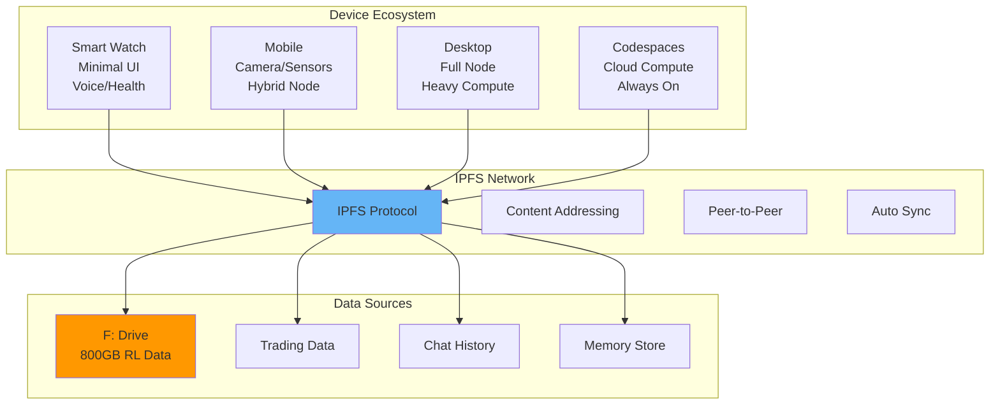
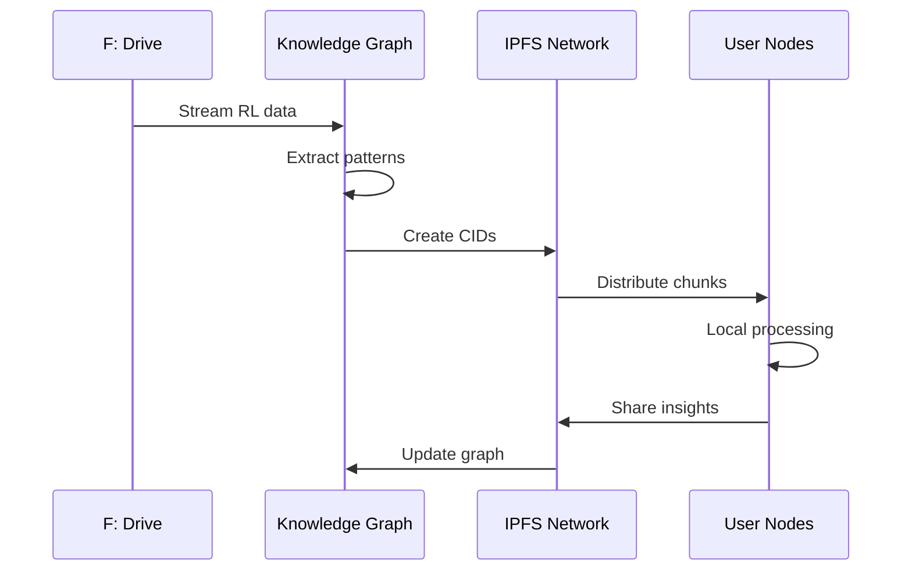

# 🌐 Distributed IPFS Multi-Device AGI Roadmap

## Vision
Transform ULTIMATE AGI into a decentralized, multi-device ecosystem where every user is a node in a collective intelligence network.

## 🎯 Core Architecture



## 📊 Data Intelligence Gathering System

### Phase 1: Data Integration (Week 1-2)
- [ ] Mount F: drive with 800GB RL data
- [ ] Index all trading data into knowledge graph
- [ ] Import chat histories and memories
- [ ] Create IPFS CIDs for all data chunks
- [ ] Build semantic search across all data

### Phase 2: Knowledge Graph Enhancement (Week 3-4)
- [ ] Parse RL training data for patterns
- [ ] Extract trading strategies and outcomes
- [ ] Build relationship maps from chat data
- [ ] Create temporal knowledge links
- [ ] Generate insights dashboard

### Phase 3: Multi-Device Apps (Week 5-8)
- [ ] **Smart Watch App**
  - Minimal AGI interface
  - Voice commands
  - Health/context monitoring
  - Quick alerts
  
- [ ] **Mobile App**
  - React Native/Flutter
  - IPFS lite client
  - Offline-first design
  - Camera/AR integration
  
- [ ] **Desktop Enhancement**
  - Full IPFS node
  - Model hosting
  - Heavy compute tasks
  - Gateway services

### Phase 4: IPFS Network (Week 9-10)
- [ ] Implement IPFS clustering
- [ ] Create content addressing for models
- [ ] Build P2P discovery mechanism
- [ ] Add encryption layer
- [ ] Deploy DHT for routing

### Phase 5: Collective Intelligence (Week 11-12)
- [ ] Federated learning setup
- [ ] Distributed compute tasks
- [ ] Consensus mechanisms
- [ ] Reputation system
- [ ] Resource sharing protocols

## 🧠 Knowledge Graph Integration

```yaml
New Nodes to Add:
  - IPFSNetwork:
      type: "Infrastructure"
      properties:
        - protocol: "IPFS"
        - nodes: "User devices"
        - storage: "Distributed"
        
  - RLDataset:
      type: "DataSource"
      location: "F:/RL_Data"
      size: "800GB"
      contains:
        - training_data
        - model_checkpoints
        - experiment_logs
        
  - TradingIntelligence:
      type: "KnowledgeDomain"
      sources:
        - market_data
        - strategy_outcomes
        - risk_metrics
        
  - DeviceNodes:
      types: ["watch", "mobile", "desktop"]
      capabilities:
        watch: ["voice", "health", "alerts"]
        mobile: ["camera", "location", "sensors"]
        desktop: ["compute", "storage", "gateway"]
```

## 🔄 Data Gathering Pipeline



## 💡 Implementation Details

### Smart Watch App
```
Tech Stack:
- WearOS/WatchOS
- Voice SDK
- BLE for local sync
- Minimal IPFS client

Features:
- "Hey AGI" activation
- Quick queries
- Health integration
- Notification system
```

### Mobile App
```
Tech Stack:
- React Native/Flutter
- IPFS Mobile SDK
- SQLite local cache
- WebRTC for P2P

Features:
- Full chat interface
- Offline mode
- Camera integration
- Location context
```

### Desktop Enhancement
```
Tech Stack:
- Electron/Pake
- Full IPFS node
- GPU acceleration
- Docker containers

Features:
- Model hosting
- Gateway services
- Heavy compute
- Network analytics
```

## 🚀 Quick Start Actions

1. **Immediate: Setup F: Drive Access**
   ```python
   # In ULTIMATE_AGI_SYSTEM_V3.py
   RL_DATA_PATH = "F:/RL_Data"
   TRADING_DATA_PATH = "F:/Trading"
   ```

2. **Today: Start Data Indexing**
   - Begin scanning F: drive
   - Create initial knowledge graph nodes
   - Start pattern extraction

3. **This Week: IPFS Setup**
   - Install IPFS daemon
   - Configure IPFS cluster
   - Create first CIDs

4. **Next Week: First Mobile Prototype**
   - Basic React Native app
   - IPFS connection
   - Simple chat interface

## 📈 Success Metrics

- **Nodes Online**: Track active devices
- **Data Indexed**: GB processed from F:
- **Query Speed**: Distributed vs centralized
- **Uptime**: Network availability
- **Intelligence Growth**: New patterns discovered

## 🔗 Resources

- [IPFS Docs](https://docs.ipfs.io)
- [React Native](https://reactnative.dev)
- [WearOS Development](https://developer.android.com/wear)
- [Federated Learning](https://federated.withgoogle.com)

---

This roadmap transforms ULTIMATE AGI into a true decentralized intelligence network where every device contributes to and benefits from collective knowledge! 🌍🧠