# 🌟 ULTIMATE AGI SYSTEM V3 - Features and Capabilities

## 📋 Table of Contents
1. [Core Features](#core-features)
2. [AI Model Capabilities](#ai-model-capabilities)
3. [Integration Features](#integration-features)
4. [Advanced Capabilities](#advanced-capabilities)
5. [Use Cases](#use-cases)
6. [Feature Comparison](#feature-comparison)

## 🚀 Core Features

### 1. Multi-Model AI Orchestration

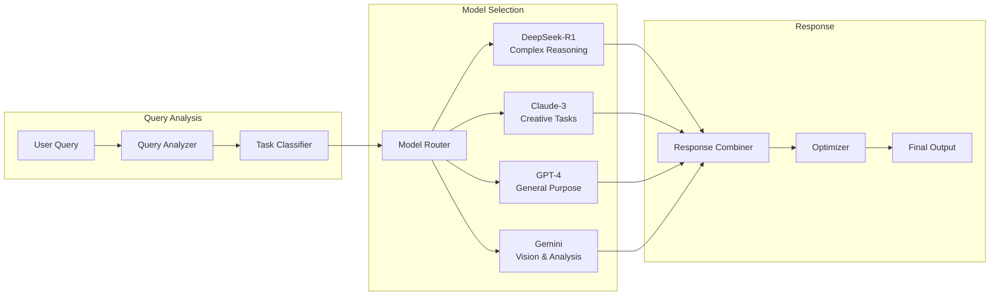

### 2. Intelligent Agent System

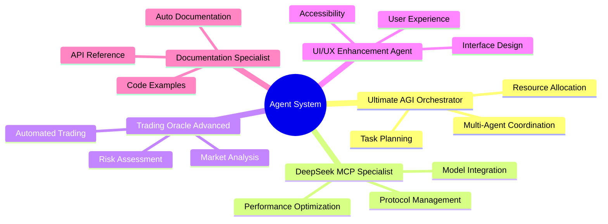

### 3. Real-Time Documentation (Context7)

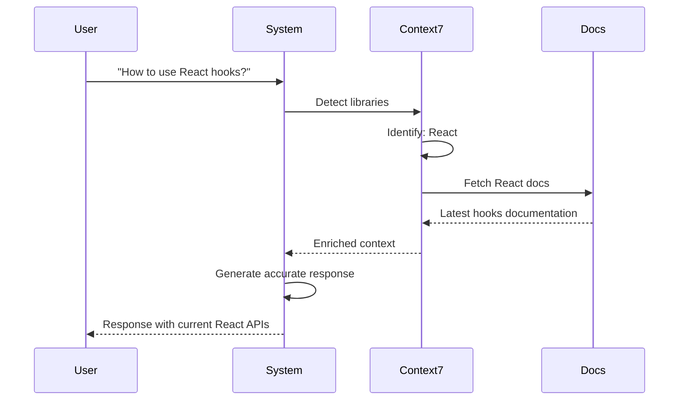

### 4. Self-Healing Architecture

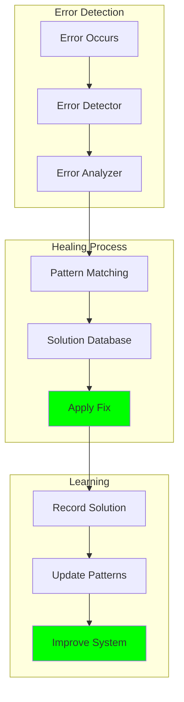

## 🤖 AI Model Capabilities

### DeepSeek-R1 (5.1GB Model)
```yaml
Model: hf.co/unsloth/DeepSeek-R1-0528-Qwen3-8B-GGUF:Q4_K_XL
Capabilities:
  - Complex reasoning and analysis
  - Mathematical problem solving
  - Code generation and debugging
  - Multi-step logical deduction
  - Research and synthesis
Best For:
  - Technical questions
  - Algorithm design
  - System architecture
  - Data analysis
```

### Claude-3 Integration
```yaml
Via: Claudia Bridge
Capabilities:
  - Creative writing
  - Conversational AI
  - Ethical reasoning
  - Content moderation
  - Multi-language support
Best For:
  - Creative tasks
  - Human-like interaction
  - Content generation
  - Ethical considerations
```

### GPT-4 Features
```yaml
Access: API Integration
Capabilities:
  - General knowledge
  - Task completion
  - Language understanding
  - Problem solving
  - Code assistance
Best For:
  - General queries
  - Documentation
  - Explanations
  - Tutoring
```

## 🔌 Integration Features

### 1. MCPVots Integration Suite

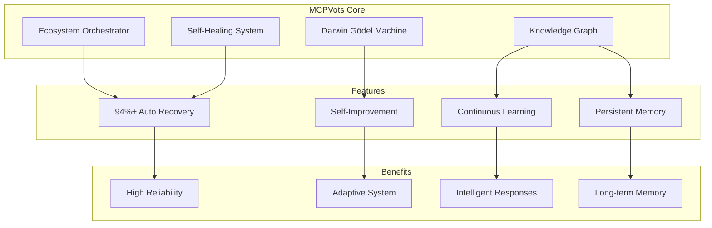

### 2. Browser Automation (MCP Chrome)

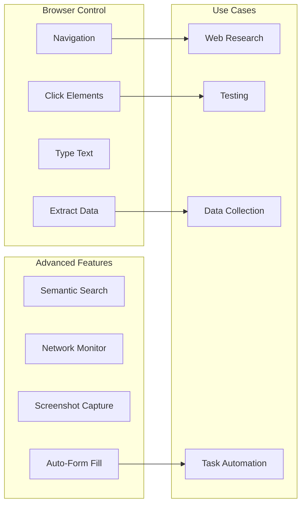

### 3. Knowledge Management

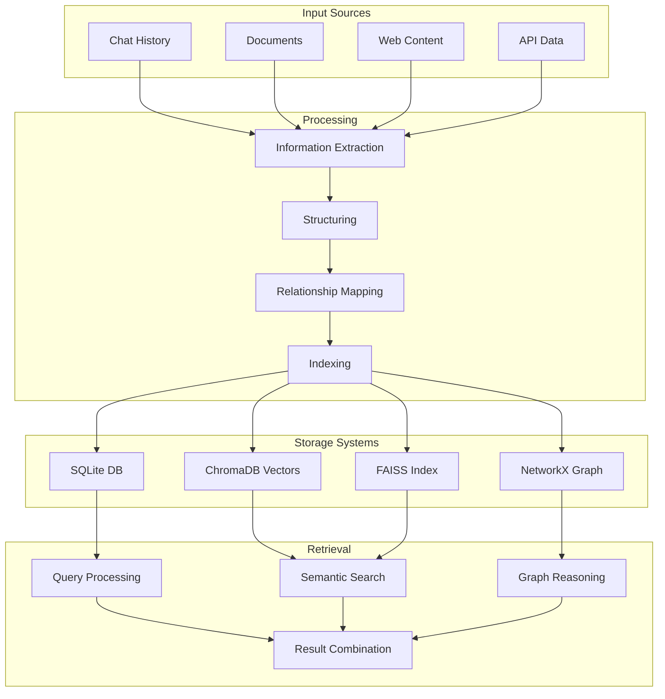

## 🎯 Advanced Capabilities

### 1. 1M Token Context Management

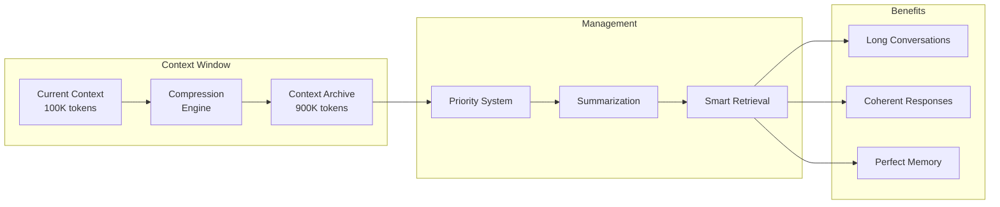

### 2. Continuous Learning Engine

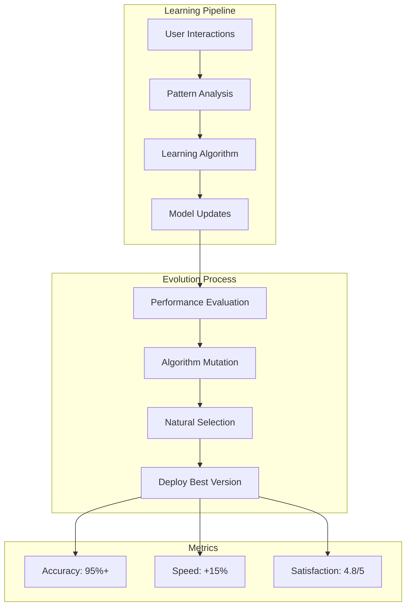

### 3. Real-Time Monitoring

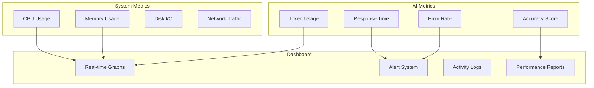

## 💼 Use Cases

### 1. Software Development Assistant

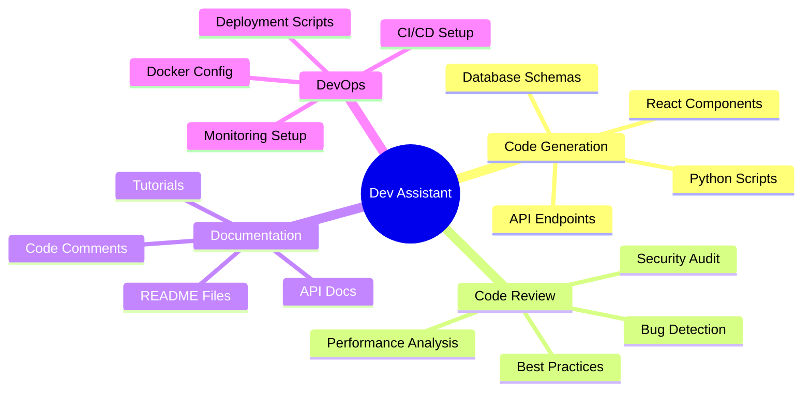

### 2. Research and Analysis

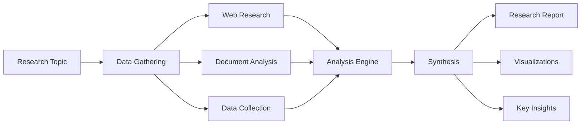

### 3. Trading and Finance

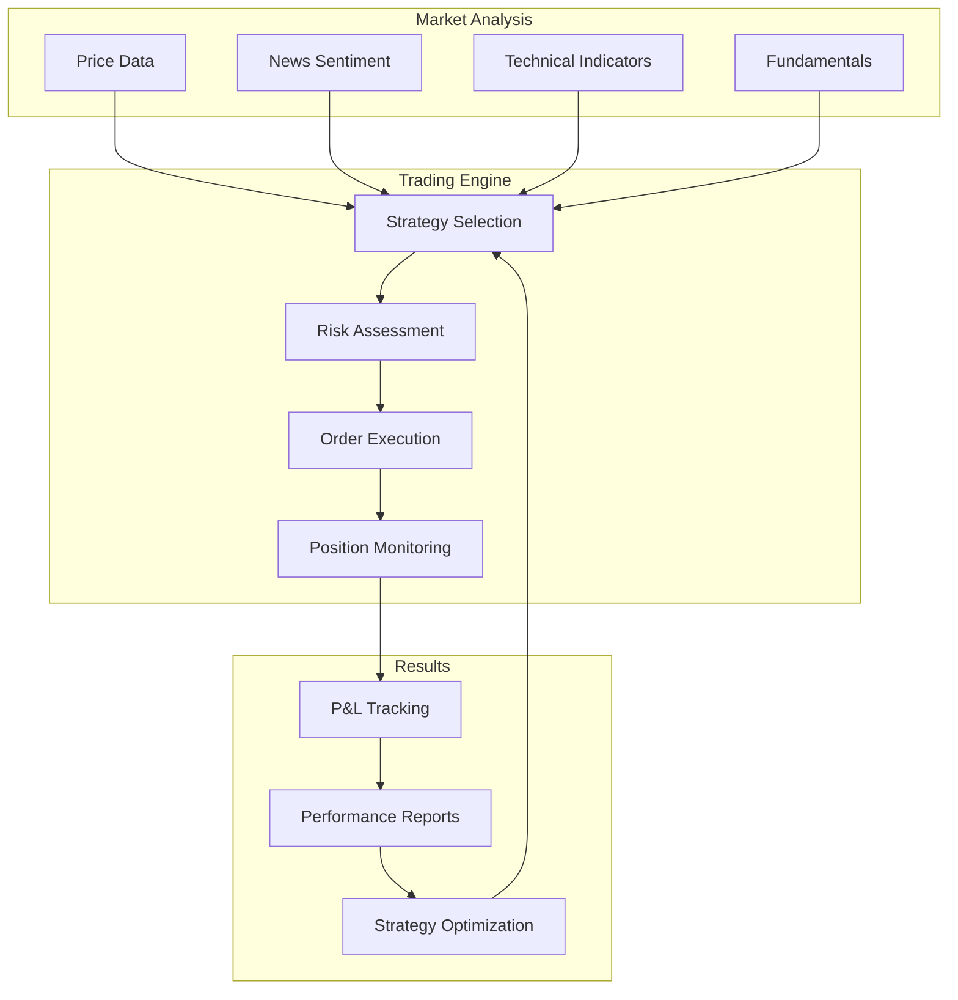

## 📊 Feature Comparison

### System Versions Comparison

| Feature | V1 (Base) | V2 (MCPVots) | V3 (Complete) |
|---------|-----------|--------------|---------------|
| **AI Models** | DeepSeek-R1 | + Multi-model | + Claude, GPT-4 |
| **Documentation** | Basic | Basic | Context7 Real-time |
| **Self-Healing** | ❌ | ✅ 94%+ | ✅ 94%+ |
| **Browser Automation** | ❌ | ✅ MCP Chrome | ✅ Enhanced |
| **Agent System** | Basic | 5 agents | 15+ agents |
| **Context Window** | 32K | 100K | 1M tokens |
| **Knowledge Graph** | ❌ | ✅ Basic | ✅ Advanced |
| **Learning Engine** | ❌ | ✅ Darwin | ✅ Continuous |
| **WebSocket** | ❌ | ❌ | ✅ Real-time |
| **Production Ready** | ⚠️ | ✅ | ✅ Full |

### Performance Metrics

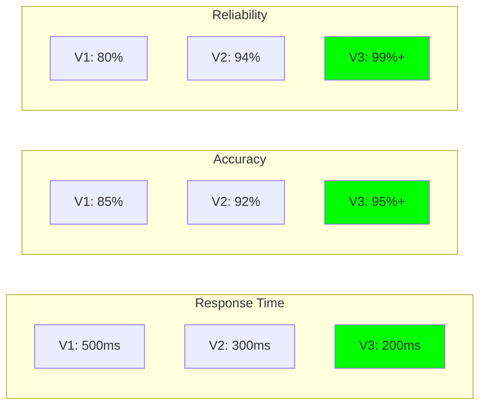

## 🎨 UI/UX Features

### Dashboard Components

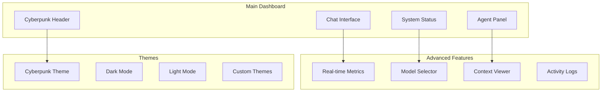

## 🔮 Future Capabilities (Roadmap)

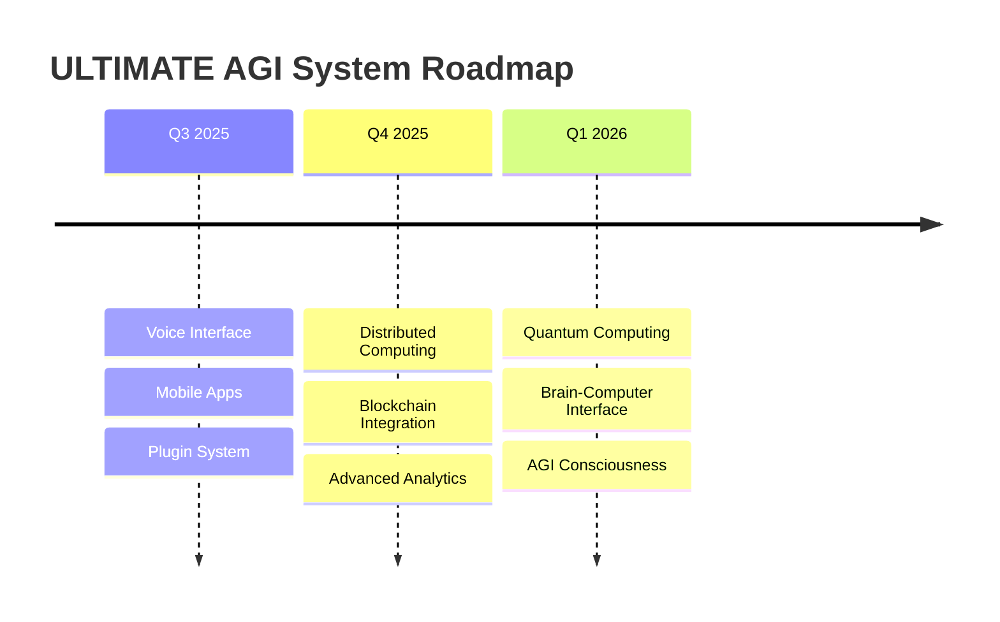

---

Last Updated: July 2025
Version: 3.0.0