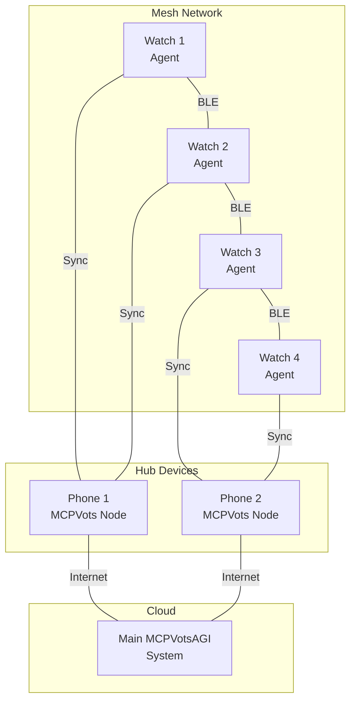

# MCPVotsAGI Smartwatch Integration - Future Vision

## Overview
A revolutionary concept to extend MCPVotsAGI to smartwatches, creating a truly decentralized AI agent network that operates both online and offline using Bluetooth mesh networking.

## Inspiration
Inspired by BitChat's Bluetooth mesh networking approach, this integration would bring AI agents literally onto users' bodies, enabling new forms of human-AI symbiosis.

## Core Concepts

### 1. Edge AI Agents
- Lightweight AI models running directly on smartwatches
- TensorFlow Lite for efficient inference
- Local decision-making without internet connectivity

### 2. Bluetooth Mesh Network
- Watches connect peer-to-peer
- Messages hop between devices to extend range
- Continues operating when internet/servers are down

### 3. Biometric Integration
```python
# Example: Biometric-aware trading
class BiometricTradingAgent:
    def analyze_trader_state(self):
        if self.heart_rate > 120:
            return "high_stress"
        if self.sleep_quality < 0.6:
            return "fatigue"
        return "optimal"
    
    def adjust_risk_tolerance(self, state):
        if state == "high_stress":
            self.risk_multiplier = 0.5  # Reduce risk
        elif state == "fatigue":
            self.risk_multiplier = 0.7
        else:
            self.risk_multiplier = 1.0
```

## Architecture



## Key Features

### 1. Offline Capabilities
- Agents continue operating without internet
- Local mesh maintains agent communication
- Decisions cached and synced when online

### 2. Collective Intelligence
- Multiple watches form distributed computing cluster
- Shared insights through mesh network
- Crowd-sourced market sentiment

### 3. Human-AI Symbiosis
- AI responds to user's physical state
- Stress detection affects trading decisions
- Activity levels influence risk parameters

## Implementation Phases

### Phase 1: Proof of Concept (6 months)
- [ ] Basic watch app with mesh networking
- [ ] Simple message passing between watches
- [ ] A2A protocol adaptation for Bluetooth

### Phase 2: Edge AI Integration (12 months)
- [ ] TensorFlow Lite model deployment
- [ ] Local inference capabilities
- [ ] Biometric data integration

### Phase 3: Full System Integration (18 months)
- [ ] Seamless online/offline switching
- [ ] Distributed consensus algorithms
- [ ] Production-ready deployment

## Technical Requirements

### Hardware
- WearOS 3.0+ or watchOS 8.0+
- Bluetooth 5.0+ with mesh support
- Minimum 1GB RAM, 8GB storage

### Software Stack
```yaml
Platform:
  - WearOS/watchOS native apps
  - Bluetooth mesh SDK
  
AI/ML:
  - TensorFlow Lite 2.x
  - Edge TPU support (where available)
  
Networking:
  - Bluetooth LE mesh protocol
  - Custom A2A mesh adaptation
  
Security:
  - End-to-end encryption
  - Secure element integration
  - Biometric authentication
```

## Use Cases

### 1. Trading Floor Scenario
- 50 traders wearing smartwatches
- Mesh network forms automatically
- Collective market sentiment analysis
- Continues during internet outages

### 2. Remote Trading
- Hiker receives market alert via mesh
- Makes trading decision offline
- Syncs when back in connectivity

### 3. Health-Aware Trading
- Detects trader stress/fatigue
- Automatically adjusts risk parameters
- Alerts team members via mesh

## Benefits

1. **True Decentralization** - No single point of failure
2. **Always Available** - Works without internet
3. **Biometric Intelligence** - New data dimensions
4. **Disaster Resilient** - Operates in any condition
5. **Privacy First** - Local processing, encrypted mesh

## Challenges

1. **Battery Life** - Mesh networking is power-intensive
2. **Processing Limits** - Watches have limited resources
3. **Security** - Mesh networks need strong encryption
4. **Synchronization** - Complex offline/online handoff

## Future Vision

Imagine a world where:
- Your AI assistant is always with you, literally
- Trading decisions consider your physical state
- AI agents collaborate through proximity
- No internet? No problem - mesh takes over
- True human-AI partnership on your wrist

## Next Steps

1. Research smartwatch capabilities and limitations
2. Prototype basic mesh networking on watches
3. Design lightweight A2A protocol variant
4. Create edge AI model specifications
5. Build proof-of-concept demo

---

*"The future of AI isn't in the cloud - it's on your wrist, in your pocket, all around you. MCPVotsAGI everywhere, always available, truly decentralized."*