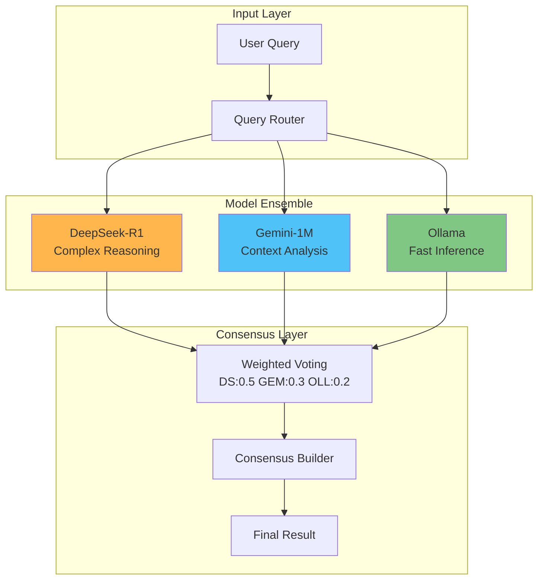
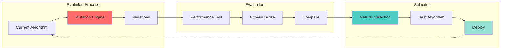
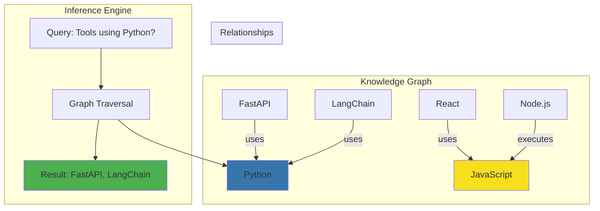
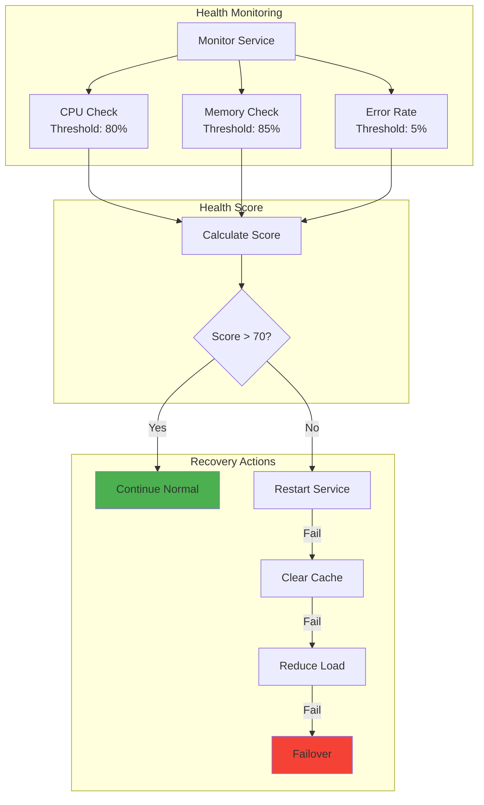
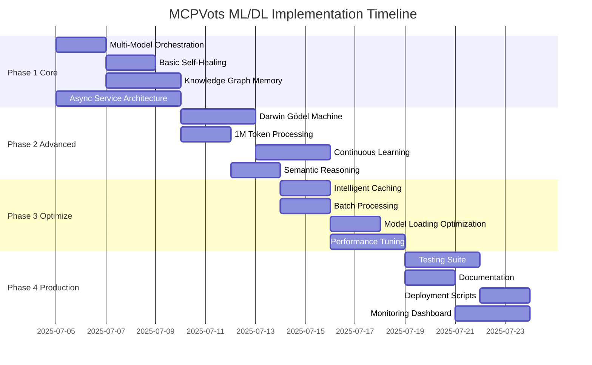

# 🧠 MCPVots ML/DL Workflows Implementation Guide

## Overview

This guide details the advanced ML/DL workflows and techniques from MCPVots that we're integrating into ULTIMATE AGI SYSTEM V2.

## 🚀 Key ML/DL Workflows

### 1. Multi-Model Orchestration



The MCPVots system demonstrates how to coordinate multiple AI models for superior results:

```python
# Example: Multi-model reasoning pipeline
async def multi_model_reasoning(query: str):
    results = await asyncio.gather(
        deepseek_r1_analysis(query),      # Deep reasoning
        gemini_1m_context(query),         # Large context analysis
        ollama_fast_inference(query)      # Quick responses
    )
    
    # Weighted consensus
    return weighted_consensus(results, weights={
        'deepseek': 0.5,
        'gemini': 0.3,
        'ollama': 0.2
    })
```

### 2. 1M Token Context Processing

Leverage Gemini's massive context window for comprehensive analysis:

```python
# Analyze entire codebases
async def analyze_codebase(repo_path: str):
    # Load all files
    all_code = load_entire_codebase(repo_path)
    
    # Single context analysis
    analysis = await gemini_analyze(
        context=all_code,  # Up to 1M tokens
        task="architecture_review"
    )
    
    return analysis
```

### 3. Continuous Learning Pipeline

Automated fine-tuning based on real-world performance:

```python
class ContinuousLearningPipeline:
    def __init__(self):
        self.performance_threshold = 0.85
        self.training_data = []
        
    async def collect_feedback(self, interaction):
        # Store successful interactions
        if interaction.success_score > self.performance_threshold:
            self.training_data.append({
                'input': interaction.input,
                'output': interaction.output,
                'score': interaction.success_score
            })
    
    async def trigger_fine_tuning(self):
        if len(self.training_data) >= 1000:
            await self.fine_tune_model()
            self.training_data = []
```

## 🧬 Advanced Algorithms

### 1. Darwin Gödel Machine (DGM)



Self-modifying AI that evolves its own algorithms:

```python
class DarwinGodelMachine:
    def __init__(self):
        self.algorithms = []
        self.fitness_scores = {}
        
    async def evolve(self, algorithm, performance_metrics):
        # Generate variations
        variations = self.mutate(algorithm)
        
        # Test each variation
        for variant in variations:
            score = await self.evaluate(variant, performance_metrics)
            if score > self.fitness_scores.get(algorithm, 0):
                # Replace with better version
                self.algorithms.append(variant)
                self.fitness_scores[variant] = score
                
        return self.get_best_algorithm()
```

### 2. Semantic Reasoning with OWL



Knowledge graph-based reasoning for complex relationships:

```python
class OWLReasoner:
    def __init__(self):
        self.knowledge_graph = NetworkX.DiGraph()
        
    def add_knowledge(self, subject, predicate, object):
        self.knowledge_graph.add_edge(subject, object, 
                                     relation=predicate)
    
    def reason(self, query):
        # Traverse graph for inference
        # Example: "What tools use Python?"
        tools = []
        for node in self.knowledge_graph.nodes():
            if self.has_path(node, "uses", "Python"):
                tools.append(node)
        return tools
```

### 3. AST-Based Code Optimization

Analyze and optimize code using Abstract Syntax Trees:

```python
import ast

class CodeOptimizer:
    def analyze_complexity(self, code: str):
        tree = ast.parse(code)
        complexity = self.calculate_cyclomatic_complexity(tree)
        
        if complexity > 10:
            # Suggest refactoring
            suggestions = self.generate_refactoring_suggestions(tree)
            return {
                'complexity': complexity,
                'suggestions': suggestions
            }
        
        return {'complexity': complexity, 'status': 'good'}
```

## 🛠️ Best Practices

### 1. Service-Oriented Architecture

Break down the AGI into specialized microservices:

```yaml
services:
  deepseek_reasoning:
    port: 8001
    model: deepseek-r1:latest
    role: complex_reasoning
    
  memory_service:
    port: 8002
    type: knowledge_graph
    role: persistent_memory
    
  evolution_engine:
    port: 8003
    type: darwin_godel
    role: algorithm_optimization
```

### 2. Async-First Design

Maximize concurrency with proper async patterns:

```python
# Bad: Sequential processing
for task in tasks:
    result = process_task(task)  # Blocking
    results.append(result)

# Good: Concurrent processing
results = await asyncio.gather(*[
    process_task(task) for task in tasks
])

# Better: With rate limiting
semaphore = asyncio.Semaphore(10)
async def rate_limited_task(task):
    async with semaphore:
        return await process_task(task)

results = await asyncio.gather(*[
    rate_limited_task(task) for task in tasks
])
```

### 3. Configuration-Driven Development

Use comprehensive configuration files:

```json
{
  "agi_config": {
    "models": {
      "primary": "deepseek-r1:latest",
      "secondary": ["gemini-2.5-pro", "ollama-llama3"],
      "fallback": "gpt-3.5-turbo"
    },
    "features": {
      "self_healing": true,
      "continuous_learning": true,
      "multi_agent": true
    },
    "performance": {
      "cache_ttl": 600,
      "max_concurrent_requests": 50,
      "timeout_seconds": 30
    }
  }
}
```

## 📊 Performance Optimizations

### 1. Intelligent Caching

```python
from functools import lru_cache
import asyncio
from datetime import datetime, timedelta

class SmartCache:
    def __init__(self, ttl_seconds=300):
        self.cache = {}
        self.ttl = timedelta(seconds=ttl_seconds)
        
    async def get_or_compute(self, key, compute_func):
        if key in self.cache:
            value, timestamp = self.cache[key]
            if datetime.now() - timestamp < self.ttl:
                return value
        
        # Compute and cache
        value = await compute_func()
        self.cache[key] = (value, datetime.now())
        return value
```

### 2. Dynamic Model Loading

Load models based on available resources:

```python
class DynamicModelLoader:
    def __init__(self):
        self.available_memory = psutil.virtual_memory().available
        
    def select_model(self, task_type):
        if self.available_memory > 16 * 1024**3:  # 16GB
            return "deepseek-r1:latest"  # Large model
        elif self.available_memory > 8 * 1024**3:  # 8GB
            return "deepseek-r1:8b"      # Medium model
        else:
            return "deepseek-r1:1.5b"    # Small model
```

### 3. Batch Processing

Process multiple requests efficiently:

```python
class BatchProcessor:
    def __init__(self, batch_size=10, timeout=1.0):
        self.batch = []
        self.batch_size = batch_size
        self.timeout = timeout
        self.lock = asyncio.Lock()
        
    async def add_request(self, request):
        async with self.lock:
            self.batch.append(request)
            
            if len(self.batch) >= self.batch_size:
                return await self.process_batch()
                
        # Wait for more requests or timeout
        await asyncio.sleep(self.timeout)
        return await self.process_batch()
        
    async def process_batch(self):
        async with self.lock:
            if not self.batch:
                return []
                
            results = await self.model.batch_inference(self.batch)
            self.batch = []
            return results
```

## 🔄 Self-Healing Implementation



### 1. Health Monitoring

```python
class HealthMonitor:
    def __init__(self):
        self.metrics = {
            'cpu_usage': [],
            'memory_usage': [],
            'response_times': [],
            'error_rates': []
        }
        
    async def check_health(self):
        health_score = 100
        
        # Check CPU
        cpu = psutil.cpu_percent(interval=1)
        if cpu > 80:
            health_score -= 20
            
        # Check memory
        memory = psutil.virtual_memory().percent
        if memory > 85:
            health_score -= 30
            
        # Check error rate
        error_rate = self.calculate_error_rate()
        if error_rate > 0.05:  # 5% errors
            health_score -= 40
            
        return {
            'score': health_score,
            'status': 'healthy' if health_score > 70 else 'unhealthy',
            'metrics': self.metrics
        }
```

### 2. Automatic Recovery

```python
class AutoRecovery:
    async def recover_service(self, service_name, error):
        strategies = [
            self.restart_service,
            self.clear_cache,
            self.reduce_load,
            self.failover_to_backup
        ]
        
        for strategy in strategies:
            try:
                await strategy(service_name)
                if await self.verify_recovery(service_name):
                    return True
            except Exception as e:
                continue
                
        return False
```

## 🎯 Implementation Roadmap



### Phase 1: Core Integration (Week 1)
- [ ] Set up multi-model orchestration
- [ ] Implement basic self-healing
- [ ] Add knowledge graph memory
- [ ] Create async service architecture

### Phase 2: Advanced Features (Week 2)
- [ ] Implement Darwin Gödel Machine
- [ ] Add 1M token processing
- [ ] Create continuous learning pipeline
- [ ] Implement semantic reasoning

### Phase 3: Optimization (Week 3)
- [ ] Add intelligent caching
- [ ] Implement batch processing
- [ ] Optimize model loading
- [ ] Performance tuning

### Phase 4: Production Ready (Week 4)
- [ ] Complete testing suite
- [ ] Documentation
- [ ] Deployment scripts
- [ ] Monitoring dashboard

## 📚 Resources

- [MCPVots Repository](https://github.com/kabrony/MCPVots)
- [DeepSeek R1 Documentation](https://deepseek.ai)
- [Gemini API Reference](https://ai.google.dev)
- [Ollama Documentation](https://ollama.ai)

## 🤝 Contributing

When implementing these workflows:

1. Follow async-first patterns
2. Use configuration files
3. Implement proper error handling
4. Add comprehensive logging
5. Write unit tests
6. Document your code

---

This guide provides a comprehensive overview of the advanced ML/DL workflows from MCPVots that enhance our ULTIMATE AGI SYSTEM with state-of-the-art capabilities.