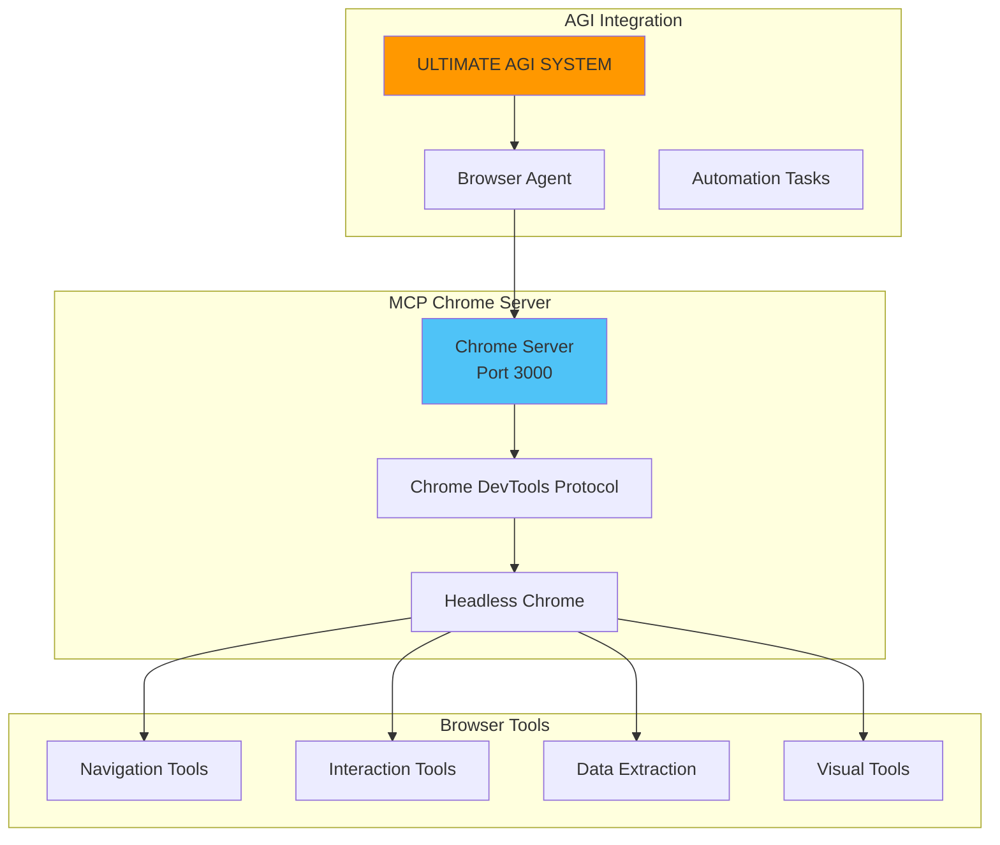
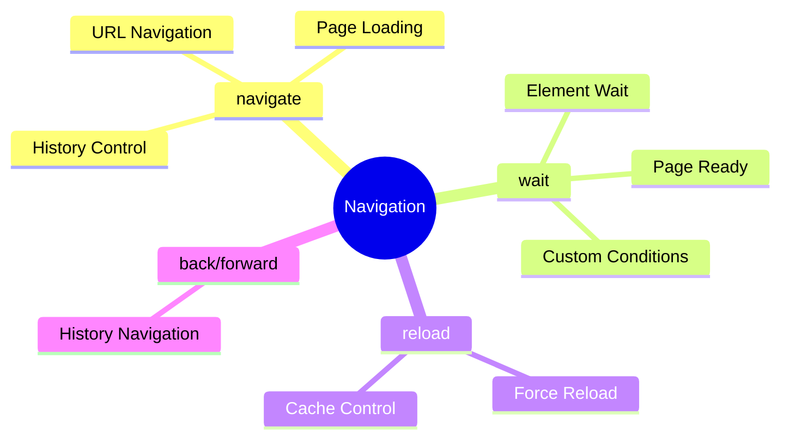
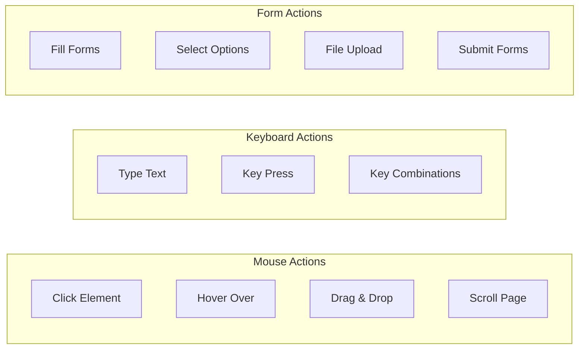
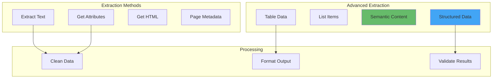
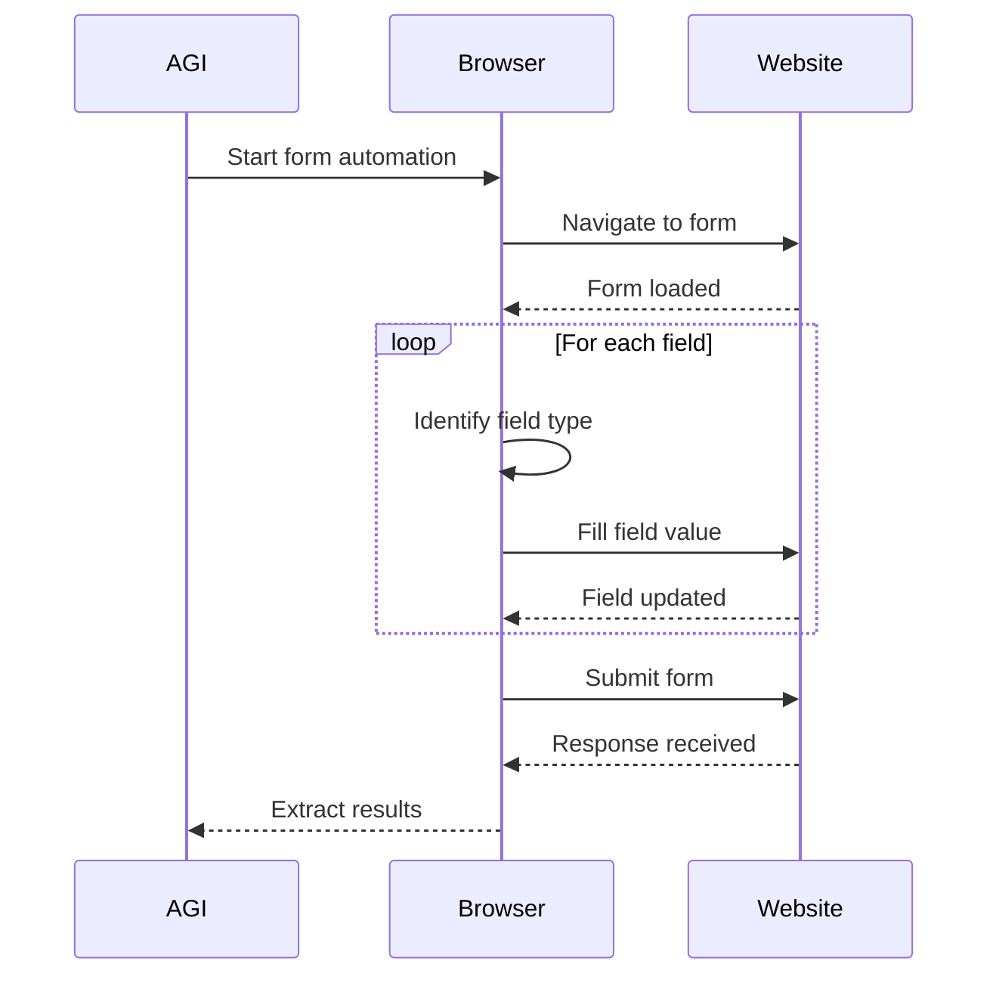
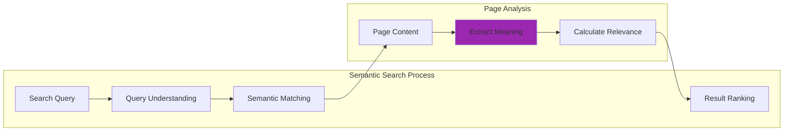
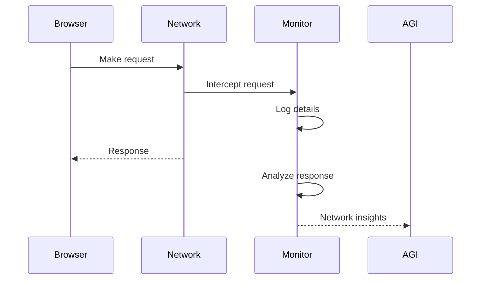
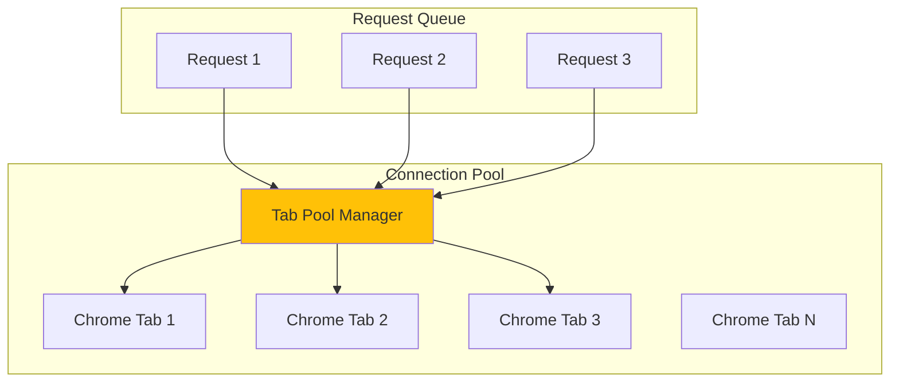
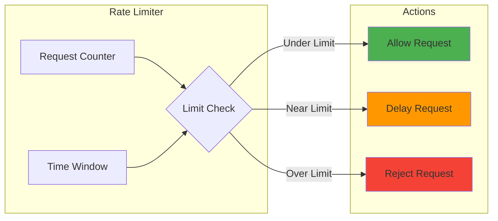
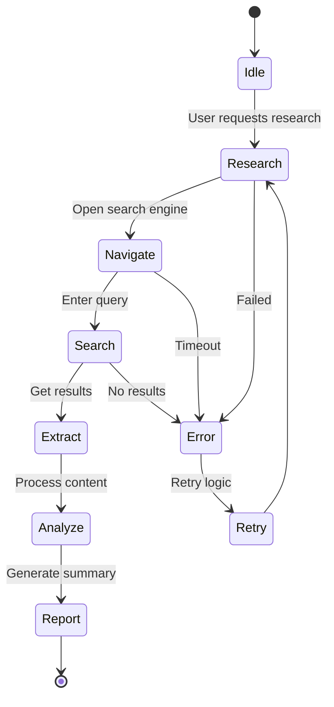

# 🌐 MCP Chrome Browser Automation Guide

## Overview

MCP Chrome provides powerful browser automation capabilities with 20+ tools, enabling the ULTIMATE AGI SYSTEM to interact with web content, perform research, automate tasks, and extract data from websites.

## 🚀 Quick Start

### 1. Start MCP Chrome Server

```batch
# Windows
START_MCP_CHROME.bat

# Or manually
cd tools/mcp-chrome
npm start
```

### 2. Verify Connection

```bash
curl http://localhost:3000/health
```

## 🏗️ Architecture



## 🛠️ Available Tools

### Navigation Tools



### Interaction Tools



### Data Extraction



## 📋 Common Use Cases

### 1. Web Research Automation

```python
async def research_topic(topic: str):
    # Navigate to search engine
    await browser.navigate("https://google.com")
    
    # Search for topic
    await browser.type("#search-input", topic)
    await browser.click("#search-button")
    
    # Extract results
    results = await browser.extract_all(".result")
    
    # Process each result
    for result in results[:10]:
        title = await browser.extract_text(result, ".title")
        url = await browser.get_attribute(result, "href")
        snippet = await browser.extract_text(result, ".snippet")
        
        # Visit and analyze
        await browser.navigate(url)
        content = await browser.extract_semantic_content()
```

### 2. Form Automation



### 3. Data Scraping

```python
async def scrape_product_data(url: str):
    await browser.navigate(url)
    
    # Wait for content
    await browser.wait_for_element(".product-grid")
    
    # Extract structured data
    products = await browser.execute_script("""
        return Array.from(document.querySelectorAll('.product')).map(p => ({
            name: p.querySelector('.name')?.textContent,
            price: p.querySelector('.price')?.textContent,
            rating: p.querySelector('.rating')?.textContent,
            image: p.querySelector('img')?.src
        }))
    """)
    
    return products
```

## 🎯 Advanced Features

### 1. Semantic Search



### 2. Visual Analysis

```python
# Take screenshots
screenshot = await browser.screenshot(full_page=True)

# Visual element detection
elements = await browser.find_elements_by_image(template_image)

# OCR text extraction
text = await browser.extract_text_from_image(screenshot)
```

### 3. Network Monitoring



## 🔧 Configuration

### Environment Variables

```bash
# MCP Chrome Configuration
MCP_CHROME_PORT=3000
MCP_CHROME_HEADLESS=true
MCP_CHROME_TIMEOUT=30000
MCP_CHROME_MAX_TABS=10

# Performance Settings
CHROME_ARGS="--disable-gpu --no-sandbox"
ENABLE_SIMD=true
CACHE_RESPONSES=true
```

### Chrome Options

```javascript
{
  "chrome_options": {
    "headless": true,
    "args": [
      "--disable-blink-features=AutomationControlled",
      "--disable-dev-shm-usage",
      "--no-sandbox",
      "--disable-setuid-sandbox",
      "--disable-gpu"
    ],
    "userAgent": "Mozilla/5.0 (Windows NT 10.0; Win64; x64) AppleWebKit/537.36",
    "viewport": {
      "width": 1920,
      "height": 1080
    }
  }
}
```

## 📊 Performance Optimization

### 1. Connection Pooling



### 2. Caching Strategy

```python
class BrowserCache:
    def __init__(self):
        self.page_cache = {}
        self.selector_cache = {}
        
    async def get_or_fetch(self, url, force_refresh=False):
        if not force_refresh and url in self.page_cache:
            return self.page_cache[url]
            
        content = await browser.navigate_and_extract(url)
        self.page_cache[url] = content
        return content
```

### 3. Batch Operations

```python
async def batch_scrape(urls: List[str], max_concurrent=5):
    semaphore = asyncio.Semaphore(max_concurrent)
    
    async def scrape_with_limit(url):
        async with semaphore:
            return await scrape_page(url)
    
    results = await asyncio.gather(*[
        scrape_with_limit(url) for url in urls
    ])
    
    return results
```

## 🛡️ Security & Best Practices

### 1. Rate Limiting



### 2. Error Handling

```python
class BrowserErrorHandler:
    async def execute_with_retry(self, func, max_retries=3):
        for attempt in range(max_retries):
            try:
                return await func()
            except TimeoutError:
                await self.handle_timeout()
            except NetworkError:
                await self.handle_network_error()
            except Exception as e:
                if attempt == max_retries - 1:
                    raise
                await asyncio.sleep(2 ** attempt)
```

### 3. Content Validation

```python
async def validate_extraction(data):
    # Check for anti-bot measures
    if "captcha" in data or "blocked" in data:
        raise BotDetectionError()
    
    # Validate data structure
    if not data or len(data) < expected_minimum:
        raise InsufficientDataError()
    
    return data
```

## 🔍 Troubleshooting

### Common Issues

1. **Connection Refused**
   ```bash
   # Check if server is running
   ps aux | grep chrome
   
   # Restart server
   npm restart
   ```

2. **Timeout Errors**
   - Increase timeout values
   - Check network connectivity
   - Verify page load times

3. **Bot Detection**
   - Rotate user agents
   - Add delays between requests
   - Use residential proxies

### Debug Mode

```javascript
// Enable verbose logging
process.env.DEBUG = "mcp-chrome:*"

// Log all browser events
browser.on('console', msg => console.log('PAGE LOG:', msg.text()));
browser.on('pageerror', err => console.log('PAGE ERROR:', err));
```

## 🚀 Integration with AGI System

### Using Browser Tools in Chat

```python
# In ULTIMATE AGI SYSTEM
@chat_handler
async def handle_web_request(message):
    if "research" in message or "browse" in message:
        # Activate browser agent
        agent = BrowserAutomationAgent()
        results = await agent.research(message)
        
        # Generate response with findings
        response = await generate_response_with_context(
            message, 
            web_context=results
        )
        
        return response
```

### Automated Workflows



## 📚 Resources

- [Chrome DevTools Protocol](https://chromedevtools.github.io/devtools-protocol/)
- [Puppeteer Documentation](https://pptr.dev/)
- [MCP Chrome GitHub](https://github.com/kabrony/mcp-chrome)
- [Web Scraping Best Practices](https://scrapfly.io/blog/web-scraping-best-practices/)

---

With MCP Chrome integration, the ULTIMATE AGI SYSTEM gains powerful web automation capabilities, enabling advanced research, data extraction, and task automation across the internet! 🌐🤖