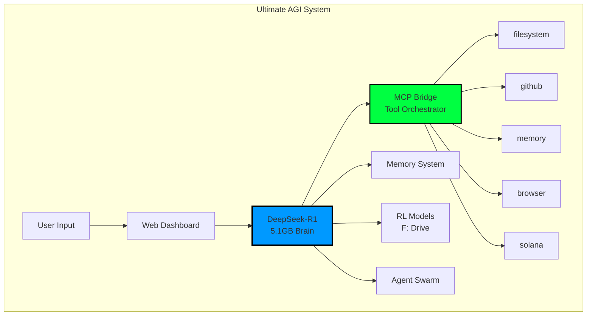
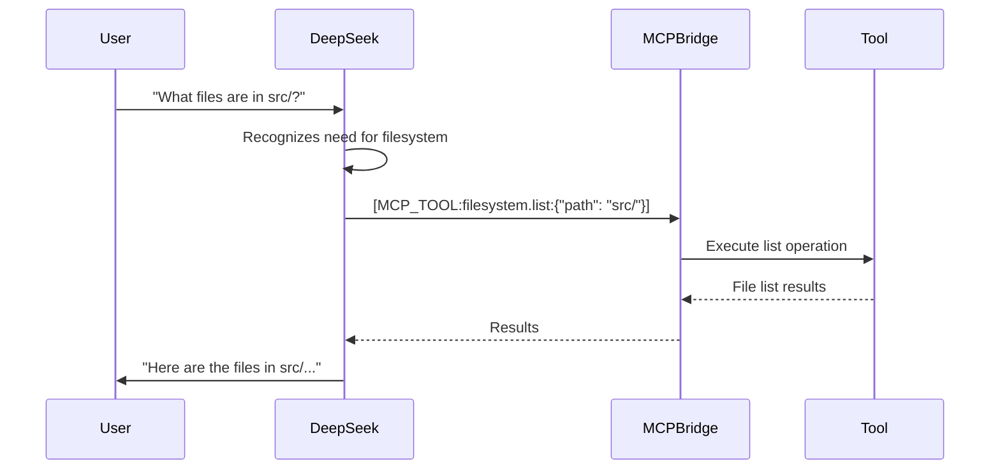

# 🔗 DeepSeek-R1 MCP Integration Guide

## 🌟 Overview

This guide explains how DeepSeek-R1 (our primary AGI brain) integrates with MCP (Model Context Protocol) tools to create a truly unified system where the AI can interact with files, GitHub, browsers, and more.



## 🚀 Quick Start

### 1. Start with MCP Integration
```bash
# Windows
python START_AGI_WITH_MCP.py

# Or directly
python src/core/deepseek_mcp_integration.py
```

### 2. Available MCP Tools

DeepSeek-R1 can now use these tools:

| Tool | Description | Example Commands |
|------|-------------|------------------|
| **filesystem** | Read/write files | "Read the config file", "Create a new Python script" |
| **github** | GitHub operations | "Create an issue", "Submit a PR" |
| **memory** | Persistent storage | "Remember this for later", "What did I tell you about X?" |
| **browser** | Web scraping | "Search for latest AI news", "Get data from website" |
| **solana** | Blockchain ops | "Check SOL balance", "Execute trade" |

## 🧠 How It Works

### 1. Tool Recognition
When you chat with DeepSeek-R1, it automatically recognizes when to use tools:



### 2. Tool Syntax
DeepSeek uses this syntax internally:
```
[MCP_TOOL:tool_name.method:{"param1": "value1", "param2": "value2"}]
```

### 3. Multi-Tool Operations
DeepSeek can chain multiple tools:

```python
# Example: Analyze code and create GitHub issue
User: "Find performance issues in the code and create GitHub issues for them"

DeepSeek:
1. [MCP_TOOL:filesystem.search:{"pattern": "*.py", "path": "src/"}]
2. [MCP_TOOL:filesystem.read:{"path": "src/core/main.py"}]
3. Analyzes code for issues
4. [MCP_TOOL:github.create_issue:{"title": "Performance: Optimize main loop", "body": "..."}]
```

## 📋 Configuration

### 1. MCP Server Configuration
Located in `config/ultimate_agi_mcp.json`:

```json
{
  "mcpServers": {
    "ultimate-agi": {
      "name": "Ultimate AGI System",
      "command": "python",
      "args": ["src/core/ultimate_agi_mcp_bridge.py"],
      "capabilities": {
        "chat": {
          "description": "Chat with DeepSeek-R1",
          "parameters": {
            "prompt": {"type": "string"},
            "use_tools": {"type": "array"}
          }
        }
      }
    }
  }
}
```

### 2. Tool Permissions
Control which tools DeepSeek can use:

```python
# In your chat request
{
  "message": "Your prompt here",
  "use_tools": ["filesystem", "github"],  # Only allow these
  "use_memory": true,
  "use_rl": false
}
```

## 🛠️ Available Tool Methods

### Filesystem Tool
```python
filesystem.read        # Read file contents
filesystem.write       # Write to file
filesystem.list        # List directory
filesystem.search      # Search for files
filesystem.delete      # Delete file
filesystem.move        # Move/rename file
```

### GitHub Tool
```python
github.create_issue    # Create new issue
github.list_issues     # List repository issues
github.create_pr       # Create pull request
github.get_pr          # Get PR details
github.merge_pr        # Merge pull request
```

### Memory Tool
```python
memory.store           # Store information
memory.recall          # Recall information
memory.search          # Search memories
memory.list            # List all memories
```

### Browser Tool
```python
browser.navigate       # Go to URL
browser.screenshot     # Take screenshot
browser.extract        # Extract data
browser.search         # Web search
```

### Solana Tool
```python
solana.get_balance     # Check wallet balance
solana.transfer        # Transfer tokens
solana.swap            # Swap tokens
solana.get_price       # Get token price
```

## 🎯 Use Cases

### 1. Code Analysis and Improvement
```
User: "Analyze the memory system code and suggest improvements"

DeepSeek will:
- Use filesystem to read relevant files
- Analyze the code
- Use memory to recall best practices
- Suggest improvements
- Optionally create GitHub issues
```

### 2. Automated Documentation
```
User: "Generate documentation for all Python files in src/"

DeepSeek will:
- Use filesystem to find all .py files
- Read each file
- Generate documentation
- Write documentation files
```

### 3. Trading with RL
```
User: "Check SOL price and suggest trading strategy"

DeepSeek will:
- Use solana tool to get current price
- Access RL models for prediction
- Use memory for historical patterns
- Provide trading recommendation
```

### 4. Research and Learning
```
User: "Research the latest developments in AGI and summarize"

DeepSeek will:
- Use browser to search for information
- Extract relevant data
- Use memory to store findings
- Generate comprehensive summary
```

## 🔧 Advanced Integration

### 1. Custom Tool Creation
Add new MCP tools by creating a server:

```python
# servers/custom_mcp_server.py
class CustomMCPServer:
    async def handle_request(self, method, params):
        if method == "custom_operation":
            # Your logic here
            return {"result": "success"}
```

### 2. Tool Chaining
Create complex workflows:

```python
# Example: Full project analysis
async def analyze_project():
    # 1. Get project structure
    files = await mcp.call("filesystem.list", {"path": ".", "recursive": True})
    
    # 2. Analyze each file
    for file in files:
        content = await mcp.call("filesystem.read", {"path": file})
        analysis = await deepseek.analyze(content)
        
    # 3. Generate report
    report = await deepseek.generate_report(analyses)
    
    # 4. Create GitHub issue with findings
    await mcp.call("github.create_issue", {
        "title": "Project Analysis Report",
        "body": report
    })
```

### 3. Memory-Augmented Tools
Combine memory with tool usage:

```python
# Remember tool usage patterns
await memory.store(
    "When analyzing code, always check for: "
    "1. Performance issues, 2. Security vulnerabilities, 3. Code style",
    memory_type=MemoryType.PROCEDURAL
)

# DeepSeek will recall this when using filesystem tools
```

## 🚨 Security Considerations

### 1. Tool Restrictions
- Filesystem access can be limited to specific directories
- GitHub operations require authentication
- Solana operations need wallet permissions

### 2. Sandboxing
```python
# Restrict filesystem access
ALLOWED_PATHS = [
    "/mnt/c/Workspace/MCPVotsAGI",
    "/tmp"
]
```

### 3. Audit Logging
All tool usage is logged:
```
2025-01-07 10:23:45 - filesystem.read - /config/settings.json - SUCCESS
2025-01-07 10:23:46 - github.create_issue - "Bug: Fix memory leak" - SUCCESS
```

## 📊 Performance Tips

### 1. Batch Operations
```python
# Good: Batch read multiple files
files_to_read = ["file1.py", "file2.py", "file3.py"]
results = await mcp.batch_call("filesystem.read", files_to_read)

# Bad: Individual reads
for file in files:
    result = await mcp.call("filesystem.read", {"path": file})
```

### 2. Caching
Tool results are cached automatically:
- Memory tool: Permanent storage
- Filesystem: 5-minute cache
- Browser: 15-minute cache

### 3. Async Operations
All MCP operations are async for performance:
```python
# Run multiple tools concurrently
results = await asyncio.gather(
    mcp.call("filesystem.read", {"path": "config.json"}),
    mcp.call("github.list_issues", {"state": "open"}),
    mcp.call("solana.get_balance", {})
)
```

## 🆘 Troubleshooting

### Tool Not Working
```bash
# Check if MCP server is running
ps aux | grep mcp

# Check logs
tail -f logs/mcp_bridge.log
```

### DeepSeek Not Using Tools
```python
# Explicitly enable tools
response = await deepseek.process(
    "Your prompt",
    allow_tools=True,
    use_tools=["filesystem", "github"]
)
```

### Performance Issues
```bash
# Monitor tool usage
python scripts/monitor_mcp_usage.py

# Clear tool cache
python scripts/clear_mcp_cache.py
```

## 🎉 Examples

### Complete Workflow Example
```
User: "Create a new feature for user authentication"

DeepSeek + MCP will:
1. [filesystem] Create new directory structure
2. [filesystem] Write authentication module code
3. [filesystem] Create tests
4. [memory] Store design decisions
5. [github] Create feature branch
6. [github] Create PR with description
7. [browser] Research best practices
8. [filesystem] Update documentation
```

---

**With MCP integration, DeepSeek-R1 becomes a truly autonomous AGI that can interact with your entire development environment!** 🚀