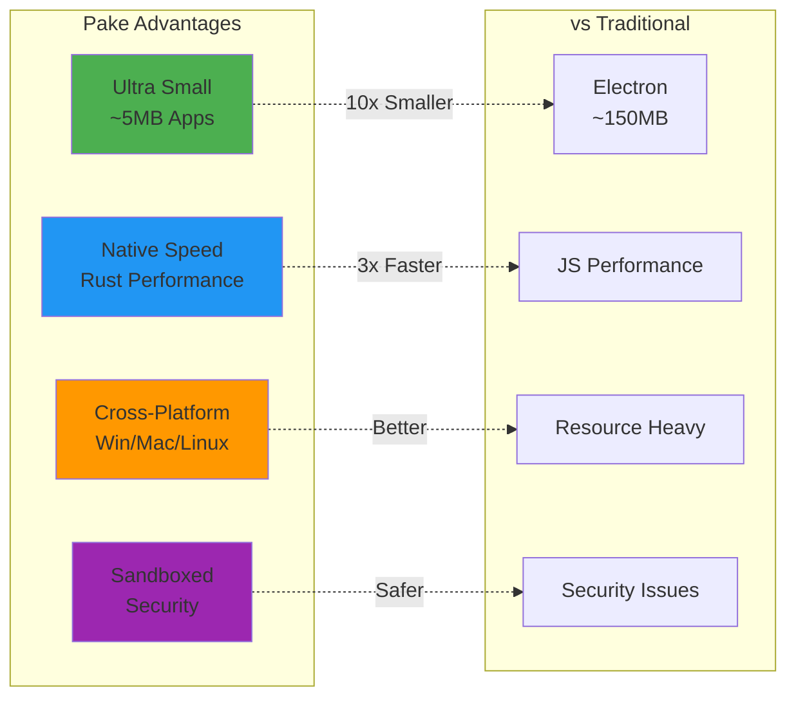
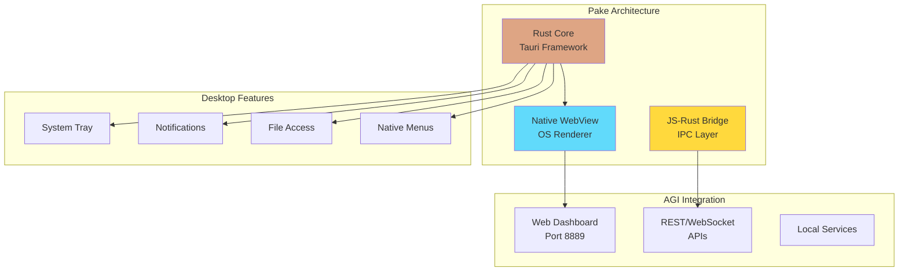
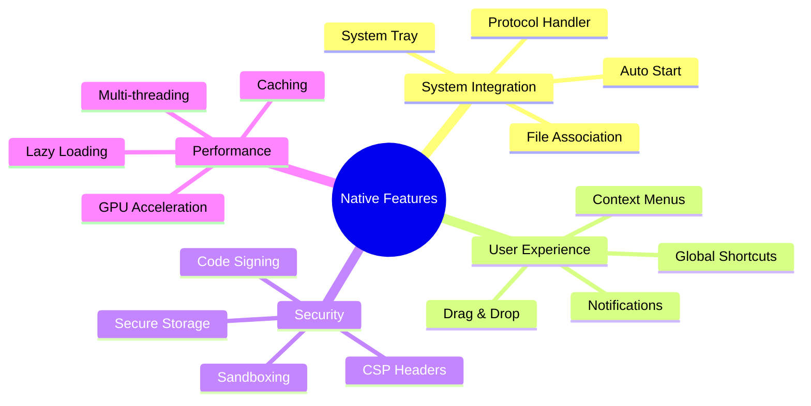
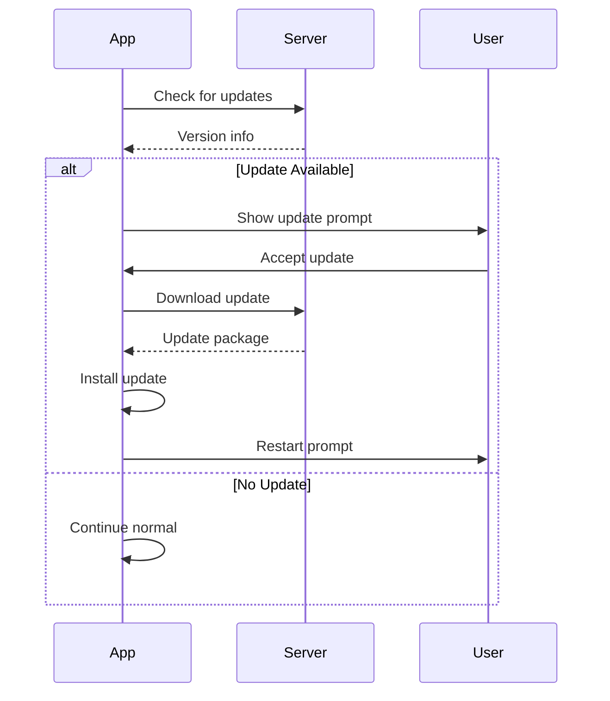
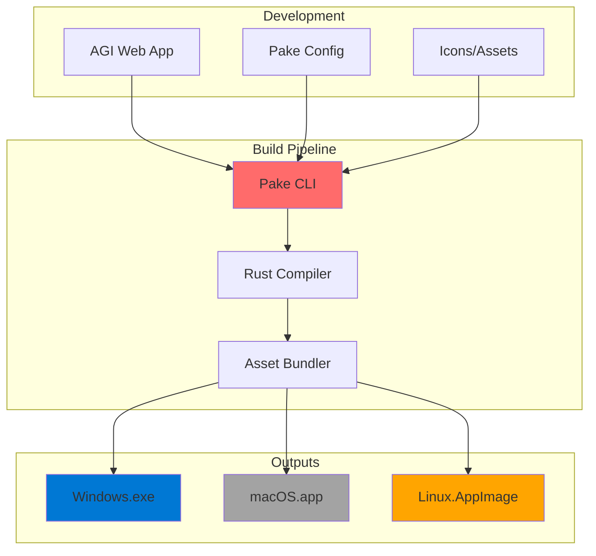
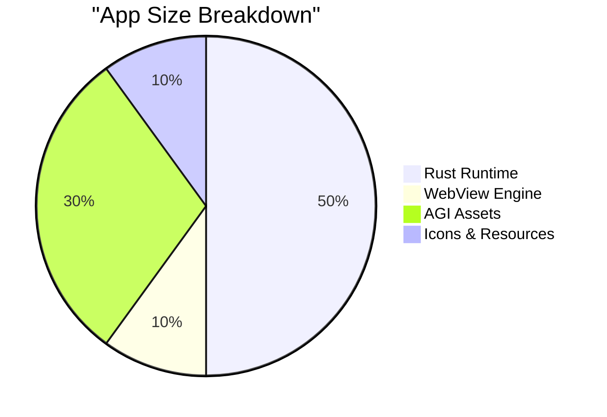
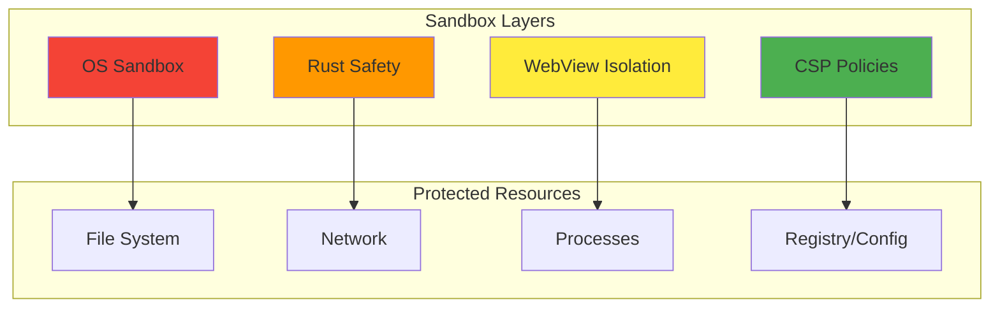

# 📦 Pake Desktop App Deployment Guide

## Overview

Pake transforms the ULTIMATE AGI SYSTEM into a lightweight desktop application (~5MB) using Rust and Tauri, providing native performance across Windows, macOS, and Linux.

## 🌟 Key Benefits



## 🚀 Quick Start

### 1. Install Pake

```bash
# Install via npm
npm install -g pake-cli

# Or download from GitHub
# https://github.com/kabrony/Pake/releases
```

### 2. Build Desktop App

```bash
# Basic build
pake http://localhost:8889 --name "ULTIMATE AGI"

# Advanced build with options
pake http://localhost:8889 \
  --name "ULTIMATE AGI System V3" \
  --icon ./assets/icon.png \
  --width 1200 \
  --height 800 \
  --fullscreen false \
  --transparent false
```

## 🏗️ Architecture



## 📋 Configuration Options

### Build Configuration

```json
{
  "name": "ULTIMATE AGI System",
  "identifier": "com.ultimate.agi",
  "version": "3.0.0",
  "description": "Advanced AGI Platform",
  "author": "AGI Team",
  "url": "http://localhost:8889",
  "window": {
    "width": 1400,
    "height": 900,
    "resizable": true,
    "fullscreen": false,
    "transparent": false,
    "title_bar_style": "overlay"
  },
  "features": {
    "system_tray": true,
    "multi_window": true,
    "auto_updater": true,
    "deep_linking": true
  }
}
```

### Platform-Specific Settings

```mermaid
flowchart LR
    subgraph "Windows"
        WIN_ICON[.ico Icon]
        WIN_SIGN[Code Signing]
        WIN_MSI[MSI Installer]
        WIN_STORE[MS Store]
    end
    
    subgraph "macOS"
        MAC_ICON[.icns Icon]
        MAC_SIGN[Notarization]
        MAC_DMG[DMG Package]
        MAC_STORE[App Store]
    end
    
    subgraph "Linux"
        LIN_ICON[.png Icon]
        LIN_SIGN[GPG Signing]
        LIN_DEB[DEB/RPM]
        LIN_SNAP[Snap/Flatpak]
    end
    
    style WIN_STORE fill:#0078d4
    style MAC_STORE fill:#000000
    style LIN_SNAP fill:#fd7e14
```



## 🎨 Customization

### 1. Custom Icons

```bash
# Generate icon set from PNG
pake-icon generate icon.png

# Output structure:
icons/
├── icon.ico     # Windows
├── icon.icns    # macOS
└── icon.png     # Linux (multiple sizes)
```

### 2. Window Styles

```javascript
// Transparent window with custom title bar
{
  "window": {
    "transparent": true,
    "decorations": false,
    "always_on_top": false,
    "skip_taskbar": false
  },
  "custom_protocol": "agi://",
  "user_agent": "ULTIMATE-AGI/3.0"
}
```

### 3. Native Features



## 🔧 Advanced Features

### 1. System Tray Integration

```rust
// Rust code for system tray
use tauri::SystemTray;

fn create_tray() -> SystemTray {
    let tray_menu = SystemTrayMenu::new()
        .add_item(CustomMenuItem::new("show", "Show AGI"))
        .add_item(CustomMenuItem::new("hide", "Hide"))
        .add_separator()
        .add_item(CustomMenuItem::new("settings", "Settings"))
        .add_item(CustomMenuItem::new("quit", "Quit"));
    
    SystemTray::new().with_menu(tray_menu)
}
```

### 2. Auto-Updater



### 3. Deep Linking

```javascript
// Handle custom protocol URLs
// agi://chat?message=hello
// agi://settings
// agi://agent/deepseek

window.addEventListener('deep-link', (event) => {
  const url = new URL(event.detail);
  
  switch(url.pathname) {
    case '/chat':
      openChat(url.searchParams.get('message'));
      break;
    case '/settings':
      openSettings();
      break;
    case '/agent':
      activateAgent(url.pathname.split('/')[2]);
      break;
  }
});
```

## 📦 Packaging & Distribution

### 1. Build Process



### 2. Code Signing

#### Windows
```powershell
# Sign with certificate
signtool sign /f certificate.pfx /p password /t http://timestamp.digicert.com ultimate-agi.exe
```

#### macOS
```bash
# Sign and notarize
codesign --deep --force --verify --sign "Developer ID" ULTIMATE-AGI.app
xcrun altool --notarize-app --file ULTIMATE-AGI.dmg
```

#### Linux
```bash
# Sign with GPG
gpg --sign --detach-sign --armor ultimate-agi.AppImage
```

### 3. Distribution Channels

```mermaid
flowchart TB
    subgraph "Direct Distribution"
        GITHUB[GitHub Releases]
        WEBSITE[Project Website]
        CDN[CDN Hosting]
    end
    
    subgraph "App Stores"
        MSSTORE[Microsoft Store]
        MACSTORE[Mac App Store]
        SNAP[Snap Store]
    end
    
    subgraph "Package Managers"
        BREW[Homebrew]
        CHOCO[Chocolatey]
        APT[APT/YUM]
    end
    
    GITHUB --> USERS[End Users]
    MSSTORE --> USERS
    BREW --> USERS
    
    style GITHUB fill:#24292e
    style MSSTORE fill:#0078d4
    style BREW fill:#f9d094
```



## 🚀 Deployment Workflow

### 1. Local Development

```bash
# Start AGI system
python LAUNCH_ULTIMATE_AGI_V3.py

# In another terminal, run Pake in dev mode
pake --dev http://localhost:8889
```

### 2. Production Build

```bash
# Build for all platforms
pake build --all \
  --url https://agi.yourcompany.com \
  --name "ULTIMATE AGI" \
  --version "3.0.0"

# Output files:
dist/
├── ULTIMATE-AGI-3.0.0-win.exe
├── ULTIMATE-AGI-3.0.0-mac.dmg
└── ULTIMATE-AGI-3.0.0-linux.AppImage
```

### 3. CI/CD Pipeline

```yaml
# .github/workflows/pake-build.yml
name: Build Desktop Apps

on:
  push:
    tags:
      - 'v*'

jobs:
  build:
    strategy:
      matrix:
        os: [windows-latest, macos-latest, ubuntu-latest]
    
    runs-on: ${{ matrix.os }}
    
    steps:
      - uses: actions/checkout@v3
      
      - name: Setup Node
        uses: actions/setup-node@v3
        with:
          node-version: 18
      
      - name: Install Pake
        run: npm install -g pake-cli
      
      - name: Build App
        run: pake build --url ${{ secrets.AGI_URL }}
      
      - name: Upload Artifacts
        uses: actions/upload-artifact@v3
        with:
          name: ${{ matrix.os }}-build
          path: dist/*
```

## 📊 Performance Optimization

### 1. Bundle Size Optimization



### 2. Startup Performance

```javascript
// Preload critical resources
const preloadScript = `
  // Cache API responses
  window.AGI_CACHE = new Map();
  
  // Preload models list
  fetch('/api/models').then(r => r.json())
    .then(data => window.AGI_CACHE.set('models', data));
  
  // Initialize WebSocket early
  window.AGI_WS = new WebSocket('ws://localhost:8889/ws');
`;
```

### 3. Memory Management

```rust
// Configure memory limits
fn configure_webview() -> WebView {
    WebViewBuilder::new()
        .with_memory_limit(512 * 1024 * 1024) // 512MB
        .with_cache_enabled(true)
        .with_devtools(cfg!(debug_assertions))
        .build()
}
```

## 🛡️ Security Considerations

### 1. Content Security Policy

```html
<meta http-equiv="Content-Security-Policy" content="
  default-src 'self';
  script-src 'self' 'unsafe-inline';
  style-src 'self' 'unsafe-inline';
  img-src 'self' data: https:;
  connect-src 'self' ws://localhost:* wss://*;
">
```

### 2. Sandboxing



## 🔍 Troubleshooting

### Common Issues

1. **WebView Not Loading**
   - Check if AGI system is running
   - Verify URL in config
   - Check firewall settings

2. **Build Failures**
   - Install Rust toolchain
   - Update Pake CLI
   - Check platform dependencies

3. **Performance Issues**
   - Enable hardware acceleration
   - Reduce animation complexity
   - Optimize API calls

### Debug Mode

```bash
# Run with debug logging
RUST_LOG=debug pake --dev http://localhost:8889

# Enable DevTools
pake --dev --devtools http://localhost:8889
```

## 📚 Resources

- [Pake GitHub Repository](https://github.com/kabrony/Pake)
- [Tauri Documentation](https://tauri.app)
- [Rust Book](https://doc.rust-lang.org/book/)
- [WebView2 Documentation](https://docs.microsoft.com/microsoft-edge/webview2/)

---

With Pake, deploy the ULTIMATE AGI SYSTEM as a lightweight, native desktop application that provides the best user experience across all platforms! 📦🚀