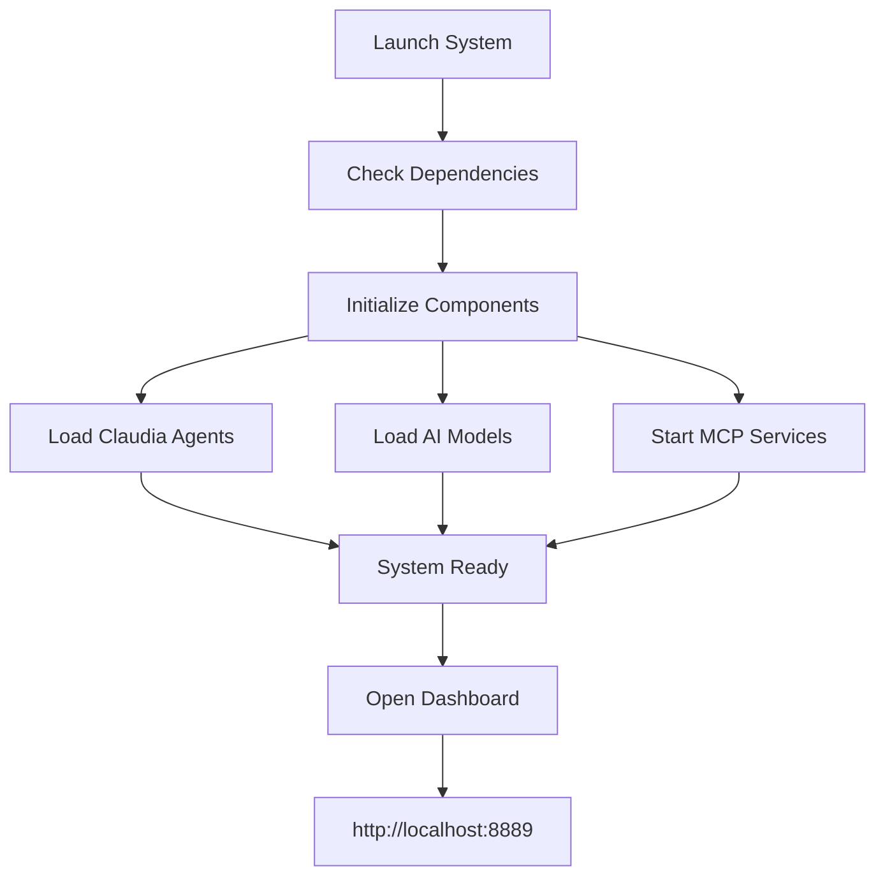
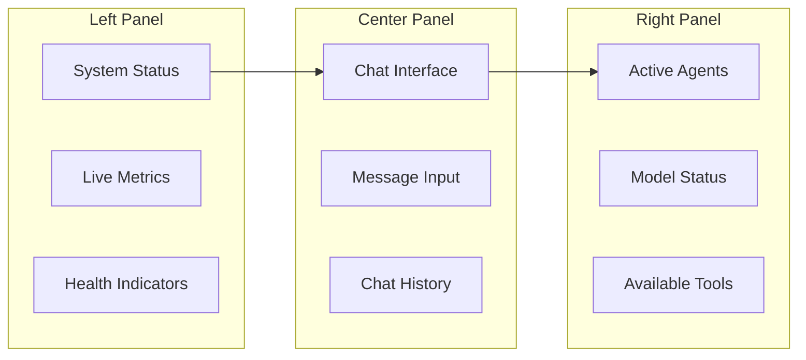
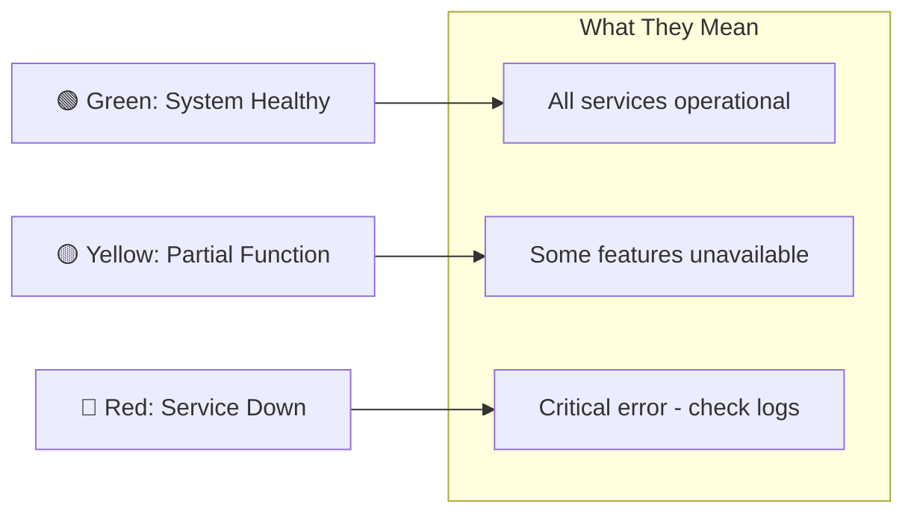

# 🚀 ULTIMATE AGI SYSTEM V3 - Quick Start Guide

## 📋 Table of Contents
1. [System Requirements](#system-requirements)
2. [Installation](#installation)
3. [First Run](#first-run)
4. [Basic Usage](#basic-usage)
5. [Advanced Features](#advanced-features)
6. [Troubleshooting](#troubleshooting)

## 💻 System Requirements

### Minimum Requirements
- **OS**: Windows 10/11, Ubuntu 20.04+, macOS 11+
- **CPU**: 4 cores @ 2.4GHz
- **RAM**: 8GB
- **Storage**: 20GB free space
- **Python**: 3.12+
- **Node.js**: 18+ (for Context7)

### Recommended Requirements
- **CPU**: 8+ cores @ 3.0GHz
- **RAM**: 16GB+
- **GPU**: NVIDIA GPU with 8GB+ VRAM (for local models)
- **Storage**: 50GB+ free space (for models)

## 🔧 Installation

### Step 1: Clone Repository
```bash
git clone https://github.com/your-repo/MCPVotsAGI.git
cd MCPVotsAGI
```

### Step 2: Install Python Dependencies
```bash
# Create virtual environment (recommended)
python -m venv venv

# Activate virtual environment
# Windows:
venv\Scripts\activate
# Linux/Mac:
source venv/bin/activate

# Install dependencies
pip install -r requirements.txt
```

### Step 3: Install Ollama (for DeepSeek-R1)
```bash
# Windows: Download from https://ollama.ai
# Linux/Mac:
curl -fsSL https://ollama.ai/install.sh | sh

# Pull DeepSeek-R1 model (5.1GB)
ollama pull unsloth/DeepSeek-R1-0528-Qwen3-8B-GGUF:Q4_K_XL
```

### Step 4: Setup Node.js (Optional - for Context7)
```bash
# Install Node.js 18+ from https://nodejs.org
# Verify installation
node --version
npm --version
```

### Step 5: Configure Environment
```bash
# Copy example environment file
cp .env.example .env

# Edit .env file with your settings
# Required settings:
AGI_PORT=8889
CLAUDIA_AGI_INTEGRATION=true
```

## 🎯 First Run

### Quick Start (Windows)
```batch
# Double-click or run:
START_AGI.bat

# Or use the launcher:
python LAUNCH_ULTIMATE_AGI_V3.py
```

### Quick Start (Linux/Mac)
```bash
python LAUNCH_ULTIMATE_AGI_V3.py
```

### What Happens on First Run:



## 📱 Basic Usage

### 1. Access the Dashboard
Open your browser and navigate to:
```
http://localhost:8889
```

### 2. Simple Chat
```javascript
// Send a basic message
{
  "message": "Hello, what can you do?"
}

// Response includes system capabilities
```

### 3. Code Generation Example
```javascript
// Request code generation
{
  "message": "Create a React component for a todo list"
}

// System will:
// 1. Detect React library reference
// 2. Fetch latest React documentation
// 3. Generate modern, working code
```

### 4. Using Specific Models
```javascript
// Use DeepSeek for complex reasoning
{
  "message": "Explain quantum computing",
  "model": "deepseek-r1"
}

// Use Claude for creative tasks
{
  "message": "Write a story about AI",
  "model": "claude-3-opus"
}
```

## 🎨 Dashboard Overview



## 🔥 Advanced Features

### 1. Agent Execution
```python
# Execute a specific agent
POST /api/chat
{
  "message": "Analyze this Python code for security issues",
  "use_claudia": true,
  "agent": "deepseek-mcp-specialist"
}
```

### 2. Multi-Model Orchestration
```python
# Let system choose best model
POST /api/chat
{
  "message": "Create a business plan for an AI startup",
  "multi_model": true
}
```

### 3. Browser Automation
```python
# Start MCP Chrome first
START_MCP_CHROME.bat

# Then use browser automation
POST /api/chat
{
  "message": "Research the latest AI news and summarize",
  "tools": ["browser"]
}
```

### 4. Knowledge Graph Queries
```python
# Query stored knowledge
POST /api/chat
{
  "message": "What do you know about React hooks?",
  "use_knowledge": true
}
```

### 5. Real-time Monitoring
```javascript
// Connect to WebSocket for live updates
const ws = new WebSocket('ws://localhost:8889/ws/v3/realtime');

ws.onmessage = (event) => {
  const data = JSON.parse(event.data);
  console.log('Real-time update:', data);
};
```

## 🛠️ Configuration Options

### Model Configuration
```yaml
# config/models.yaml
models:
  deepseek-r1:
    enabled: true
    priority: high
    use_for: ["reasoning", "technical", "math"]
  
  claude-3:
    enabled: true
    priority: medium
    use_for: ["creative", "writing", "conversation"]
  
  gpt-4:
    enabled: false  # Requires API key
    priority: low
    use_for: ["general", "fallback"]
```

### Agent Configuration
```yaml
# config/agents.yaml
agents:
  ultimate-agi-orchestrator:
    auto_select: true
    capabilities: ["planning", "coordination", "execution"]
  
  deepseek-mcp-specialist:
    auto_select: false
    capabilities: ["technical", "debugging", "optimization"]
```

## 🔍 Troubleshooting

### Common Issues and Solutions

#### 1. Port Already in Use
```bash
# Error: Port 8889 is already in use

# Solution 1: Kill the process
# Windows:
netstat -ano | findstr :8889
taskkill /F /PID <PID>

# Linux/Mac:
lsof -ti:8889 | xargs kill -9

# Solution 2: Change port in .env
AGI_PORT=8890
```

#### 2. Model Not Found
```bash
# Error: DeepSeek-R1 model not found

# Solution: Pull the model
ollama pull unsloth/DeepSeek-R1-0528-Qwen3-8B-GGUF:Q4_K_XL

# Or use fallback model
ollama pull deepseek-r1:latest
```

#### 3. Context7 Not Working
```bash
# Error: Context7 server not available

# Solution 1: Install Node.js dependencies
npm install -g @upstash/context7-mcp

# Solution 2: System works without it (limited docs)
# Continue without real-time documentation
```

#### 4. Memory Issues
```bash
# Error: Out of memory

# Solution 1: Reduce context window
CONTEXT_MAX_TOKENS=100000

# Solution 2: Enable context compression
ENABLE_COMPRESSION=true

# Solution 3: Increase swap space
```

## 📊 Performance Tips

### 1. Optimize Response Time
```yaml
optimization:
  cache_responses: true
  cache_ttl: 3600
  preload_models: true
  compress_context: true
```

### 2. Reduce Memory Usage
```yaml
memory:
  max_context_tokens: 100000
  cleanup_interval: 300
  gc_threshold: 0.8
```

### 3. Improve Accuracy
```yaml
accuracy:
  use_context7: true
  verify_responses: true
  cross_check_models: false  # Slower but more accurate
```

## 🎯 Quick Commands Reference

### System Control
```bash
# Start system
python LAUNCH_ULTIMATE_AGI_V3.py

# Stop system
Ctrl+C

# Check status
curl http://localhost:8889/api/status

# View logs
tail -f ecosystem_orchestrator.log
```

### Testing
```bash
# Run system test
python TEST_SYSTEM.py

# Test specific endpoint
curl -X POST http://localhost:8889/api/chat \
  -H "Content-Type: application/json" \
  -d '{"message": "Hello"}'
```

### Maintenance
```bash
# Clean old files
python CLEANUP_OLD_FILES.py

# Update dependencies
pip install -r requirements.txt --upgrade

# Backup database
cp ultimate_agi.db ultimate_agi.db.backup
```

## 🚦 Status Indicators



## 📚 Next Steps

1. **Explore Advanced Features**
   - Read [FEATURES_AND_CAPABILITIES.md](FEATURES_AND_CAPABILITIES.md)
   - Try different agents and models
   - Experiment with browser automation

2. **Customize Your Setup**
   - Configure preferred models
   - Add custom agents
   - Modify UI theme

3. **Join the Community**
   - Report issues on GitHub
   - Share your use cases
   - Contribute improvements

---

Need more help? Check the full documentation or open an issue on GitHub.

Last Updated: July 2025
Version: 3.0.0