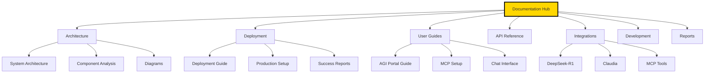
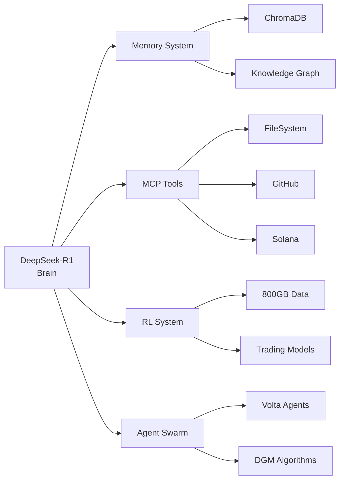

# 📚 MCPVotsAGI Documentation Hub

Welcome to the **ULTIMATE AGI System** documentation! This is your central hub for all documentation related to MCPVotsAGI.

## 🚀 Quick Links

- **[Main README](../README.md)** - Project overview and quick start
- **[Deployment Guide](deployment/DEPLOYMENT_GUIDE.md)** - Complete deployment instructions
- **[System Architecture](architecture/SYSTEM_ARCHITECTURE.md)** - Detailed system design with diagrams

## 📖 Documentation Structure

## 🏗️ Architecture Documentation

### Core Architecture
- **[System Architecture](architecture/SYSTEM_ARCHITECTURE.md)** - Complete system design with Mermaid diagrams
- **[Architecture Overview](architecture/ARCHITECTURE.md)** - High-level architecture
- **[Architecture Diagrams](architecture/ARCHITECTURE_DIAGRAMS.md)** - Visual representations
- **[Comprehensive Analysis](architecture/COMPREHENSIVE_SYSTEM_ANALYSIS.md)** - Deep system analysis

## 🚀 Deployment & Operations

### Deployment Guides
- **[Ultimate Deployment Guide](deployment/DEPLOYMENT_GUIDE.md)** - Step-by-step deployment
- **[Production Ready Summary](deployment/PRODUCTION_READY_SUMMARY.md)** - Production checklist
- **[Deployment Success Report](deployment/DEPLOYMENT_SUCCESS_JULY_3_2025.md)** - Latest deployment

### Setup Guides
- **[MCP Servers Setup](MCP_SERVERS_SETUP_GUIDE.md)** - MCP server configuration
- **[VS Code MCP Setup](MCP_SETUP_GUIDE_VSCODE.md)** - IDE integration

## 👤 User Guides

### Getting Started
- **[Unified AGI Portal](user-guide/UNIFIED_AGI_PORTAL_DOCS.md)** - Using the dashboard
- **[Chat Interface Guide](#)** - Interacting with DeepSeek-R1
- **[Memory System Guide](#)** - Understanding memory persistence

## 🔧 API Reference

### Core APIs
- **[REST API Documentation](api/)** - HTTP endpoints
- **[WebSocket API](api/)** - Real-time communication
- **[MCP Protocol](api/)** - Model Context Protocol

## 🔗 Integrations

### AI Models
- **[DeepSeek-R1 Integration](integrations/DEEPSEEK_INTEGRATION.md)** - Primary brain setup
- **[DeepSeek F: Drive](integrations/DEEPSEEK_F_DRIVE_SUMMARY.md)** - RL data integration
- **[Claudia Integration](integrations/CLAUDIA_INTEGRATION.md)** - Multi-model setup

### Tools & Services
- **[MCP Installation](integrations/MCP_INSTALLATION_SUCCESS.md)** - MCP tools setup
- **[Solana Integration](#)** - Blockchain connection
- **[IPFS Integration](#)** - Decentralized storage

## 💻 Development

### Contributing
- **[Contributing Guide](development/CONTRIBUTING.md)** - How to contribute
- **[Development Guide](development/DEVELOPMENT.md)** - Development setup
- **[Security Policy](development/SECURITY.md)** - Security guidelines
- **[Changelog](development/CHANGELOG.md)** - Version history

### Code Organization
- **[Project Structure](PROJECT_STRUCTURE.md)** - File organization
- **[Repository Organization](project-management/REPOSITORY_ORGANIZATION.md)** - Repo structure

## 📊 Reports & Analysis

### System Reports
- **[Oracle AGI V5 Docs](reports/ORACLE_AGI_V5_COMPLETE_DOCUMENTATION.md)**
- **[Oracle AGI V7 Report](reports/ORACLE_AGI_V7_COMPLETE_UPGRADE_REPORT.md)**
- **[Complete Documentation](reports/MCPVotsAGI_Complete_Documentation.md)**
- **[Ultimate Consolidation](reports/ULTIMATE_AGI_CONSOLIDATION_SUCCESS.md)**

### Analysis Reports
- **[Claude Code Capabilities](reports/CLAUDE_CODE_CAPABILITIES_REPORT.md)**
- **[System Refactor Complete](reports/SYSTEM_REFACTOR_COMPLETE.md)**
- **[Milestone Report](reports/MILESTONE_COMPLETE_FORK_INTEGRATION.md)**

## 🔄 Project Management

### Repository Management
- **[Repository Cleanup](project-management/REPOSITORY_CLEANUP.md)**
- **[Fork Integration](project-management/FORK_INTEGRATION_COMPLETE.md)**
- **[Reorganization Complete](project-management/MCPVOTSAGI_REORGANIZATION_COMPLETE.md)**

## 📚 Legacy Documentation

### Previous Versions
- **[README v2](legacy/README_v2.md)**
- **[README v3 Enhanced](legacy/README_V3_ENHANCED.md)**
- **[README Integrated](legacy/README_INTEGRATED.md)**
- **[README Professional](legacy/README_PROFESSIONAL.md)**

## 🎯 Key Concepts

### System Components

### Quick Navigation

| Category | Description | Key Docs |
|----------|-------------|----------|
| 🏗️ Architecture | System design and structure | [Architecture](architecture/SYSTEM_ARCHITECTURE.md) |
| 🚀 Deployment | Installation and setup | [Deploy Guide](deployment/DEPLOYMENT_GUIDE.md) |
| 🧠 AI Integration | DeepSeek-R1 and models | [DeepSeek Docs](integrations/DEEPSEEK_INTEGRATION.md) |
| 💾 Memory | Persistence and knowledge | [Memory System](#) |
| 📊 RL System | 800GB reinforcement learning | [RL Integration](#) |
| 🔗 MCP Tools | Tool orchestration | [MCP Setup](MCP_SERVERS_SETUP_GUIDE.md) |

## 🆘 Getting Help

- **GitHub Issues**: Report bugs or request features
- **Documentation Issues**: Found an error? Open a PR!
- **Community**: Join our Discord (coming soon)

---

**Welcome to the ULTIMATE AGI System - Where everything comes together in ONE unified platform!** 🚀