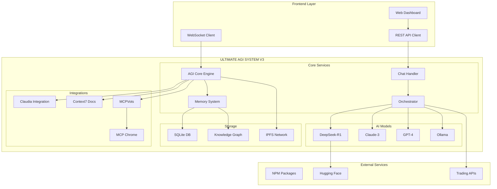
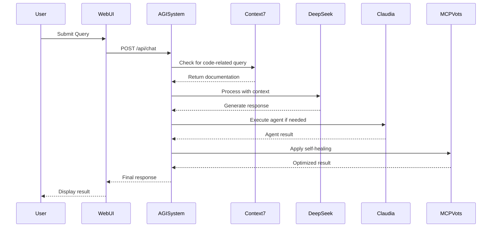
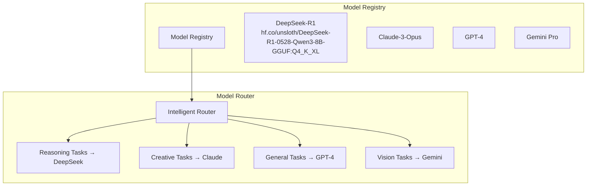
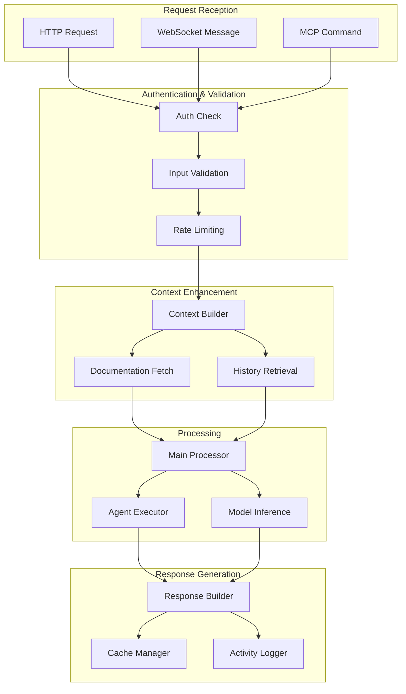
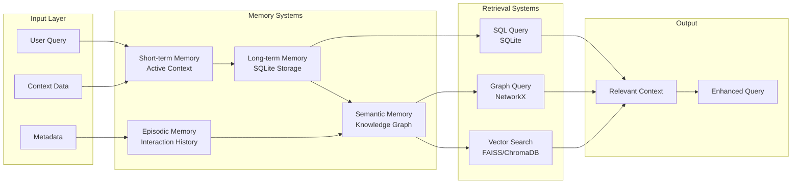
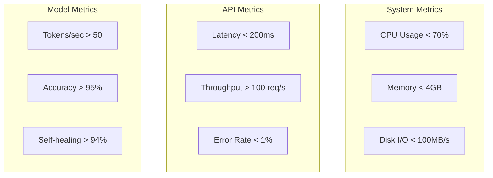
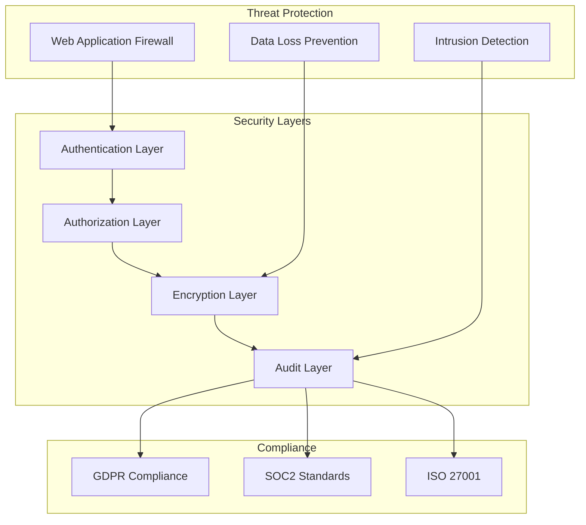

# 🚀 ULTIMATE AGI SYSTEM V3 - Complete Architecture Documentation

## 📋 Table of Contents
1. [System Overview](#system-overview)
2. [Architecture Diagrams](#architecture-diagrams)
3. [Core Components](#core-components)
4. [Integration Points](#integration-points)
5. [Data Flow](#data-flow)
6. [API Reference](#api-reference)
7. [Deployment Guide](#deployment-guide)

## 🌟 System Overview

The ULTIMATE AGI SYSTEM V3 is a comprehensive, production-ready AGI platform that integrates multiple AI models, tools, and services into a unified ecosystem.

### Key Features:
- **Multi-Model Orchestration**: DeepSeek-R1, Claude, GPT-4
- **Complete Claudia Integration**: 15+ specialized agents
- **MCPVots Advanced Features**: Self-healing, Darwin Gödel Machine
- **Real-time Documentation**: Context7 integration
- **1M Token Context**: Advanced context management
- **Browser Automation**: MCP Chrome integration
- **Knowledge Graph**: Persistent semantic memory

## 🏗️ Architecture Diagrams

### System Architecture Overview



### Component Interaction Flow



### Data Flow Architecture

```mermaid
graph LR
    subgraph "Input Processing"
        IN[User Input]
        DETECT[Library Detection]
        ENRICH[Context Enrichment]
    end
    
    subgraph "Processing Layer"
        ROUTE[Request Router]
        MODEL[Model Selection]
        EXEC[Execution Engine]
    end
    
    subgraph "Knowledge Layer"
        KNOW[Knowledge Graph]
        MEM[Memory Store]
        CACHE[Response Cache]
    end
    
    subgraph "Output Generation"
        FORMAT[Response Formatter]
        VALID[Validation]
        OUT[Final Output]
    end
    
    IN --> DETECT
    DETECT --> ENRICH
    ENRICH --> ROUTE
    ROUTE --> MODEL
    MODEL --> EXEC
    EXEC --> KNOW
    KNOW --> MEM
    MEM --> CACHE
    CACHE --> FORMAT
    FORMAT --> VALID
    VALID --> OUT
```



## 🔧 Core Components

### 1. ULTIMATE_AGI_SYSTEM.py
The base system that provides:
- Web server infrastructure
- Basic routing and middleware
- Database initialization
- Component integration points

### 2. ULTIMATE_AGI_SYSTEM_V3.py
Enhanced V3 system with:
- Complete Claudia integration
- Multi-model orchestration
- Real-time metrics
- WebSocket support
- Advanced UI components

### 3. Context7 Integration
```python
# Automatic documentation enrichment
- Library detection in queries
- Real-time API documentation
- Code example retrieval
- Version-specific docs
```

### 4. MCPVots Integration
```python
# Advanced ML/DL workflows
- Self-healing architecture (94%+ success)
- Darwin Gödel Machine evolution
- Knowledge graph persistence
- Browser automation
```

### 5. Claudia Integration
```python
# Agent management
- 15+ specialized agents
- Project coordination
- Task execution
- GUI control
```

## 🔌 Integration Points

### API Endpoints

```yaml
Core Endpoints:
  - POST /api/chat: Main chat interface
  - GET /api/status: System status
  - GET /api/v3/dashboard: Advanced dashboard
  - GET /api/v3/metrics: Real-time metrics
  - WS /ws/v3/realtime: WebSocket updates

Agent Endpoints:
  - POST /api/v3/agent/execute: Execute specific agent
  - GET /api/claudia/agents: List available agents
  - GET /api/claudia/status: Claudia status

Model Endpoints:
  - GET /api/v3/models: Active models
  - POST /api/v3/model/switch: Switch active model

Documentation:
  - POST /api/documentation: Get library docs
  - POST /api/examples: Get code examples
  - GET /api/library-stats: Usage statistics

System Control:
  - GET /api/health: Health check
  - POST /api/v3/context/compress: Compress context
  - POST /api/v3/learning/evolve: Trigger evolution
```

### Model Configuration



## 📊 Data Flow

### Request Processing Pipeline



### Memory and Knowledge Management



## 📚 API Reference

### Chat API

```typescript
// Basic Chat Request
POST /api/chat
{
  "message": string,           // User message
  "model"?: string,           // Optional: specific model to use
  "agent"?: string,           // Optional: specific agent
  "use_claudia"?: boolean,    // Use Claudia integration
  "context"?: object          // Additional context
}

// Response
{
  "response": string,         // AI response
  "model": string,           // Model used
  "context7_enriched": boolean,  // Was documentation added
  "system_info": {
    "version": string,
    "agents_available": number,
    "claudia_connected": boolean
  },
  "timestamp": string
}
```

### Agent Execution

```typescript
// Execute Agent
POST /api/v3/agent/execute
{
  "agent": string,            // Agent name
  "task": string,            // Task description
  "context": object          // Task context
}

// Response
{
  "result": any,             // Agent execution result
  "agent_name": string,
  "execution_id": string,
  "total_executions": number,
  "timestamp": string
}
```

### System Status

```typescript
// Get System Status
GET /api/status

// Response
{
  "status": "online",
  "version": string,
  "uptime": number,
  "v3_features": {
    "context7_status": string,
    "claudia_status": string,
    "agents_count": number,
    "models_active": number,
    "context_tokens": number
  },
  "real_time_metrics": object,
  "timestamp": string
}
```

## 🚀 Deployment Guide

### Prerequisites

1. **Python 3.12+**
   ```bash
   python --version
   ```

2. **Node.js 18+** (for Context7)
   ```bash
   node --version
   npm --version
   ```

3. **Ollama** (for DeepSeek-R1)
   ```bash
   ollama list
   ```

### Installation Steps

1. **Clone Repository**
   ```bash
   git clone https://github.com/your-repo/MCPVotsAGI.git
   cd MCPVotsAGI
   ```

2. **Install Python Dependencies**
   ```bash
   pip install -r requirements.txt
   ```

3. **Install MCP Chrome** (optional)
   ```bash
   cd tools/mcp-chrome
   npm install
   ```

4. **Configure Environment**
   ```bash
   # .env file
   AGI_PORT=8889
   CLAUDIA_AGI_INTEGRATION=true
   CONTEXT7_PORT=3001
   ```

5. **Start the System**
   ```bash
   python LAUNCH_ULTIMATE_AGI_V3.py
   ```

### Docker Deployment (Future)

```dockerfile
FROM python:3.12-slim

WORKDIR /app
COPY . .

RUN pip install -r requirements.txt
RUN apt-get update && apt-get install -y nodejs npm

EXPOSE 8889
CMD ["python", "LAUNCH_ULTIMATE_AGI_V3.py"]
```

### Production Considerations

1. **Security**
   - Enable authentication
   - Use HTTPS
   - Implement rate limiting
   - Secure API keys

2. **Performance**
   - Use Redis for caching
   - Implement load balancing
   - Monitor resource usage
   - Scale horizontally

3. **Monitoring**
   - Set up logging aggregation
   - Implement health checks
   - Monitor API latency
   - Track error rates

---

## 📈 Performance Metrics



## 🔐 Security Architecture



---

Last Updated: July 2025
Version: 3.0.0