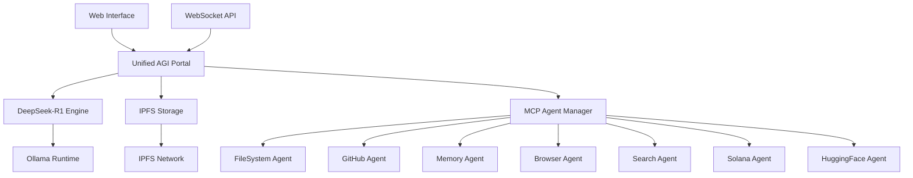

# 🌟 Unified AGI Portal - Complete Documentation

## Overview

The **Unified AGI Portal** is the ultimate artificial general intelligence dashboard that serves as a comprehensive portal for both humans and AI agents. It integrates DeepSeek-R1 for advanced reasoning, IPFS for decentralized storage, and multiple MCP (Model Context Protocol) agents for diverse capabilities.

## 🚀 Key Features

### Core Intelligence
- **DeepSeek-R1 Integration**: Advanced reasoning and planning with state-of-the-art language model
- **Claude Integration**: Major decision-making and complex task planning support
- **Multi-Model Support**: Fallback to different models for various tasks

### Decentralized Storage
- **IPFS Integration**: Store conversations, data, and results on the decentralized web
- **Permanent Data**: Important information stored permanently and accessibly
- **Distributed Architecture**: Resilient against centralized failures

### MCP Agent Ecosystem
- **FileSystem Agent**: File operations, reading, writing, manipulation
- **GitHub Agent**: Repository management, issues, pull requests, code collaboration
- **Memory Agent**: Persistent memory across sessions and interactions
- **Browser Agent**: Web automation, scraping, and interaction
- **Search Agent**: Web search via Brave API for real-time information
- **Solana Agent**: Blockchain integration for DeFi and crypto operations
- **HuggingFace Agent**: AI model integration and deployment

### Universal Interface
- **Human-Friendly**: Beautiful web dashboard with real-time chat
- **Agent-Friendly**: WebSocket API for seamless agent-to-agent communication
- **Cross-Platform**: Works on any device with a web browser
- **Real-Time**: Live updates and instant communication

## 🏗️ Architecture



## 🛠️ Installation & Setup

### Prerequisites

1. **Python 3.8+**
   ```bash
   python --version
   ```

2. **Node.js 16+** (for MCP servers)
   ```bash
   node --version
   npm --version
   ```

3. **Ollama** (for DeepSeek-R1)
   ```bash
   # Install Ollama
   curl -fsSL https://ollama.ai/install.sh | sh

   # Start Ollama
   ollama serve

   # Install DeepSeek-R1 model
   ollama pull deepseek-r1
   # or
   ollama pull hf.co/unsloth/DeepSeek-R1-0528-Qwen3-8B-GGUF:Q4_K_XL
   ```

4. **IPFS** (optional but recommended)
   ```bash
   # Install IPFS
   wget https://dist.ipfs.io/go-ipfs/v0.17.0/go-ipfs_v0.17.0_linux-amd64.tar.gz
   tar -xzf go-ipfs_v0.17.0_linux-amd64.tar.gz
   sudo ./go-ipfs/install.sh

   # Initialize and start IPFS
   ipfs init
   ipfs daemon
   ```

### Automated Setup

1. **Clone the repository**
   ```bash
   git clone https://github.com/kabrony/MCPVotsAGI.git
   cd MCPVotsAGI
   ```

2. **Run the setup script**
   ```bash
   python setup_unified_agi_portal.py
   ```

3. **Start the portal**
   ```bash
   # Windows
   START_UNIFIED_AGI_PORTAL.bat

   # Linux/Mac
   python START_UNIFIED_AGI_PORTAL.py
   ```

### Manual Setup

1. **Install Python dependencies**
   ```bash
   pip install -r requirements.txt
   ```

2. **Install MCP servers**
   ```bash
   npm install -g @modelcontextprotocol/server-filesystem
   npm install -g @modelcontextprotocol/server-github
   npm install -g @modelcontextprotocol/server-memory
   npm install -g @modelcontextprotocol/server-brave-search
   npm install -g @agentdeskai/browser-tools-mcp
   ```

3. **Configure environment**
   ```bash
   cp .env.example .env
   # Edit .env with your settings
   ```

## 🚀 Usage

### Web Interface

1. **Start the portal**
   ```bash
   python START_UNIFIED_AGI_PORTAL.py
   ```

2. **Access the dashboard**
   - Open http://localhost:8000 in your browser
   - Chat interface available immediately
   - Real-time status monitoring
   - Agent interaction controls

### API Usage

#### Chat via HTTP
```python
import requests

response = requests.post('http://localhost:8000/api/chat', json={
    'message': 'Create a new Python project with GitHub integration',
    'session_id': 'my_session_123'
})

print(response.json())
```

#### WebSocket Integration
```python
import asyncio
import websockets
import json

async def chat_with_agi():
    uri = "ws://localhost:8001"
    async with websockets.connect(uri) as websocket:
        # Send message
        await websocket.send(json.dumps({
            'type': 'chat',
            'message': 'Analyze this repository structure',
            'session_id': 'agent_session_456'
        }))

        # Receive response
        response = await websocket.recv()
        data = json.loads(response)
        print(data)

asyncio.run(chat_with_agi())
```

### Agent-to-Agent Communication

```python
# Example: Agent requesting file analysis
message = {
    'type': 'chat',
    'message': 'Analyze the Python files in /src/core/ and suggest improvements',
    'session_id': 'analysis_agent_789',
    'metadata': {
        'agent_type': 'code_analyzer',
        'priority': 'high',
        'expected_agents': ['filesystem', 'github']
    }
}
```

## 🧠 Capabilities

### Advanced Reasoning
- **Complex Planning**: Break down multi-step tasks into actionable plans
- **Decision Making**: Evaluate options and recommend optimal approaches
- **Problem Solving**: Analyze issues and provide comprehensive solutions
- **Context Awareness**: Maintain conversation context across sessions

### File Operations
- Read, write, and manipulate files
- Directory navigation and management
- Code analysis and generation
- Document processing

### GitHub Integration
- Repository management
- Issue tracking and creation
- Pull request handling
- Code collaboration

### Web Capabilities
- Real-time web search
- Website interaction and automation
- Data scraping and extraction
- Browser-based testing

### Blockchain Operations
- Solana blockchain interaction
- DeFi protocol integration
- Token and NFT management
- Smart contract deployment

### AI Model Integration
- HuggingFace model access
- Custom model deployment
- Multi-modal processing
- Model fine-tuning support

## 🔧 Configuration

### Environment Variables

```bash
# Server Configuration
AGI_PORTAL_HOST=localhost
AGI_PORTAL_PORT=8000
AGI_PORTAL_WEBSOCKET_PORT=8001

# DeepSeek-R1 Configuration
OLLAMA_ENDPOINT=http://localhost:11434
DEEPSEEK_MODEL=deepseek-r1

# IPFS Configuration
IPFS_ENDPOINT=http://localhost:5001
IPFS_GATEWAY=http://localhost:8080

# API Keys (Optional)
GITHUB_TOKEN=your_github_token
BRAVE_API_KEY=your_brave_api_key
HUGGINGFACE_API_KEY=your_hf_api_key
```

### Advanced Configuration

Edit `config/unified_agi_portal.yaml` for detailed settings:

```yaml
# Model Configuration
deepseek_r1:
  temperature: 0.7
  max_tokens: 2048
  top_p: 0.9

# Agent Configuration
mcp_agents:
  filesystem:
    enabled: true
    port: 3000
  github:
    enabled: true
    port: 3001
```

## 🌐 IPFS Integration

### Automatic Storage
- All chat sessions automatically stored in IPFS
- Important data pinned for permanence
- Cross-session data sharing

### Manual IPFS Operations
```python
# Store data in IPFS
ipfs_hash = portal.ipfs.add_to_ipfs(json.dumps(data))

# Retrieve data from IPFS
data = portal.ipfs.get_from_ipfs(ipfs_hash)
```

### IPFS Benefits
- **Decentralized**: No single point of failure
- **Permanent**: Data stored indefinitely
- **Accessible**: Global access via IPFS network
- **Efficient**: Content-addressed storage

## 🔒 Security

### Access Control
- Rate limiting for API requests
- CORS configuration for web security
- Session management and timeouts

### Data Protection
- Encrypted storage options
- Secure API key management
- Privacy-preserving operations

### Best Practices
1. Use environment variables for sensitive data
2. Enable rate limiting in production
3. Regularly backup important data
4. Monitor access logs

## 📊 Monitoring & Analytics

### System Status
- Real-time agent health monitoring
- Performance metrics tracking
- Error logging and reporting

### Usage Analytics
- Chat session statistics
- Agent usage patterns
- Performance benchmarks

### Health Checks
```bash
# Check system status
curl http://localhost:8000/api/status

# View real-time events
curl http://localhost:8000/api/events
```

## 🤝 Integration Examples

### Smart Contract Development
```python
# Request smart contract creation
response = await portal.process_chat_message(
    "Create a Solana NFT minting program with royalties",
    session_id="contract_dev_001"
)
```

### Data Analysis Pipeline
```python
# Complex data analysis request
response = await portal.process_chat_message(
    "Download financial data for AAPL, analyze trends, and create a trading strategy",
    session_id="financial_analysis_002"
)
```

### Multi-Agent Workflow
```python
# Coordinated agent workflow
response = await portal.process_chat_message(
    "Research competitor analysis, store findings in GitHub, and notify team via webhook",
    session_id="research_workflow_003"
)
```

## 🚨 Troubleshooting

### Common Issues

#### DeepSeek-R1 Not Available
```bash
# Check Ollama status
ollama list

# Install DeepSeek-R1
ollama pull deepseek-r1
```

#### MCP Agents Offline
```bash
# Restart MCP servers
python START_MCP_SERVERS.py
```

#### IPFS Connection Failed
```bash
# Check IPFS daemon
ipfs daemon

# Verify connection
curl http://localhost:5001/api/v0/version
```

### Debug Mode
Enable debug logging:
```bash
export LOG_LEVEL=DEBUG
python START_UNIFIED_AGI_PORTAL.py
```

## 🛣️ Roadmap

### Phase 1: Core Platform ✅
- DeepSeek-R1 integration
- Basic MCP agents
- Web interface
- IPFS storage

### Phase 2: Enhanced Intelligence 🚧
- Multi-model support
- Advanced reasoning chains
- Custom agent development
- Vector database integration

### Phase 3: Ecosystem Expansion 📋
- Plugin marketplace
- Third-party integrations
- Mobile applications
- Enterprise features

### Phase 4: Autonomous Operations 🔮
- Self-improving agents
- Automated workflows
- Predictive intelligence
- Swarm coordination

## 📞 Support

### Community
- GitHub Issues: [Report bugs and feature requests](https://github.com/kabrony/MCPVotsAGI/issues)
- Discussions: [Community discussions and help](https://github.com/kabrony/MCPVotsAGI/discussions)

### Documentation
- [API Reference](docs/api/)
- [Agent Development Guide](docs/agents/)
- [Deployment Guide](docs/deployment/)

### Contributing
1. Fork the repository
2. Create a feature branch
3. Make your changes
4. Submit a pull request

## 📄 License

MIT License - see [LICENSE](LICENSE) for details.

---

**The Unified AGI Portal: Where Human Intelligence Meets Artificial General Intelligence** 🤖🤝👥
