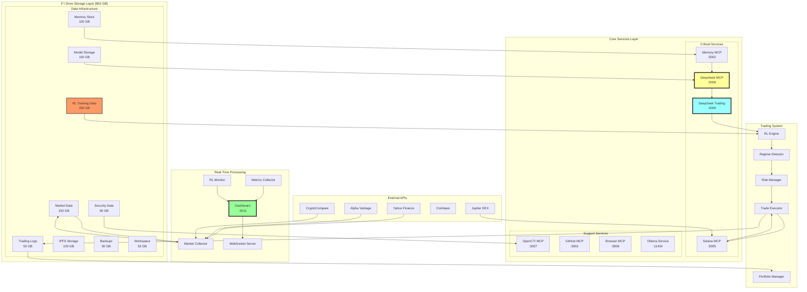
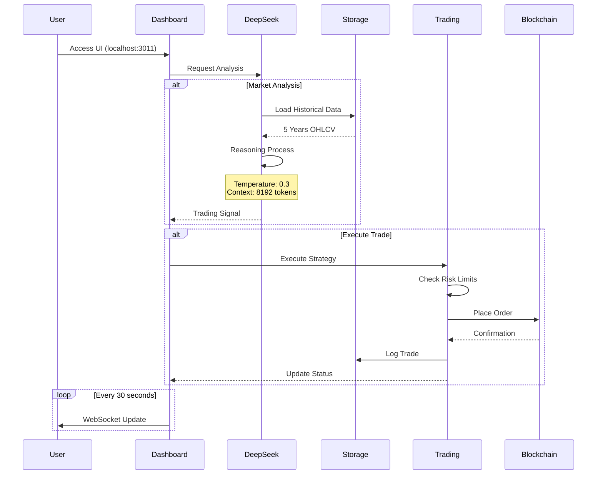
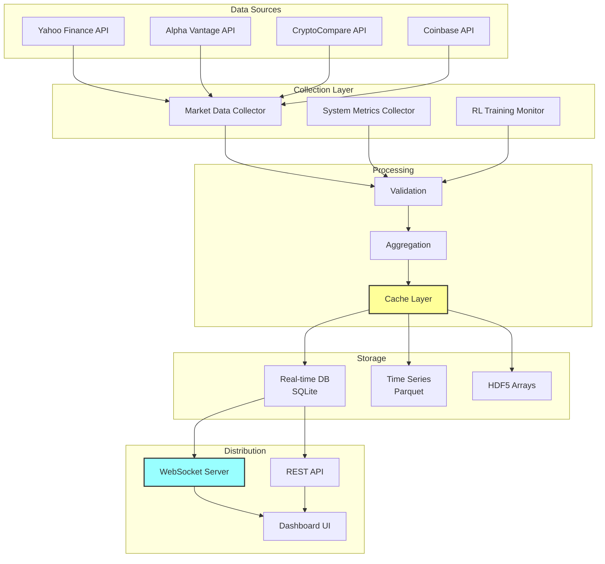
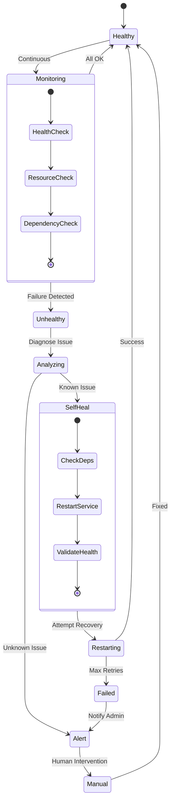
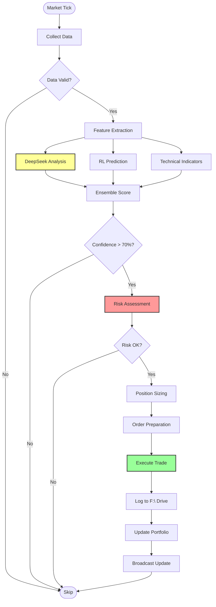
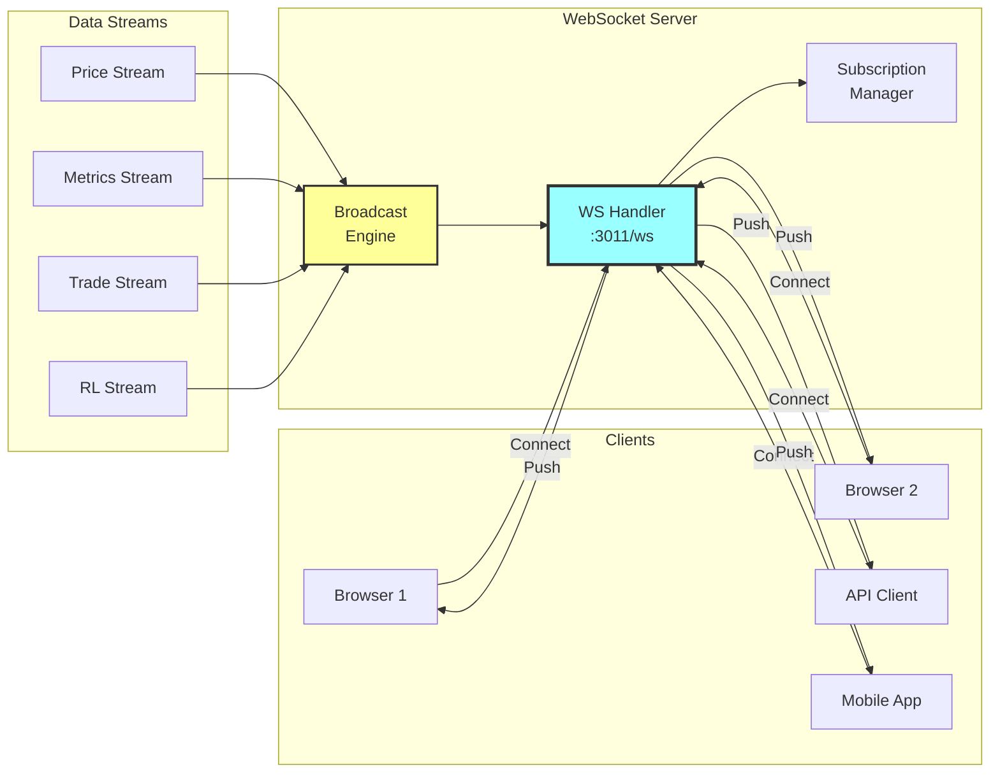
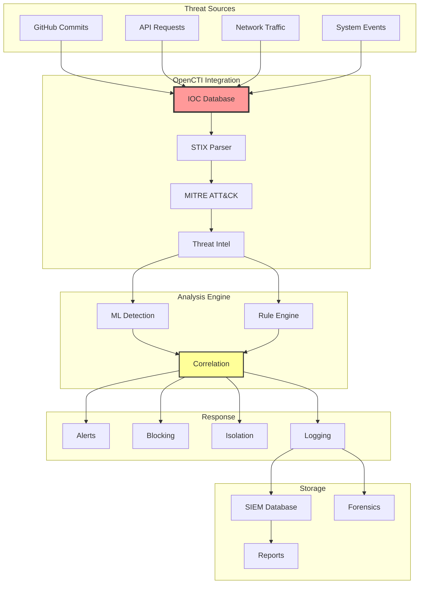
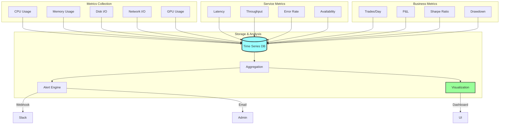
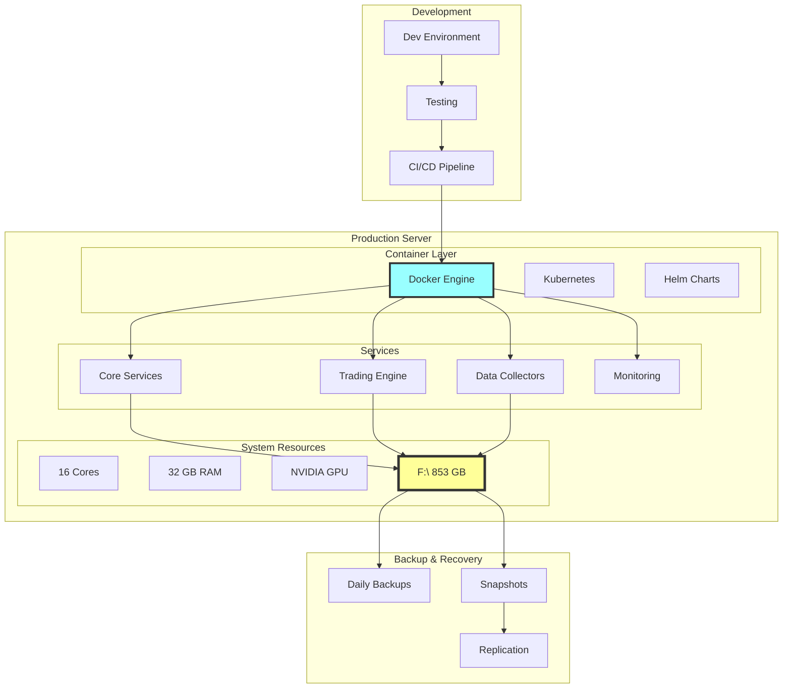

# MCPVotsAGI V3 Architecture Diagrams

## 1. Complete System Architecture



## 2. DeepSeek Integration Flow



## 3. RL/ML Training Pipeline

```mermaid
graph LR
    subgraph "Data Collection"
        MD[Market Data]
        TA[Technical Analysis]
        SA[Sentiment Analysis]
        OB[Order Books]
    end
    
    subgraph "Feature Engineering"
        FE[Feature Extraction]
        NM[Normalization]
        FS[Feature Selection]
    end
    
    subgraph "RL Training"
        ST[State Space<br/>50 features]
        DQN[Deep Q-Network<br/>[512, 256, 128]]
        ATT[Attention Layer<br/>4 heads]
        ACT[Action Space<br/>5 actions]
    end
    
    subgraph "Experience Replay"
        BUF[Buffer<br/>50M experiences]
        SAM[Sampling<br/>Batch: 256]
        PRI[Priority Replay]
    end
    
    subgraph "Execution"
        POL[Policy]
        EPS[ε-greedy<br/>ε: 1.0→0.01]
        TRD[Trade Execution]
    end
    
    MD --> FE
    TA --> FE
    SA --> FE
    OB --> FE
    
    FE --> NM
    NM --> FS
    FS --> ST
    
    ST --> DQN
    DQN --> ATT
    ATT --> ACT
    
    ACT --> BUF
    BUF --> SAM
    SAM --> DQN
    
    ACT --> POL
    POL --> EPS
    EPS --> TRD
    
    TRD --> BUF
```

## 4. Real-Time Data Flow



## 5. Self-Healing Architecture



## 6. Trading Decision Flow



## 7. WebSocket Communication



## 8. Security Integration



## 9. Performance Monitoring



## 10. Deployment Architecture



---

These diagrams provide a comprehensive view of the MCPVotsAGI V3 architecture, showing:

1. **Complete System Architecture**: Overall system layout with F:\ drive integration
2. **DeepSeek Integration Flow**: How reasoning integrates with trading
3. **RL/ML Training Pipeline**: The complete machine learning workflow
4. **Real-Time Data Flow**: From APIs to dashboard
5. **Self-Healing Architecture**: Automatic recovery mechanisms
6. **Trading Decision Flow**: Step-by-step trading logic
7. **WebSocket Communication**: Real-time update distribution
8. **Security Integration**: Threat detection and response
9. **Performance Monitoring**: Comprehensive metrics tracking
10. **Deployment Architecture**: Production deployment strategy

Each diagram uses consistent styling:
- 🟨 Yellow: Critical components
- 🟦 Blue: Communication/networking
- 🟩 Green: Success/execution
- 🟥 Red: Storage/critical data