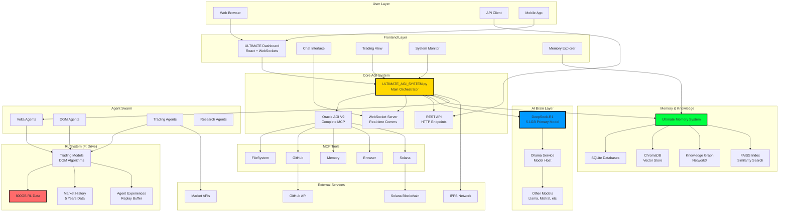
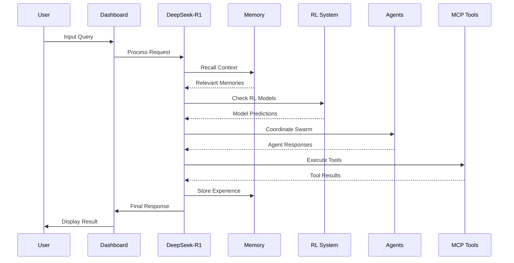
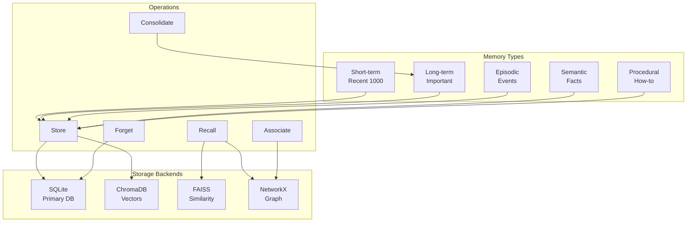
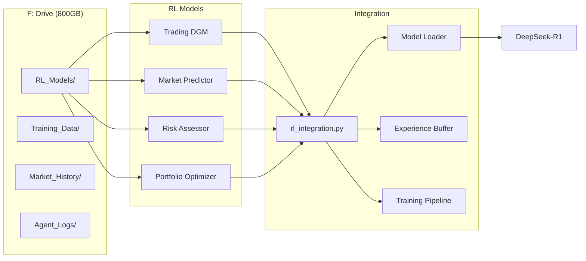
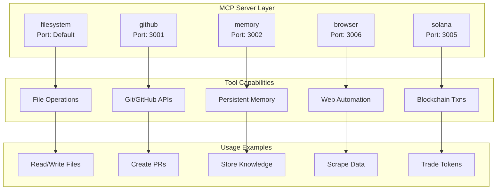
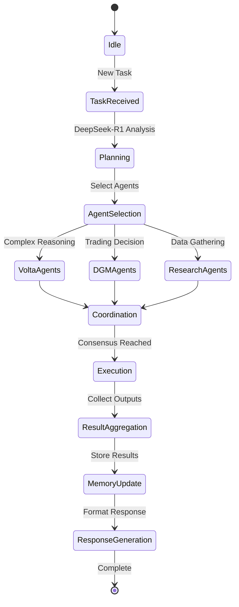
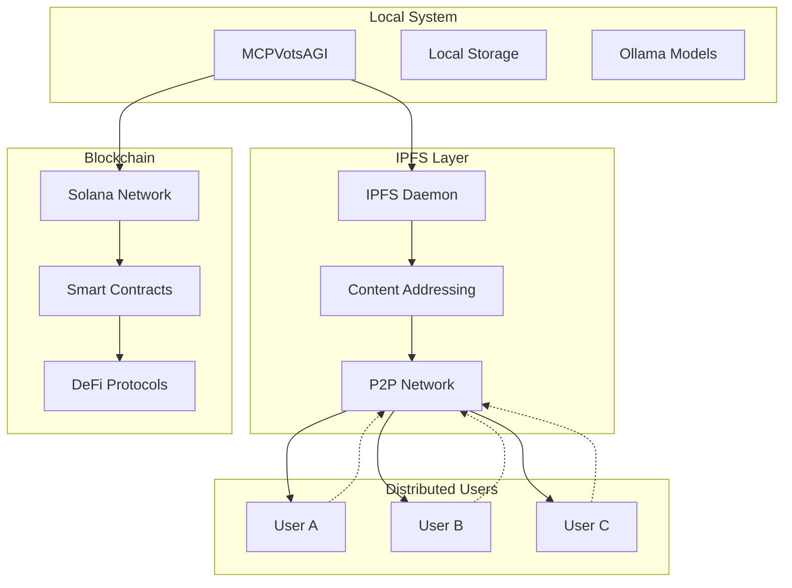
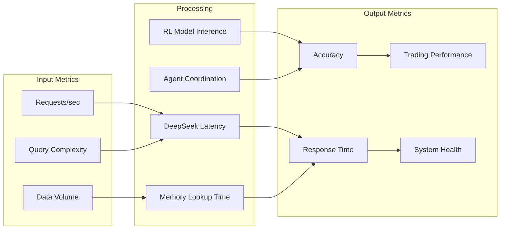
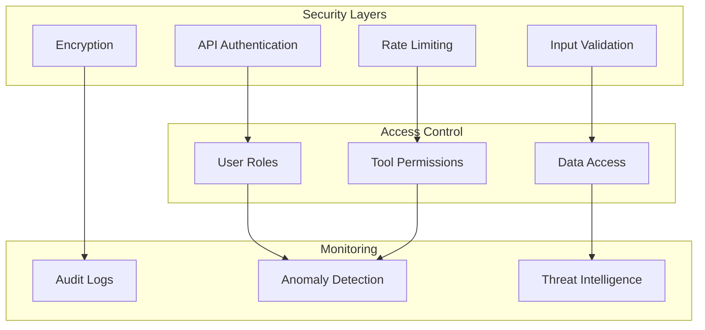
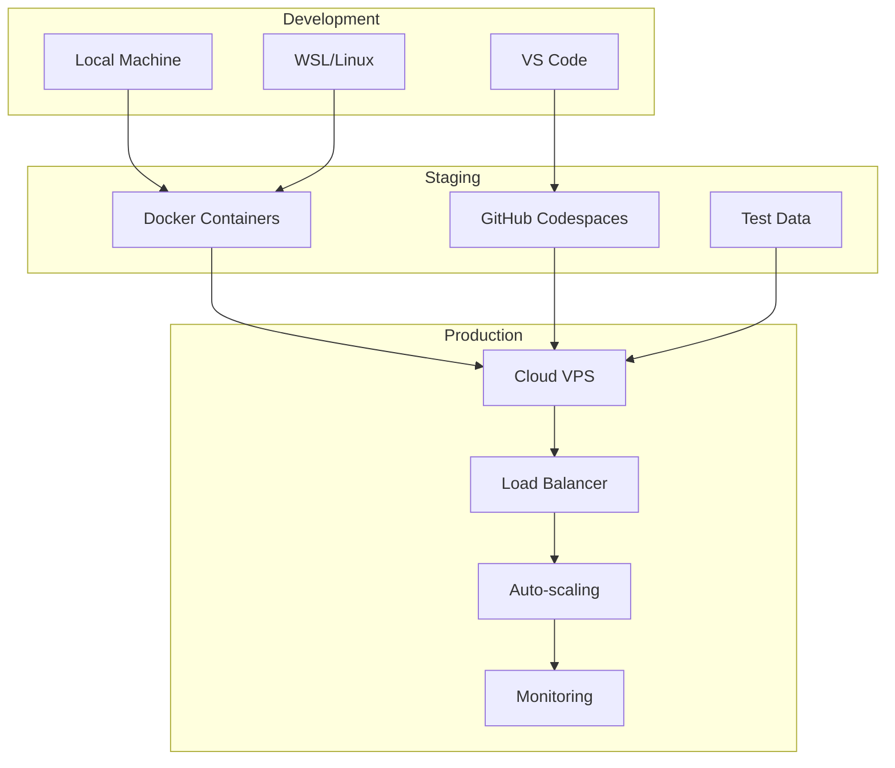

# 🏗️ MCPVotsAGI System Architecture

## 🌐 Complete System Overview

## 🧠 DeepSeek-R1 Integration Flow

## 💾 Memory System Architecture

## 📊 RL System Integration

## 🔗 MCP Tool Orchestration

## 🤖 Multi-Agent Coordination

## 🌐 Decentralization Architecture

## 📈 Performance Metrics

## 🔒 Security Architecture

## 🚀 Deployment Architecture

---

**This architecture represents the ULTIMATE consolidation of all MCPVotsAGI capabilities into ONE unified system!**