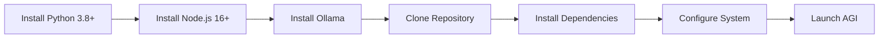

# 🚀 MCPVotsAGI Ultimate Deployment Guide

## 📋 Table of Contents
1. [System Requirements](#system-requirements)
2. [Quick Start](#quick-start)
3. [Detailed Installation](#detailed-installation)
4. [Configuration](#configuration)
5. [Running the System](#running-the-system)
6. [Verification](#verification)
7. [Troubleshooting](#troubleshooting)

## 💻 System Requirements

### Minimum Requirements
- **CPU**: 4 cores (8 threads recommended)
- **RAM**: 16GB (32GB recommended for full RL)
- **Storage**: 50GB free (1TB+ for full RL data)
- **GPU**: Optional but recommended for faster inference
- **OS**: Windows 10/11, Linux, macOS

### Software Requirements
- Python 3.8+
- Node.js 16+
- Git
- Ollama
- Docker (optional)

## 🚀 Quick Start

### Windows Users (Fastest Method)
```batch
# 1. Clone the repository
git clone https://github.com/kabrony/mcpvotsagi.git
cd MCPVotsAGI

# 2. Run the ultimate installer
python INSTALL_EVERYTHING.py

# 3. Start Ollama (in a separate terminal)
ollama serve

# 4. Pull DeepSeek-R1
ollama pull hf.co/unsloth/DeepSeek-R1-0528-Qwen3-8B-GGUF:Q4_K_XL

# 5. Launch the system
START_ULTIMATE_AGI.bat
```

### Linux/macOS Users
```bash
# 1. Clone the repository
git clone https://github.com/kabrony/mcpvotsagi.git
cd MCPVotsAGI

# 2. Install dependencies
pip3 install -r requirements_complete.txt
npm install -g @modelcontextprotocol/server-filesystem @modelcontextprotocol/server-github

# 3. Start Ollama
ollama serve &

# 4. Pull DeepSeek-R1
ollama pull hf.co/unsloth/DeepSeek-R1-0528-Qwen3-8B-GGUF:Q4_K_XL

# 5. Launch the system
python3 src/core/ULTIMATE_AGI_SYSTEM.py
```

## 📦 Detailed Installation

### Step 1: Environment Setup



#### Python Environment
```bash
# Create virtual environment (recommended)
python -m venv venv

# Activate virtual environment
# Windows:
venv\Scripts\activate
# Linux/macOS:
source venv/bin/activate

# Upgrade pip
python -m pip install --upgrade pip
```

#### Install Core Dependencies
```bash
# Python packages
pip install -r requirements_complete.txt

# Or install manually:
pip install aiohttp psutil websockets numpy pandas pyyaml
pip install chromadb sentence-transformers networkx scikit-learn
pip install ollama ipfshttpclient finnhub-python
```

#### Install MCP Servers
```bash
# Core MCP servers
npm install -g @modelcontextprotocol/server-filesystem
npm install -g @modelcontextprotocol/server-github
npm install -g @modelcontextprotocol/server-memory
npm install -g @modelcontextprotocol/server-sqlite
npm install -g @agentdeskai/browser-tools-mcp
```

### Step 2: Ollama Setup

#### Install Ollama
- **Windows**: Download from https://ollama.ai
- **Linux**: `curl -fsSL https://ollama.ai/install.sh | sh`
- **macOS**: `brew install ollama`

#### Start Ollama Service
```bash
# Start in background
ollama serve

# Verify it's running
curl http://localhost:11434/api/tags
```

#### Pull DeepSeek-R1 (CRITICAL!)
```bash
# This is our primary brain - 5.1GB download
ollama pull hf.co/unsloth/DeepSeek-R1-0528-Qwen3-8B-GGUF:Q4_K_XL

# Verify model is available
ollama list
```

### Step 3: Configure F: Drive (Optional)

If you have the 800GB RL data:

```batch
# Windows - Mount F: drive
# Ensure F:\MCPVotsAGI_Data exists

# WSL - Mount F: drive
sudo mkdir -p /mnt/f
sudo mount -t drvfs F: /mnt/f
```

## ⚙️ Configuration

### Environment Variables (.env)
```env
# Create .env file in project root
OPENAI_API_KEY=your_key_here
ANTHROPIC_API_KEY=your_key_here
FINNHUB_API_KEY=your_key_here
GITHUB_TOKEN=your_token_here
SOLANA_RPC_URL=https://api.mainnet-beta.solana.com
```

### System Configuration
```yaml
# config/unified_system_config.yaml
system:
  name: "MCPVotsAGI Ultimate"
  version: "ULTIMATE-V1.0"
  
ollama:
  host: "http://localhost:11434"
  primary_model: "hf.co/unsloth/DeepSeek-R1-0528-Qwen3-8B-GGUF:Q4_K_XL"
  
memory:
  type: "ultimate"
  backends:
    - chromadb
    - faiss
    - sqlite
    
rl_data:
  path: "F:/MCPVotsAGI_Data"
  fallback: "./rl_models"
```

## 🎯 Running the System

### Method 1: Batch Script (Windows)
```batch
START_ULTIMATE_AGI.bat
```

### Method 2: Python Direct
```bash
python src/core/ULTIMATE_AGI_SYSTEM.py
```

### Method 3: With Specific Config
```bash
python src/core/ULTIMATE_AGI_SYSTEM.py --config config/production.yaml
```

### Method 4: Docker (Coming Soon)
```bash
docker-compose up -d
```

## ✅ Verification

### System Health Check
```bash
# Run verification script
python VERIFY_AND_INTEGRATE_RL.py
```

Expected output:
```
✅ DeepSeek-R1 is ready
✅ 800GB RL data on F: drive accessible
✅ RL integration module created
✅ System integration tests passed
```

### Dashboard Access
1. Open browser to http://localhost:8888
2. You should see the ULTIMATE AGI Dashboard
3. Test chat functionality with DeepSeek-R1
4. Check system status indicators

### Memory System Test
```bash
python test_memory_system.py
```

## 🔍 Troubleshooting

### Common Issues

#### 1. Ollama Not Running
```bash
# Check if running
curl http://localhost:11434/api/tags

# If not, start it
ollama serve
```

#### 2. DeepSeek-R1 Not Found
```bash
# Pull the model
ollama pull hf.co/unsloth/DeepSeek-R1-0528-Qwen3-8B-GGUF:Q4_K_XL

# List models
ollama list
```

#### 3. Port 8888 In Use
```python
# Edit src/core/ULTIMATE_AGI_SYSTEM.py
self.port = 8889  # Change to different port
```

#### 4. F: Drive Not Accessible
- System will use local fallback
- RL features will be limited
- Check drive mounting in WSL

#### 5. Memory Errors
```bash
# Install missing dependencies
pip install chromadb sentence-transformers
```

### Debug Mode
```bash
# Run with debug logging
python src/core/ULTIMATE_AGI_SYSTEM.py --debug
```

### Check Logs
```bash
# View system logs
tail -f logs/ultimate_agi.log
```

## 📊 Performance Optimization

### Memory Usage
- Minimum: 16GB RAM
- Recommended: 32GB+ for full RL
- GPU: Speeds up inference 10x

### Model Loading
```python
# Reduce model size if needed
ollama pull llama2:7b  # Smaller alternative
```

### Database Optimization
```sql
-- Vacuum SQLite databases
VACUUM;

-- Analyze for better query plans
ANALYZE;
```

## 🚀 Advanced Features

### Enable IPFS
```bash
# Start IPFS daemon
ipfs daemon

# Configure in dashboard
Settings > Decentralization > Enable IPFS
```

### Multi-Node Setup
```yaml
# config/cluster.yaml
nodes:
  - host: localhost
    port: 8888
  - host: node2.local
    port: 8888
```

### Custom Agents
```python
# Add to src/agents/custom_agent.py
class CustomAgent(BaseAgent):
    async def process(self, task):
        # Your logic here
        pass
```

## 📞 Support

- **GitHub Issues**: https://github.com/kabrony/mcpvotsagi/issues
- **Documentation**: This guide and README.md
- **Community**: Discord (coming soon)

---

**🎉 Congratulations! You now have the ULTIMATE AGI System running!**

The system consolidates EVERYTHING into ONE unified platform. No more switching between dashboards - it's all here at http://localhost:8888!